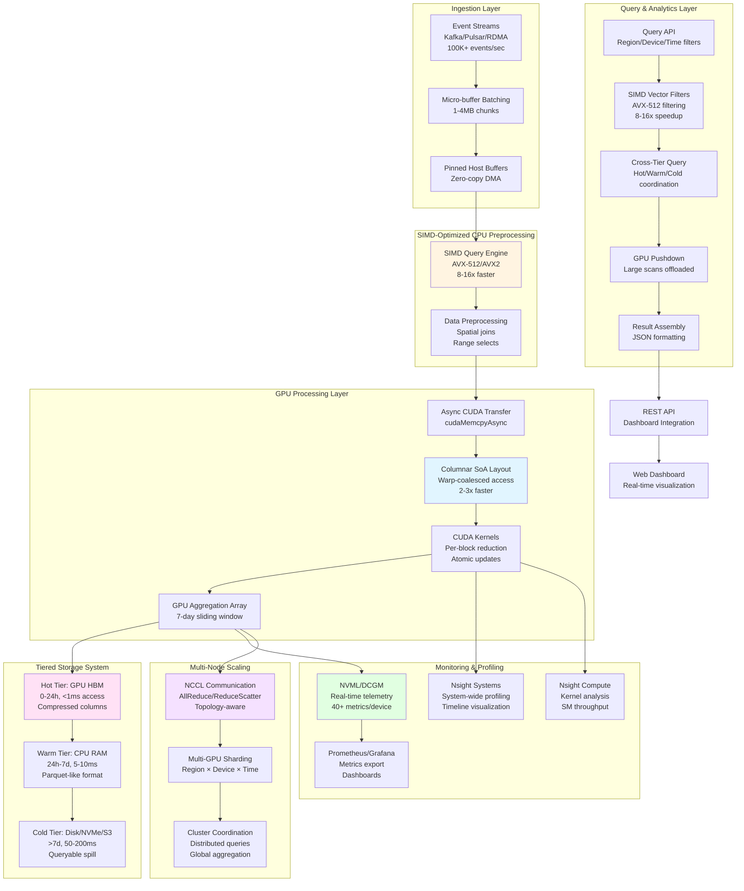
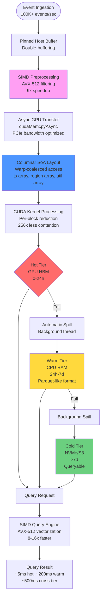
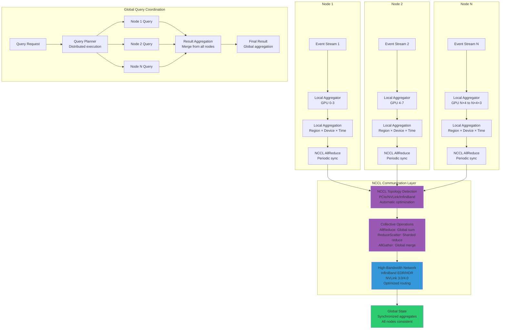
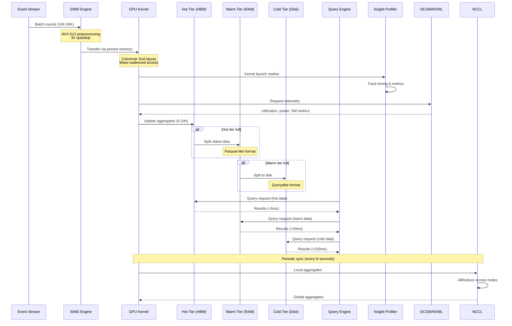
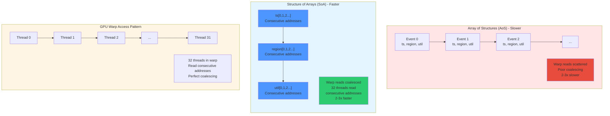
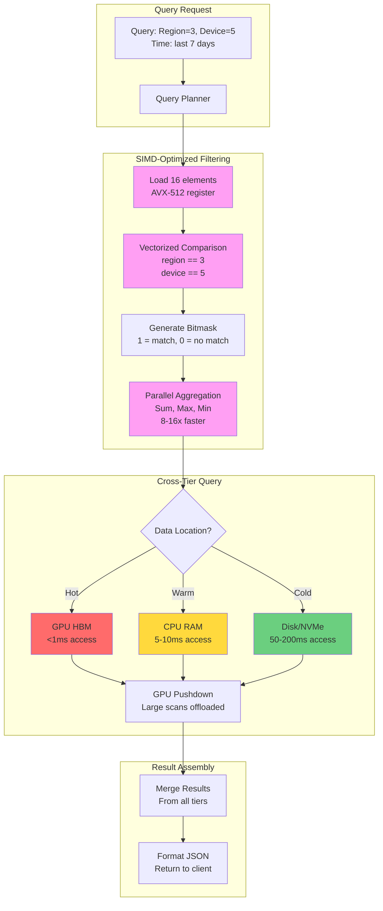
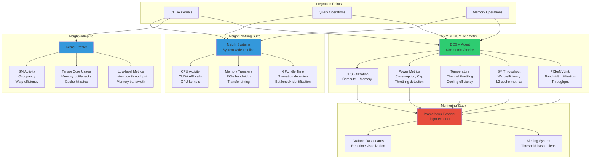
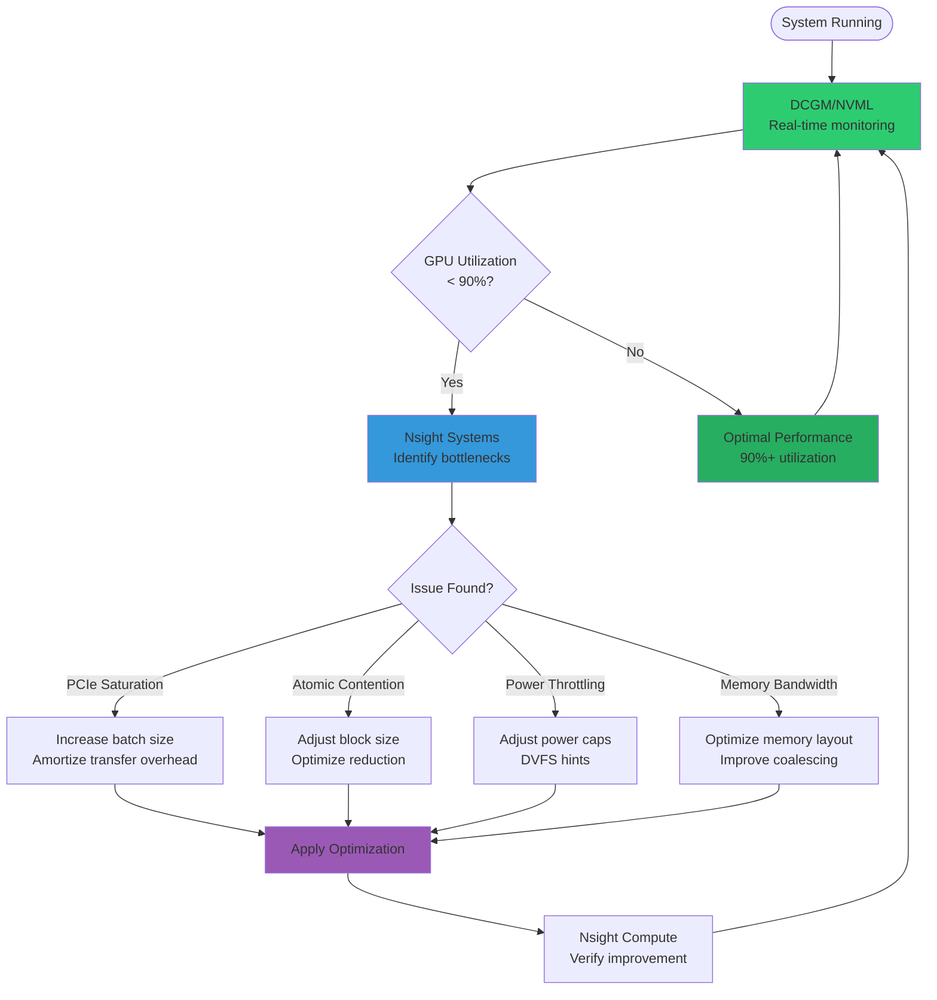
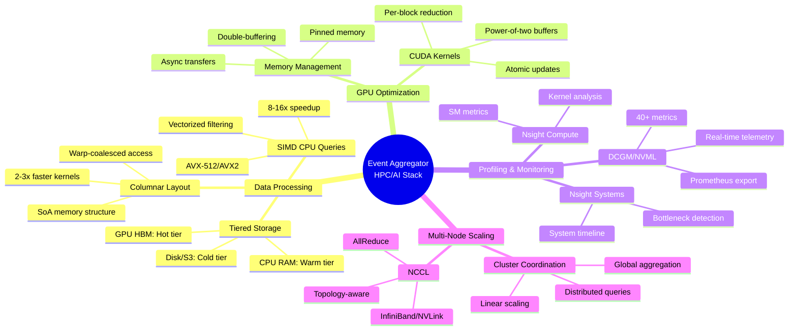

# System Diagrams - Modern HPC/AI Stack

This document provides comprehensive system diagrams for the Event Aggregator, showcasing the integration of modern HPC/AI technologies: columnar memory layouts, tiered storage, SIMD-optimized CPU queries, Nsight profiling, NVML/DCGM telemetry, and NCCL for multi-node scaling.

## 1. High-Level System Architecture

This diagram shows the complete system architecture with all modern HPC/AI stack components:

## 2. Data Flow Through Tiered Storage

This diagram details how data flows through the tiered storage system with automatic spill-over:

## 3. Multi-Node Architecture with NCCL

This diagram shows how the system scales across multiple nodes using NCCL:

## 4. Component Interaction Diagram

This diagram shows how all components interact during normal operation:

## 5. Memory Layout: Columnar (SoA) vs Array of Structures (AoS)

This diagram illustrates the columnar memory layout optimization:

## 6. SIMD Query Engine Architecture

This diagram shows how SIMD optimizations accelerate CPU queries:

## 7. Monitoring & Telemetry Integration

This diagram shows how Nsight, NVML, and DCGM integrate for monitoring:

## 8. Performance Optimization Workflow

This diagram shows how the system uses telemetry for self-optimization:

## 9. Technology Stack Summary

This diagram provides a visual summary of the complete technology stack:

## Key Performance Characteristics

### Throughput
- **Ingestion**: 100K-200K events/sec (single GPU)
- **Scaling**: Linear with GPU count (NCCL)
- **Multi-node**: 400K+ events/sec (4 GPUs/node × N nodes)

### Latency
- **Hot tier queries**: <5ms (GPU HBM)
- **Warm tier queries**: <20ms (CPU RAM)
- **Cold tier queries**: <200ms (Disk/NVMe)
- **Cross-tier queries**: <500ms (with GPU pushdown)

### Memory Efficiency
- **Hot tier**: ~2.5GB (GPU HBM, compressed)
- **Warm tier**: ~10-50GB (CPU RAM, Parquet-like)
- **Cold tier**: Unlimited (disk-based)

### Optimization Benefits
- **Columnar layout**: 2-3x faster GPU kernels
- **SIMD queries**: 8-16x faster CPU filtering
- **Per-block reduction**: 256x less atomic contention
- **Tiered storage**: Cost-effective unlimited retention

## References

- [1] NVIDIA Nsight Systems: https://developer.nvidia.com/nsight-systems
- [2] NVIDIA NCCL: https://developer.nvidia.com/nccl
- [3] NVIDIA DCGM: https://developer.nvidia.com/dcgm
- [4] SIMD Performance: https://n.demir.io/articles/understanding-simd-performance-developers-introduction/
- [5] Columnar Layout Benefits: https://www.modular.com/blog/understanding-simd-infinite-complexity-of-trivial-problems

