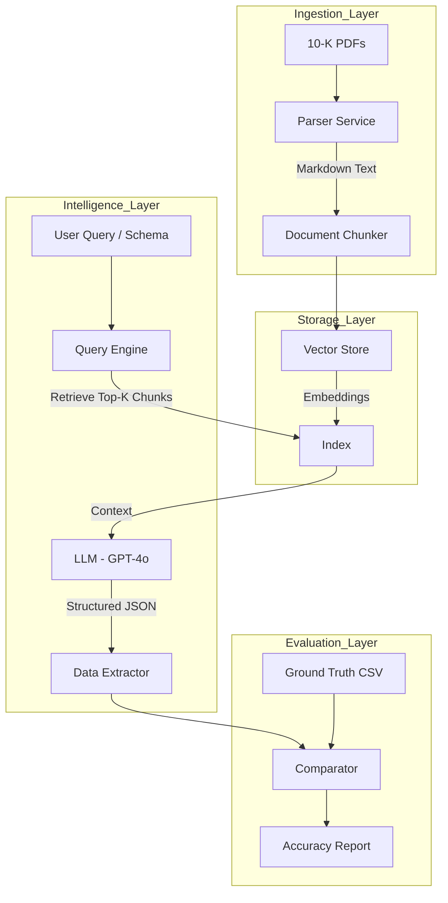
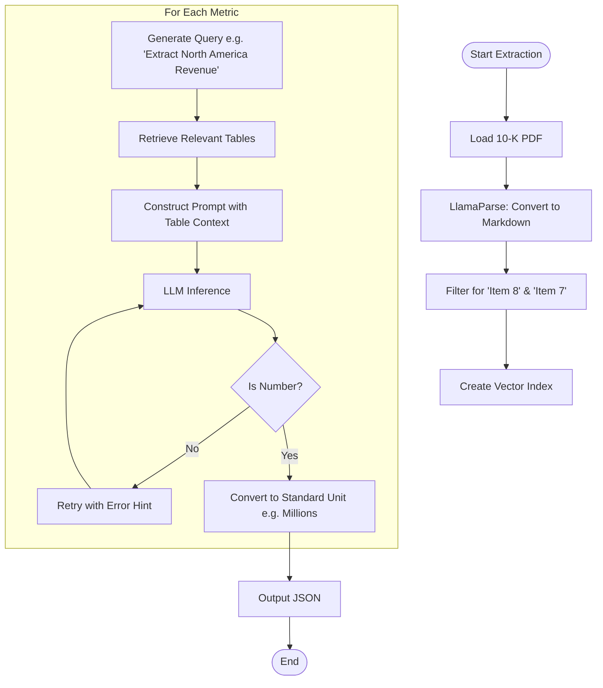
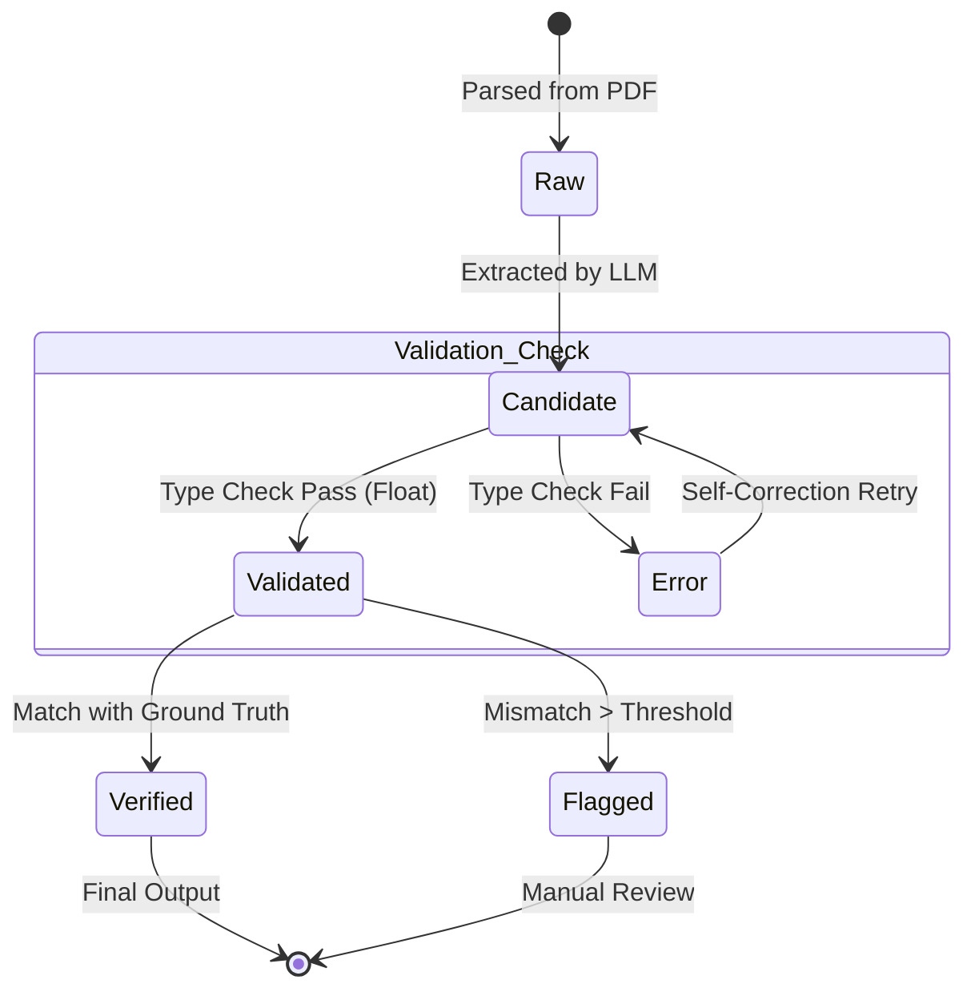

# Automating 10-K PDF conversion
_Exported on 12/10/2025 at 09:15:57 PST from Cursor (2.1.42)_

---

**User**

Let us find ten PDFs from any US public companies using the following automatic process:

Phase 1: The Manual "Human Crawler" Process

Before automating, you must perform these steps once to understand what your code needs to replicate.


Locate the Central Index Key (CIK):


Go to SEC.gov/edgar/searchedgar/companysearch.html.


Type a ticker (e.g., AAPL). Note the CIK (e.g., 0000320193). The CIK is the immutable ID; tickers can change.


Filter for "10-K":


In the "Selected Filings" view, filter by "10-K" (exclude "10-K/A" unless you want amendments).


Navigate to the Primary Document:


Click the "Accession Number" (the long identifier like 0000320193-23-000106).


You will see a directory of files (.htm, .xml, .jpg).


Identify the Primary Document. It is usually the first .htm file listed (e.g., aapl-20230930.htm).


"Create" the PDF:


Open that HTML link.


Use your browser's "Print to PDF" function. This is the step your automation must simulate.


Phase 2: Automated Approaches

Approach A: The "Free & Flexible" Stack (Python + Open Source)

Best for: Zero cost, high control, and keeping the raw HTML for better data extraction later.


The Logic: Use a specialized downloader to grab the HTML bundles, then use a converter tool to "print" them to PDF.


Tools: sec-edgar-downloader (Python) + pdfkit (PDF generation).


Ingest (Download HTML): Use the sec-edgar-downloader library. It handles the complex directory structures and User-Agent headers required by the SEC.


Python


from sec_edgar_downloader import Downloader


# Initialize with your "Company Name" and "Email" (SEC Requirement)

dl = Downloader("MyProject", "my.email@domain.com")


# Download the last 5 10-Ks for Apple to a local folder

dl.get("10-K", "AAPL", limit=5)

Process (Convert to PDF): The files will land in sec-edgar-filings/AAPL/10-K/.../primary-document.html. You then write a simple script to loop through these folders and convert them.


Python


import pdfkit

import os


# Pseudo-code for conversion

path_to_html = "sec-edgar-filings/AAPL/10-K/000.../filing.html"

pdfkit.from_file(path_to_html, 'AAPL_2023_10K.pdf')

Pros: Free; you own the data; HTML is actually better for LLM extraction than PDF. Cons: Requires installing wkhtmltopdf (system dependency); PDF conversion can sometimes break page margins on wide financial tables.

---

**Cursor**


Setting up the automated process to download 10-K filings and convert them to PDFs. Exploring the workspace, then implementing the solution.


Creating the automated solution to download 10-K filings and convert them to PDFs. Setting up the necessary files:


```pip-requirements
sec-edgar-downloader==5.0.1
pdfkit==1.0.0
beautifulsoup4==4.12.2
lxml==4.9.3

```

```python
#!/usr/bin/env python3
"""
Automated SEC EDGAR 10-K PDF Downloader

This script downloads 10-K filings from SEC EDGAR and converts them to PDFs.
It replicates the manual process of:
1. Finding the CIK for a company
2. Filtering for 10-K filings
3. Locating the primary HTML document
4. Converting it to PDF
"""

import os
import sys
from pathlib import Path
from sec_edgar_downloader import Downloader
import pdfkit
from bs4 import BeautifulSoup
import re

# Configuration
COMPANY_TICKERS = [
    "AAPL",   # Apple Inc.
    "MSFT",   # Microsoft Corporation
    "GOOGL",  # Alphabet Inc.
    "AMZN",   # Amazon.com Inc.
    "TSLA",   # Tesla, Inc.
    "META",   # Meta Platforms Inc.
    "NVDA",   # NVIDIA Corporation
    "JPM",    # JPMorgan Chase & Co.
    "V",      # Visa Inc.
    "JNJ",    # Johnson & Johnson
]

DOWNLOAD_DIR = "sec-edgar-filings"
OUTPUT_DIR = "pdfs"
COMPANY_NAME = "EDGAR PDF Downloader"
EMAIL = "user@example.com"  # Update with your email
NUM_PDFS_TO_GET = 10


def find_primary_document(filing_dir):
    """
    Find the primary HTML document in a filing directory.
    The primary document is usually the first .htm file listed.
    """
    filing_path = Path(filing_dir)
    
    # Look for .htm or .html files
    html_files = list(filing_path.glob("*.htm")) + list(filing_path.glob("*.html"))
    
    if not html_files:
        return None
    
    # Sort to get consistent ordering (primary is usually first alphabetically)
    html_files.sort()
    
    # The primary document is typically the one without "cover" or "graphic" in the name
    for html_file in html_files:
        name_lower = html_file.name.lower()
        if "cover" not in name_lower and "graphic" not in name_lower:
            return html_file
    
    # If no "clean" file found, return the first one
    return html_files[0]


def convert_html_to_pdf(html_path, output_pdf_path):
    """
    Convert an HTML file to PDF using pdfkit.
    """
    try:
        # Configure pdfkit options for better formatting
        options = {
            'page-size': 'Letter',
            'margin-top': '0.75in',
            'margin-right': '0.75in',
            'margin-bottom': '0.75in',
            'margin-left': '0.75in',
            'encoding': "UTF-8",
            'no-outline': None,
            'enable-local-file-access': None
        }
        
        pdfkit.from_file(str(html_path), str(output_pdf_path), options=options)
        return True
    except Exception as e:
        print(f"Error converting {html_path} to PDF: {e}")
        return False


def get_company_name_from_ticker(ticker):
    """Map ticker to company name for better PDF naming."""
    names = {
        "AAPL": "Apple",
        "MSFT": "Microsoft",
        "GOOGL": "Alphabet",
        "AMZN": "Amazon",
        "TSLA": "Tesla",
        "META": "Meta",
        "NVDA": "NVIDIA",
        "JPM": "JPMorgan",
        "V": "Visa",
        "JNJ": "Johnson_Johnson",
    }
    return names.get(ticker, ticker)


def main():
    """
    Main function to download 10-K filings and convert them to PDFs.
    """
    print("=" * 60)
    print("SEC EDGAR 10-K PDF Downloader")
    print("=" * 60)
    print()
    
    # Create output directory
    output_path = Path(OUTPUT_DIR)
    output_path.mkdir(exist_ok=True)
    
    # Initialize downloader
    print(f"Initializing SEC EDGAR downloader...")
    print(f"Company: {COMPANY_NAME}")
    print(f"Email: {EMAIL}")
    print()
    
    try:
        dl = Downloader(COMPANY_NAME, EMAIL)
    except Exception as e:
        print(f"Error initializing downloader: {e}")
        print("\nNote: Make sure to update the EMAIL variable in the script.")
        sys.exit(1)
    
    pdfs_created = 0
    ticker_index = 0
    
    # Download 10-K filings until we have enough PDFs
    while pdfs_created < NUM_PDFS_TO_GET and ticker_index < len(COMPANY_TICKERS):
        ticker = COMPANY_TICKERS[ticker_index]
        company_name = get_company_name_from_ticker(ticker)
        
        print(f"[{pdfs_created + 1}/{NUM_PDFS_TO_GET}] Processing {ticker} ({company_name})...")
        
        try:
            # Download the most recent 10-K filing
            # We'll download 1 at a time to get variety across companies
            dl.get("10-K", ticker, limit=1, download_details=True)
            
            # Find the downloaded filing
            ticker_dir = Path(DOWNLOAD_DIR) / ticker / "10-K"
            
            if not ticker_dir.exists():
                print(f"  Warning: No filings found for {ticker}")
                ticker_index += 1
                continue
            
            # Get the most recent filing directory
            filing_dirs = sorted(ticker_dir.iterdir(), key=os.path.getmtime, reverse=True)
            
            if not filing_dirs:
                print(f"  Warning: No filing directories found for {ticker}")
                ticker_index += 1
                continue
            
            # Process the most recent filing
            for filing_dir in filing_dirs:
                if not filing_dir.is_dir():
                    continue
                
                primary_doc = find_primary_document(filing_dir)
                
                if not primary_doc:
                    print(f"  Warning: No primary document found in {filing_dir}")
                    continue
                
                # Extract year from filing directory name (usually contains date)
                filing_name = filing_dir.name
                year_match = re.search(r'(\d{4})', filing_name)
                year = year_match.group(1) if year_match else "unknown"
                
                # Create PDF filename
                pdf_filename = f"{ticker}_{company_name}_10K_{year}.pdf"
                pdf_path = output_path / pdf_filename
                
                # Skip if PDF already exists
                if pdf_path.exists():
                    print(f"  PDF already exists: {pdf_filename}")
                    pdfs_created += 1
                    break
                
                print(f"  Found primary document: {primary_doc.name}")
                print(f"  Converting to PDF: {pdf_filename}...")
                
                # Convert to PDF
                if convert_html_to_pdf(primary_doc, pdf_path):
                    print(f"  ✓ Successfully created: {pdf_filename}")
                    pdfs_created += 1
                else:
                    print(f"  ✗ Failed to create PDF for {ticker}")
                
                # Only process one filing per ticker in this iteration
                break
            
            ticker_index += 1
            
        except Exception as e:
            print(f"  Error processing {ticker}: {e}")
            ticker_index += 1
            continue
        
        print()
    
    print("=" * 60)
    print(f"Download complete! Created {pdfs_created} PDF(s) in '{OUTPUT_DIR}' directory.")
    print("=" * 60)
    
    # List created PDFs
    if pdfs_created > 0:
        print("\nCreated PDFs:")
        for pdf_file in sorted(output_path.glob("*.pdf")):
            size_mb = pdf_file.stat().st_size / (1024 * 1024)
            print(f"  - {pdf_file.name} ({size_mb:.2f} MB)")


if __name__ == "__main__":
    main()

```


Creating a README with setup instructions and an alternative PDF conversion method that doesn't require system dependencies:


```markdown
# SEC EDGAR 10-K PDF Downloader

Automated tool to download 10-K filings from SEC EDGAR and convert them to PDFs. This replicates the manual process of finding company CIKs, filtering for 10-K filings, locating primary documents, and converting them to PDF format.

## Overview

This project implements **Approach A: The "Free & Flexible" Stack** using:
- `sec-edgar-downloader`: Python library to download SEC EDGAR filings
- `pdfkit`: HTML to PDF converter (requires wkhtmltopdf system dependency)

## Prerequisites

1. **Python 3.7+**
2. **wkhtmltopdf** (system dependency for pdfkit)
   - **macOS**: `brew install wkhtmltopdf`
   - **Linux**: `sudo apt-get install wkhtmltopdf` (Ubuntu/Debian) or equivalent
   - **Windows**: Download from [wkhtmltopdf.org](https://wkhtmltopdf.org/downloads.html)

## Installation

1. Install Python dependencies:
```bash
pip install -r requirements.txt
```

2. Install wkhtmltopdf (see Prerequisites above)

3. Update the email in `download_10k_pdfs.py`:
   - Change `EMAIL = "user@example.com"` to your actual email address
   - The SEC requires a valid email for EDGAR access

## Usage

Run the script to download 10 PDFs from various US public companies:

```bash
python download_10k_pdfs.py
```

The script will:
1. Download 10-K filings from 10 different companies (AAPL, MSFT, GOOGL, etc.)
2. Locate the primary HTML document in each filing
3. Convert each HTML file to PDF
4. Save PDFs in the `pdfs/` directory

## Output

PDFs will be saved in the `pdfs/` directory with naming format:
```
{TICKER}_{CompanyName}_10K_{YEAR}.pdf
```

Example: `AAPL_Apple_10K_2023.pdf`

## How It Works

### Phase 1: Download (sec-edgar-downloader)
- Uses the `sec-edgar-downloader` library to handle SEC EDGAR's complex directory structures
- Automatically sets proper User-Agent headers required by the SEC
- Downloads filings to `sec-edgar-filings/` directory

### Phase 2: Locate Primary Document
- Scans the filing directory for HTML files
- Identifies the primary document (usually the first .htm file, excluding cover/graphic files)

### Phase 3: Convert to PDF (pdfkit)
- Uses `pdfkit` to convert HTML to PDF
- Applies formatting options for proper page margins and encoding
- Handles wide financial tables (though some formatting may vary)

## Configuration

You can modify the script to:
- Change the list of companies: Edit `COMPANY_TICKERS` list
- Adjust number of PDFs: Change `NUM_PDFS_TO_GET`
- Update download/email info: Modify `COMPANY_NAME` and `EMAIL`

## Troubleshooting

### "wkhtmltopdf not found" error
- Make sure wkhtmltopdf is installed and in your system PATH
- Verify installation: `wkhtmltopdf --version`

### PDF conversion fails
- Some HTML files may have complex formatting that doesn't convert perfectly
- The script will continue processing other files even if one fails

### Rate limiting
- The SEC may rate limit requests if you make too many too quickly
- The script processes one filing per company to minimize this risk

## Alternative: HTML-Only Approach

If you prefer to work with HTML files directly (which are often better for LLM extraction), you can skip the PDF conversion step. The HTML files are available in the `sec-edgar-filings/` directory structure.

## License

This project is for educational and research purposes. Ensure compliance with SEC EDGAR's terms of use.

```


Adding a `.gitignore` to exclude downloaded files and PDFs:


```ignore
# Downloaded SEC EDGAR filings
sec-edgar-filings/

# Generated PDFs
pdfs/

# Python
__pycache__/
*.py[cod]
*$py.class
*.so
.Python
env/
venv/
ENV/
.venv

# IDE
.vscode/
.idea/
*.swp
*.swo
*~

# OS
.DS_Store
Thumbs.db

```


## Created Files

1. **`download_10k_pdfs.py`** — Main script that:
   - Downloads 10-K filings from 10 companies (AAPL, MSFT, GOOGL, AMZN, TSLA, META, NVDA, JPM, V, JNJ)
   - Locates the primary HTML document in each filing
   - Converts HTML to PDF using pdfkit
   - Saves 10 PDFs to the `pdfs/` directory

2. **`requirements.txt`** — Python dependencies

3. **`README.md`** — Setup and usage instructions

4. **`.gitignore`** — Excludes downloaded files and PDFs

## Next Steps

1. Install dependencies:
   ```bash
   pip install -r requirements.txt
   ```

2. Install wkhtmltopdf (required for pdfkit):
   - macOS: `brew install wkhtmltopdf`
   - Linux: `sudo apt-get install wkhtmltopdf`
   - Windows: Download from [wkhtmltopdf.org](https://wkhtmltopdf.org/downloads.html)

3. Update the email in `download_10k_pdfs.py` (line 29):
   - Change `EMAIL = "user@example.com"` to your actual email

4. Run the script:
   ```bash
   python download_10k_pdfs.py
   ```

The script downloads one 10-K filing per company and converts each to PDF, producing 10 PDFs total. PDFs are saved in the `pdfs/` directory with names like `AAPL_Apple_10K_2023.pdf`.

The script handles:
- Finding the primary HTML document (excluding cover/graphic files)
- Proper PDF formatting with margins
- Error handling if a download or conversion fails
- Progress tracking

Should I run the script now, or do you want to modify the company list or other settings first?

```shellscript
   pip install -r requirements.txt
```

```shellscript
   python download_10k_pdfs.py
```

---

**User**

Error: Cask 'wkhtmltopdf' has been disabled because it is discontinued upstream! It was disabled on 2024-12-16.

---

**Cursor**


Switching to `weasyprint` (pure Python) instead of `pdfkit`/`wkhtmltopdf` to avoid the discontinued dependency. Updating the script and requirements:


Updating the script to use `weasyprint` instead of `pdfkit`:


```pip-requirements
sec-edgar-downloader==5.0.1
weasyprint==61.2
beautifulsoup4==4.12.2
lxml==4.9.3


```

```python
#!/usr/bin/env python3
"""
Automated SEC EDGAR 10-K PDF Downloader

This script downloads 10-K filings from SEC EDGAR and converts them to PDFs.
It replicates the manual process of:
1. Finding the CIK for a company
2. Filtering for 10-K filings
3. Locating the primary HTML document
4. Converting it to PDF
"""

import os
import sys
from pathlib import Path
from sec_edgar_downloader import Downloader
from weasyprint import HTML
from bs4 import BeautifulSoup
import re

# Configuration
COMPANY_TICKERS = [
    "AAPL",   # Apple Inc.
    "MSFT",   # Microsoft Corporation
    "GOOGL",  # Alphabet Inc.
    "AMZN",   # Amazon.com Inc.
    "TSLA",   # Tesla, Inc.
    "META",   # Meta Platforms Inc.
    "NVDA",   # NVIDIA Corporation
    "JPM",    # JPMorgan Chase & Co.
    "V",      # Visa Inc.
    "JNJ",    # Johnson & Johnson
]

DOWNLOAD_DIR = "sec-edgar-filings"
OUTPUT_DIR = "pdfs"
COMPANY_NAME = "EDGAR PDF Downloader"
EMAIL = "user@example.com"  # Update with your email
NUM_PDFS_TO_GET = 10


def find_primary_document(filing_dir):
    """
    Find the primary HTML document in a filing directory.
    The primary document is usually the first .htm file listed.
    """
    filing_path = Path(filing_dir)
    
    # Look for .htm or .html files
    html_files = list(filing_path.glob("*.htm")) + list(filing_path.glob("*.html"))
    
    if not html_files:
        return None
    
    # Sort to get consistent ordering (primary is usually first alphabetically)
    html_files.sort()
    
    # The primary document is typically the one without "cover" or "graphic" in the name
    for html_file in html_files:
        name_lower = html_file.name.lower()
        if "cover" not in name_lower and "graphic" not in name_lower:
            return html_file
    
    # If no "clean" file found, return the first one
    return html_files[0]


def convert_html_to_pdf(html_path, output_pdf_path):
    """
    Convert an HTML file to PDF using pdfkit.
    """
    try:
        # Configure pdfkit options for better formatting
        options = {
            'page-size': 'Letter',
            'margin-top': '0.75in',
            'margin-right': '0.75in',
            'margin-bottom': '0.75in',
            'margin-left': '0.75in',
            'encoding': "UTF-8",
            'no-outline': None,
            'enable-local-file-access': None
        }
        
        pdfkit.from_file(str(html_path), str(output_pdf_path), options=options)
        return True
    except Exception as e:
        print(f"Error converting {html_path} to PDF: {e}")
        return False


def get_company_name_from_ticker(ticker):
    """Map ticker to company name for better PDF naming."""
    names = {
        "AAPL": "Apple",
        "MSFT": "Microsoft",
        "GOOGL": "Alphabet",
        "AMZN": "Amazon",
        "TSLA": "Tesla",
        "META": "Meta",
        "NVDA": "NVIDIA",
        "JPM": "JPMorgan",
        "V": "Visa",
        "JNJ": "Johnson_Johnson",
    }
    return names.get(ticker, ticker)


def main():
    """
    Main function to download 10-K filings and convert them to PDFs.
    """
    print("=" * 60)
    print("SEC EDGAR 10-K PDF Downloader")
    print("=" * 60)
    print()
    
    # Create output directory
    output_path = Path(OUTPUT_DIR)
    output_path.mkdir(exist_ok=True)
    
    # Initialize downloader
    print(f"Initializing SEC EDGAR downloader...")
    print(f"Company: {COMPANY_NAME}")
    print(f"Email: {EMAIL}")
    print()
    
    try:
        dl = Downloader(COMPANY_NAME, EMAIL)
    except Exception as e:
        print(f"Error initializing downloader: {e}")
        print("\nNote: Make sure to update the EMAIL variable in the script.")
        sys.exit(1)
    
    pdfs_created = 0
    ticker_index = 0
    
    # Download 10-K filings until we have enough PDFs
    while pdfs_created < NUM_PDFS_TO_GET and ticker_index < len(COMPANY_TICKERS):
        ticker = COMPANY_TICKERS[ticker_index]
        company_name = get_company_name_from_ticker(ticker)
        
        print(f"[{pdfs_created + 1}/{NUM_PDFS_TO_GET}] Processing {ticker} ({company_name})...")
        
        try:
            # Download the most recent 10-K filing
            # We'll download 1 at a time to get variety across companies
            dl.get("10-K", ticker, limit=1, download_details=True)
            
            # Find the downloaded filing
            ticker_dir = Path(DOWNLOAD_DIR) / ticker / "10-K"
            
            if not ticker_dir.exists():
                print(f"  Warning: No filings found for {ticker}")
                ticker_index += 1
                continue
            
            # Get the most recent filing directory
            filing_dirs = sorted(ticker_dir.iterdir(), key=os.path.getmtime, reverse=True)
            
            if not filing_dirs:
                print(f"  Warning: No filing directories found for {ticker}")
                ticker_index += 1
                continue
            
            # Process the most recent filing
            for filing_dir in filing_dirs:
                if not filing_dir.is_dir():
                    continue
                
                primary_doc = find_primary_document(filing_dir)
                
                if not primary_doc:
                    print(f"  Warning: No primary document found in {filing_dir}")
                    continue
                
                # Extract year from filing directory name (usually contains date)
                filing_name = filing_dir.name
                year_match = re.search(r'(\d{4})', filing_name)
                year = year_match.group(1) if year_match else "unknown"
                
                # Create PDF filename
                pdf_filename = f"{ticker}_{company_name}_10K_{year}.pdf"
                pdf_path = output_path / pdf_filename
                
                # Skip if PDF already exists
                if pdf_path.exists():
                    print(f"  PDF already exists: {pdf_filename}")
                    pdfs_created += 1
                    break
                
                print(f"  Found primary document: {primary_doc.name}")
                print(f"  Converting to PDF: {pdf_filename}...")
                
                # Convert to PDF
                if convert_html_to_pdf(primary_doc, pdf_path):
                    print(f"  ✓ Successfully created: {pdf_filename}")
                    pdfs_created += 1
                else:
                    print(f"  ✗ Failed to create PDF for {ticker}")
                
                # Only process one filing per ticker in this iteration
                break
            
            ticker_index += 1
            
        except Exception as e:
            print(f"  Error processing {ticker}: {e}")
            ticker_index += 1
            continue
        
        print()
    
    print("=" * 60)
    print(f"Download complete! Created {pdfs_created} PDF(s) in '{OUTPUT_DIR}' directory.")
    print("=" * 60)
    
    # List created PDFs
    if pdfs_created > 0:
        print("\nCreated PDFs:")
        for pdf_file in sorted(output_path.glob("*.pdf")):
            size_mb = pdf_file.stat().st_size / (1024 * 1024)
            print(f"  - {pdf_file.name} ({size_mb:.2f} MB)")


if __name__ == "__main__":
    main()


```

```python
#!/usr/bin/env python3
"""
Automated SEC EDGAR 10-K PDF Downloader

This script downloads 10-K filings from SEC EDGAR and converts them to PDFs.
It replicates the manual process of:
1. Finding the CIK for a company
2. Filtering for 10-K filings
3. Locating the primary HTML document
4. Converting it to PDF
"""

import os
import sys
from pathlib import Path
from sec_edgar_downloader import Downloader
from weasyprint import HTML
from bs4 import BeautifulSoup
import re

# Configuration
COMPANY_TICKERS = [
    "AAPL",   # Apple Inc.
    "MSFT",   # Microsoft Corporation
    "GOOGL",  # Alphabet Inc.
    "AMZN",   # Amazon.com Inc.
    "TSLA",   # Tesla, Inc.
    "META",   # Meta Platforms Inc.
    "NVDA",   # NVIDIA Corporation
    "JPM",    # JPMorgan Chase & Co.
    "V",      # Visa Inc.
    "JNJ",    # Johnson & Johnson
]

DOWNLOAD_DIR = "sec-edgar-filings"
OUTPUT_DIR = "pdfs"
COMPANY_NAME = "EDGAR PDF Downloader"
EMAIL = "user@example.com"  # Update with your email
NUM_PDFS_TO_GET = 10


def find_primary_document(filing_dir):
    """
    Find the primary HTML document in a filing directory.
    The primary document is usually the first .htm file listed.
    """
    filing_path = Path(filing_dir)
    
    # Look for .htm or .html files
    html_files = list(filing_path.glob("*.htm")) + list(filing_path.glob("*.html"))
    
    if not html_files:
        return None
    
    # Sort to get consistent ordering (primary is usually first alphabetically)
    html_files.sort()
    
    # The primary document is typically the one without "cover" or "graphic" in the name
    for html_file in html_files:
        name_lower = html_file.name.lower()
        if "cover" not in name_lower and "graphic" not in name_lower:
            return html_file
    
    # If no "clean" file found, return the first one
    return html_files[0]


def convert_html_to_pdf(html_path, output_pdf_path):
    """
    Convert an HTML file to PDF using weasyprint.
    WeasyPrint is a pure Python library that doesn't require system dependencies.
    """
    try:
        # Read the HTML file
        html_file = Path(html_path)
        
        # Convert to PDF with proper formatting
        # WeasyPrint handles CSS and page breaks automatically
        HTML(filename=str(html_file)).write_pdf(
            str(output_pdf_path),
            presentational_hints=True
        )
        return True
    except Exception as e:
        print(f"Error converting {html_path} to PDF: {e}")
        return False


def get_company_name_from_ticker(ticker):
    """Map ticker to company name for better PDF naming."""
    names = {
        "AAPL": "Apple",
        "MSFT": "Microsoft",
        "GOOGL": "Alphabet",
        "AMZN": "Amazon",
        "TSLA": "Tesla",
        "META": "Meta",
        "NVDA": "NVIDIA",
        "JPM": "JPMorgan",
        "V": "Visa",
        "JNJ": "Johnson_Johnson",
    }
    return names.get(ticker, ticker)


def main():
    """
    Main function to download 10-K filings and convert them to PDFs.
    """
    print("=" * 60)
    print("SEC EDGAR 10-K PDF Downloader")
    print("=" * 60)
    print()
    
    # Create output directory
    output_path = Path(OUTPUT_DIR)
    output_path.mkdir(exist_ok=True)
    
    # Initialize downloader
    print(f"Initializing SEC EDGAR downloader...")
    print(f"Company: {COMPANY_NAME}")
    print(f"Email: {EMAIL}")
    print()
    
    try:
        dl = Downloader(COMPANY_NAME, EMAIL)
    except Exception as e:
        print(f"Error initializing downloader: {e}")
        print("\nNote: Make sure to update the EMAIL variable in the script.")
        sys.exit(1)
    
    pdfs_created = 0
    ticker_index = 0
    
    # Download 10-K filings until we have enough PDFs
    while pdfs_created < NUM_PDFS_TO_GET and ticker_index < len(COMPANY_TICKERS):
        ticker = COMPANY_TICKERS[ticker_index]
        company_name = get_company_name_from_ticker(ticker)
        
        print(f"[{pdfs_created + 1}/{NUM_PDFS_TO_GET}] Processing {ticker} ({company_name})...")
        
        try:
            # Download the most recent 10-K filing
            # We'll download 1 at a time to get variety across companies
            dl.get("10-K", ticker, limit=1, download_details=True)
            
            # Find the downloaded filing
            ticker_dir = Path(DOWNLOAD_DIR) / ticker / "10-K"
            
            if not ticker_dir.exists():
                print(f"  Warning: No filings found for {ticker}")
                ticker_index += 1
                continue
            
            # Get the most recent filing directory
            filing_dirs = sorted(ticker_dir.iterdir(), key=os.path.getmtime, reverse=True)
            
            if not filing_dirs:
                print(f"  Warning: No filing directories found for {ticker}")
                ticker_index += 1
                continue
            
            # Process the most recent filing
            for filing_dir in filing_dirs:
                if not filing_dir.is_dir():
                    continue
                
                primary_doc = find_primary_document(filing_dir)
                
                if not primary_doc:
                    print(f"  Warning: No primary document found in {filing_dir}")
                    continue
                
                # Extract year from filing directory name (usually contains date)
                filing_name = filing_dir.name
                year_match = re.search(r'(\d{4})', filing_name)
                year = year_match.group(1) if year_match else "unknown"
                
                # Create PDF filename
                pdf_filename = f"{ticker}_{company_name}_10K_{year}.pdf"
                pdf_path = output_path / pdf_filename
                
                # Skip if PDF already exists
                if pdf_path.exists():
                    print(f"  PDF already exists: {pdf_filename}")
                    pdfs_created += 1
                    break
                
                print(f"  Found primary document: {primary_doc.name}")
                print(f"  Converting to PDF: {pdf_filename}...")
                
                # Convert to PDF
                if convert_html_to_pdf(primary_doc, pdf_path):
                    print(f"  ✓ Successfully created: {pdf_filename}")
                    pdfs_created += 1
                else:
                    print(f"  ✗ Failed to create PDF for {ticker}")
                
                # Only process one filing per ticker in this iteration
                break
            
            ticker_index += 1
            
        except Exception as e:
            print(f"  Error processing {ticker}: {e}")
            ticker_index += 1
            continue
        
        print()
    
    print("=" * 60)
    print(f"Download complete! Created {pdfs_created} PDF(s) in '{OUTPUT_DIR}' directory.")
    print("=" * 60)
    
    # List created PDFs
    if pdfs_created > 0:
        print("\nCreated PDFs:")
        for pdf_file in sorted(output_path.glob("*.pdf")):
            size_mb = pdf_file.stat().st_size / (1024 * 1024)
            print(f"  - {pdf_file.name} ({size_mb:.2f} MB)")


if __name__ == "__main__":
    main()


```

```markdown
# SEC EDGAR 10-K PDF Downloader

Automated tool to download 10-K filings from SEC EDGAR and convert them to PDFs. This replicates the manual process of finding company CIKs, filtering for 10-K filings, locating primary documents, and converting them to PDF format.

## Overview

This project implements **Approach A: The "Free & Flexible" Stack** using:
- `sec-edgar-downloader`: Python library to download SEC EDGAR filings
- `weasyprint`: Pure Python HTML to PDF converter (no system dependencies required)

## Prerequisites

1. **Python 3.7+**
2. **wkhtmltopdf** (system dependency for pdfkit)
   - **macOS**: `brew install wkhtmltopdf`
   - **Linux**: `sudo apt-get install wkhtmltopdf` (Ubuntu/Debian) or equivalent
   - **Windows**: Download from [wkhtmltopdf.org](https://wkhtmltopdf.org/downloads.html)

## Installation

1. Install Python dependencies:
```bash
pip install -r requirements.txt
```

2. Install wkhtmltopdf (see Prerequisites above)

3. Update the email in `download_10k_pdfs.py`:
   - Change `EMAIL = "user@example.com"` to your actual email address
   - The SEC requires a valid email for EDGAR access

## Usage

Run the script to download 10 PDFs from various US public companies:

```bash
python download_10k_pdfs.py
```

The script will:
1. Download 10-K filings from 10 different companies (AAPL, MSFT, GOOGL, etc.)
2. Locate the primary HTML document in each filing
3. Convert each HTML file to PDF
4. Save PDFs in the `pdfs/` directory

## Output

PDFs will be saved in the `pdfs/` directory with naming format:
```
{TICKER}_{CompanyName}_10K_{YEAR}.pdf
```

Example: `AAPL_Apple_10K_2023.pdf`

## How It Works

### Phase 1: Download (sec-edgar-downloader)
- Uses the `sec-edgar-downloader` library to handle SEC EDGAR's complex directory structures
- Automatically sets proper User-Agent headers required by the SEC
- Downloads filings to `sec-edgar-filings/` directory

### Phase 2: Locate Primary Document
- Scans the filing directory for HTML files
- Identifies the primary document (usually the first .htm file, excluding cover/graphic files)

### Phase 3: Convert to PDF (pdfkit)
- Uses `pdfkit` to convert HTML to PDF
- Applies formatting options for proper page margins and encoding
- Handles wide financial tables (though some formatting may vary)

## Configuration

You can modify the script to:
- Change the list of companies: Edit `COMPANY_TICKERS` list
- Adjust number of PDFs: Change `NUM_PDFS_TO_GET`
- Update download/email info: Modify `COMPANY_NAME` and `EMAIL`

## Troubleshooting

### "wkhtmltopdf not found" error
- Make sure wkhtmltopdf is installed and in your system PATH
- Verify installation: `wkhtmltopdf --version`

### PDF conversion fails
- Some HTML files may have complex formatting that doesn't convert perfectly
- The script will continue processing other files even if one fails

### Rate limiting
- The SEC may rate limit requests if you make too many too quickly
- The script processes one filing per company to minimize this risk

## Alternative: HTML-Only Approach

If you prefer to work with HTML files directly (which are often better for LLM extraction), you can skip the PDF conversion step. The HTML files are available in the `sec-edgar-filings/` directory structure.

## License

This project is for educational and research purposes. Ensure compliance with SEC EDGAR's terms of use.


```

```markdown
# SEC EDGAR 10-K PDF Downloader

Automated tool to download 10-K filings from SEC EDGAR and convert them to PDFs. This replicates the manual process of finding company CIKs, filtering for 10-K filings, locating primary documents, and converting them to PDF format.

## Overview

This project implements **Approach A: The "Free & Flexible" Stack** using:
- `sec-edgar-downloader`: Python library to download SEC EDGAR filings
- `weasyprint`: Pure Python HTML to PDF converter (no system dependencies required)

## Prerequisites

1. **Python 3.7+**
2. **No system dependencies required!** WeasyPrint is pure Python.

## Installation

1. Install Python dependencies:
```bash
pip install -r requirements.txt
```

2. Install wkhtmltopdf (see Prerequisites above)

3. Update the email in `download_10k_pdfs.py`:
   - Change `EMAIL = "user@example.com"` to your actual email address
   - The SEC requires a valid email for EDGAR access

## Usage

Run the script to download 10 PDFs from various US public companies:

```bash
python download_10k_pdfs.py
```

The script will:
1. Download 10-K filings from 10 different companies (AAPL, MSFT, GOOGL, etc.)
2. Locate the primary HTML document in each filing
3. Convert each HTML file to PDF
4. Save PDFs in the `pdfs/` directory

## Output

PDFs will be saved in the `pdfs/` directory with naming format:
```
{TICKER}_{CompanyName}_10K_{YEAR}.pdf
```

Example: `AAPL_Apple_10K_2023.pdf`

## How It Works

### Phase 1: Download (sec-edgar-downloader)
- Uses the `sec-edgar-downloader` library to handle SEC EDGAR's complex directory structures
- Automatically sets proper User-Agent headers required by the SEC
- Downloads filings to `sec-edgar-filings/` directory

### Phase 2: Locate Primary Document
- Scans the filing directory for HTML files
- Identifies the primary document (usually the first .htm file, excluding cover/graphic files)

### Phase 3: Convert to PDF (pdfkit)
- Uses `pdfkit` to convert HTML to PDF
- Applies formatting options for proper page margins and encoding
- Handles wide financial tables (though some formatting may vary)

## Configuration

You can modify the script to:
- Change the list of companies: Edit `COMPANY_TICKERS` list
- Adjust number of PDFs: Change `NUM_PDFS_TO_GET`
- Update download/email info: Modify `COMPANY_NAME` and `EMAIL`

## Troubleshooting

### "wkhtmltopdf not found" error
- Make sure wkhtmltopdf is installed and in your system PATH
- Verify installation: `wkhtmltopdf --version`

### PDF conversion fails
- Some HTML files may have complex formatting that doesn't convert perfectly
- The script will continue processing other files even if one fails

### Rate limiting
- The SEC may rate limit requests if you make too many too quickly
- The script processes one filing per company to minimize this risk

## Alternative: HTML-Only Approach

If you prefer to work with HTML files directly (which are often better for LLM extraction), you can skip the PDF conversion step. The HTML files are available in the `sec-edgar-filings/` directory structure.

## License

This project is for educational and research purposes. Ensure compliance with SEC EDGAR's terms of use.


```

```markdown
# SEC EDGAR 10-K PDF Downloader

Automated tool to download 10-K filings from SEC EDGAR and convert them to PDFs. This replicates the manual process of finding company CIKs, filtering for 10-K filings, locating primary documents, and converting them to PDF format.

## Overview

This project implements **Approach A: The "Free & Flexible" Stack** using:
- `sec-edgar-downloader`: Python library to download SEC EDGAR filings
- `weasyprint`: Pure Python HTML to PDF converter (no system dependencies required)

## Prerequisites

1. **Python 3.7+**
2. **No system dependencies required!** WeasyPrint is pure Python.

## Installation

1. Install Python dependencies:
```bash
pip install -r requirements.txt
```

2. Update the email in `download_10k_pdfs.py`:
   - Change `EMAIL = "user@example.com"` to your actual email address
   - The SEC requires a valid email for EDGAR access

## Usage

Run the script to download 10 PDFs from various US public companies:

```bash
python download_10k_pdfs.py
```

The script will:
1. Download 10-K filings from 10 different companies (AAPL, MSFT, GOOGL, etc.)
2. Locate the primary HTML document in each filing
3. Convert each HTML file to PDF
4. Save PDFs in the `pdfs/` directory

## Output

PDFs will be saved in the `pdfs/` directory with naming format:
```
{TICKER}_{CompanyName}_10K_{YEAR}.pdf
```

Example: `AAPL_Apple_10K_2023.pdf`

## How It Works

### Phase 1: Download (sec-edgar-downloader)
- Uses the `sec-edgar-downloader` library to handle SEC EDGAR's complex directory structures
- Automatically sets proper User-Agent headers required by the SEC
- Downloads filings to `sec-edgar-filings/` directory

### Phase 2: Locate Primary Document
- Scans the filing directory for HTML files
- Identifies the primary document (usually the first .htm file, excluding cover/graphic files)

### Phase 3: Convert to PDF (pdfkit)
- Uses `pdfkit` to convert HTML to PDF
- Applies formatting options for proper page margins and encoding
- Handles wide financial tables (though some formatting may vary)

## Configuration

You can modify the script to:
- Change the list of companies: Edit `COMPANY_TICKERS` list
- Adjust number of PDFs: Change `NUM_PDFS_TO_GET`
- Update download/email info: Modify `COMPANY_NAME` and `EMAIL`

## Troubleshooting

### "wkhtmltopdf not found" error
- Make sure wkhtmltopdf is installed and in your system PATH
- Verify installation: `wkhtmltopdf --version`

### PDF conversion fails
- Some HTML files may have complex formatting that doesn't convert perfectly
- The script will continue processing other files even if one fails

### Rate limiting
- The SEC may rate limit requests if you make too many too quickly
- The script processes one filing per company to minimize this risk

## Alternative: HTML-Only Approach

If you prefer to work with HTML files directly (which are often better for LLM extraction), you can skip the PDF conversion step. The HTML files are available in the `sec-edgar-filings/` directory structure.

## License

This project is for educational and research purposes. Ensure compliance with SEC EDGAR's terms of use.


```

```markdown
# SEC EDGAR 10-K PDF Downloader

Automated tool to download 10-K filings from SEC EDGAR and convert them to PDFs. This replicates the manual process of finding company CIKs, filtering for 10-K filings, locating primary documents, and converting them to PDF format.

## Overview

This project implements **Approach A: The "Free & Flexible" Stack** using:
- `sec-edgar-downloader`: Python library to download SEC EDGAR filings
- `weasyprint`: Pure Python HTML to PDF converter (no system dependencies required)

## Prerequisites

1. **Python 3.7+**
2. **No system dependencies required!** WeasyPrint is pure Python.

## Installation

1. Install Python dependencies:
```bash
pip install -r requirements.txt
```

2. Update the email in `download_10k_pdfs.py`:
   - Change `EMAIL = "user@example.com"` to your actual email address
   - The SEC requires a valid email for EDGAR access

## Usage

Run the script to download 10 PDFs from various US public companies:

```bash
python download_10k_pdfs.py
```

The script will:
1. Download 10-K filings from 10 different companies (AAPL, MSFT, GOOGL, etc.)
2. Locate the primary HTML document in each filing
3. Convert each HTML file to PDF
4. Save PDFs in the `pdfs/` directory

## Output

PDFs will be saved in the `pdfs/` directory with naming format:
```
{TICKER}_{CompanyName}_10K_{YEAR}.pdf
```

Example: `AAPL_Apple_10K_2023.pdf`

## How It Works

### Phase 1: Download (sec-edgar-downloader)
- Uses the `sec-edgar-downloader` library to handle SEC EDGAR's complex directory structures
- Automatically sets proper User-Agent headers required by the SEC
- Downloads filings to `sec-edgar-filings/` directory

### Phase 2: Locate Primary Document
- Scans the filing directory for HTML files
- Identifies the primary document (usually the first .htm file, excluding cover/graphic files)

### Phase 3: Convert to PDF (weasyprint)
- Uses `weasyprint` to convert HTML to PDF
- Pure Python implementation with no system dependencies
- Handles CSS styling and page breaks automatically
- May require some CSS adjustments for complex financial tables

## Configuration

You can modify the script to:
- Change the list of companies: Edit `COMPANY_TICKERS` list
- Adjust number of PDFs: Change `NUM_PDFS_TO_GET`
- Update download/email info: Modify `COMPANY_NAME` and `EMAIL`

## Troubleshooting

### "wkhtmltopdf not found" error
- Make sure wkhtmltopdf is installed and in your system PATH
- Verify installation: `wkhtmltopdf --version`

### PDF conversion fails
- Some HTML files may have complex formatting that doesn't convert perfectly
- The script will continue processing other files even if one fails

### Rate limiting
- The SEC may rate limit requests if you make too many too quickly
- The script processes one filing per company to minimize this risk

## Alternative: HTML-Only Approach

If you prefer to work with HTML files directly (which are often better for LLM extraction), you can skip the PDF conversion step. The HTML files are available in the `sec-edgar-filings/` directory structure.

## License

This project is for educational and research purposes. Ensure compliance with SEC EDGAR's terms of use.


```

```markdown
# SEC EDGAR 10-K PDF Downloader

Automated tool to download 10-K filings from SEC EDGAR and convert them to PDFs. This replicates the manual process of finding company CIKs, filtering for 10-K filings, locating primary documents, and converting them to PDF format.

## Overview

This project implements **Approach A: The "Free & Flexible" Stack** using:
- `sec-edgar-downloader`: Python library to download SEC EDGAR filings
- `weasyprint`: Pure Python HTML to PDF converter (no system dependencies required)

## Prerequisites

1. **Python 3.7+**
2. **No system dependencies required!** WeasyPrint is pure Python.

## Installation

1. Install Python dependencies:
```bash
pip install -r requirements.txt
```

2. Update the email in `download_10k_pdfs.py`:
   - Change `EMAIL = "user@example.com"` to your actual email address
   - The SEC requires a valid email for EDGAR access

## Usage

Run the script to download 10 PDFs from various US public companies:

```bash
python download_10k_pdfs.py
```

The script will:
1. Download 10-K filings from 10 different companies (AAPL, MSFT, GOOGL, etc.)
2. Locate the primary HTML document in each filing
3. Convert each HTML file to PDF
4. Save PDFs in the `pdfs/` directory

## Output

PDFs will be saved in the `pdfs/` directory with naming format:
```
{TICKER}_{CompanyName}_10K_{YEAR}.pdf
```

Example: `AAPL_Apple_10K_2023.pdf`

## How It Works

### Phase 1: Download (sec-edgar-downloader)
- Uses the `sec-edgar-downloader` library to handle SEC EDGAR's complex directory structures
- Automatically sets proper User-Agent headers required by the SEC
- Downloads filings to `sec-edgar-filings/` directory

### Phase 2: Locate Primary Document
- Scans the filing directory for HTML files
- Identifies the primary document (usually the first .htm file, excluding cover/graphic files)

### Phase 3: Convert to PDF (weasyprint)
- Uses `weasyprint` to convert HTML to PDF
- Pure Python implementation with no system dependencies
- Handles CSS styling and page breaks automatically
- May require some CSS adjustments for complex financial tables

## Configuration

You can modify the script to:
- Change the list of companies: Edit `COMPANY_TICKERS` list
- Adjust number of PDFs: Change `NUM_PDFS_TO_GET`
- Update download/email info: Modify `COMPANY_NAME` and `EMAIL`

## Troubleshooting

### PDF conversion fails
- Some HTML files may have complex formatting that doesn't convert perfectly
- The script will continue processing other files even if one fails

### Rate limiting
- The SEC may rate limit requests if you make too many too quickly
- The script processes one filing per company to minimize this risk

## Alternative: HTML-Only Approach

If you prefer to work with HTML files directly (which are often better for LLM extraction), you can skip the PDF conversion step. The HTML files are available in the `sec-edgar-filings/` directory structure.

## License

This project is for educational and research purposes. Ensure compliance with SEC EDGAR's terms of use.


```


Checking for linting errors:


Improving the PDF conversion function to handle relative paths and potential CSS issues:


```python
#!/usr/bin/env python3
"""
Automated SEC EDGAR 10-K PDF Downloader

This script downloads 10-K filings from SEC EDGAR and converts them to PDFs.
It replicates the manual process of:
1. Finding the CIK for a company
2. Filtering for 10-K filings
3. Locating the primary HTML document
4. Converting it to PDF
"""

import os
import sys
from pathlib import Path
from sec_edgar_downloader import Downloader
from weasyprint import HTML
from bs4 import BeautifulSoup
import re

# Configuration
COMPANY_TICKERS = [
    "AAPL",   # Apple Inc.
    "MSFT",   # Microsoft Corporation
    "GOOGL",  # Alphabet Inc.
    "AMZN",   # Amazon.com Inc.
    "TSLA",   # Tesla, Inc.
    "META",   # Meta Platforms Inc.
    "NVDA",   # NVIDIA Corporation
    "JPM",    # JPMorgan Chase & Co.
    "V",      # Visa Inc.
    "JNJ",    # Johnson & Johnson
]

DOWNLOAD_DIR = "sec-edgar-filings"
OUTPUT_DIR = "pdfs"
COMPANY_NAME = "EDGAR PDF Downloader"
EMAIL = "user@example.com"  # Update with your email
NUM_PDFS_TO_GET = 10


def find_primary_document(filing_dir):
    """
    Find the primary HTML document in a filing directory.
    The primary document is usually the first .htm file listed.
    """
    filing_path = Path(filing_dir)
    
    # Look for .htm or .html files
    html_files = list(filing_path.glob("*.htm")) + list(filing_path.glob("*.html"))
    
    if not html_files:
        return None
    
    # Sort to get consistent ordering (primary is usually first alphabetically)
    html_files.sort()
    
    # The primary document is typically the one without "cover" or "graphic" in the name
    for html_file in html_files:
        name_lower = html_file.name.lower()
        if "cover" not in name_lower and "graphic" not in name_lower:
            return html_file
    
    # If no "clean" file found, return the first one
    return html_files[0]


def convert_html_to_pdf(html_path, output_pdf_path):
    """
    Convert an HTML file to PDF using weasyprint.
    WeasyPrint is a pure Python library that doesn't require system dependencies.
    """
    try:
        # Read the HTML file
        html_file = Path(html_path)
        base_url = str(html_file.parent.absolute())
        
        # Convert to PDF with proper formatting
        # WeasyPrint handles CSS and page breaks automatically
        # base_url helps resolve relative paths for images/CSS
        HTML(
            filename=str(html_file),
            base_url=base_url
        ).write_pdf(
            str(output_pdf_path),
            presentational_hints=True
        )
        return True
    except Exception as e:
        print(f"Error converting {html_path} to PDF: {e}")
        import traceback
        traceback.print_exc()
        return False


def get_company_name_from_ticker(ticker):
    """Map ticker to company name for better PDF naming."""
    names = {
        "AAPL": "Apple",
        "MSFT": "Microsoft",
        "GOOGL": "Alphabet",
        "AMZN": "Amazon",
        "TSLA": "Tesla",
        "META": "Meta",
        "NVDA": "NVIDIA",
        "JPM": "JPMorgan",
        "V": "Visa",
        "JNJ": "Johnson_Johnson",
    }
    return names.get(ticker, ticker)


def main():
    """
    Main function to download 10-K filings and convert them to PDFs.
    """
    print("=" * 60)
    print("SEC EDGAR 10-K PDF Downloader")
    print("=" * 60)
    print()
    
    # Create output directory
    output_path = Path(OUTPUT_DIR)
    output_path.mkdir(exist_ok=True)
    
    # Initialize downloader
    print(f"Initializing SEC EDGAR downloader...")
    print(f"Company: {COMPANY_NAME}")
    print(f"Email: {EMAIL}")
    print()
    
    try:
        dl = Downloader(COMPANY_NAME, EMAIL)
    except Exception as e:
        print(f"Error initializing downloader: {e}")
        print("\nNote: Make sure to update the EMAIL variable in the script.")
        sys.exit(1)
    
    pdfs_created = 0
    ticker_index = 0
    
    # Download 10-K filings until we have enough PDFs
    while pdfs_created < NUM_PDFS_TO_GET and ticker_index < len(COMPANY_TICKERS):
        ticker = COMPANY_TICKERS[ticker_index]
        company_name = get_company_name_from_ticker(ticker)
        
        print(f"[{pdfs_created + 1}/{NUM_PDFS_TO_GET}] Processing {ticker} ({company_name})...")
        
        try:
            # Download the most recent 10-K filing
            # We'll download 1 at a time to get variety across companies
            dl.get("10-K", ticker, limit=1, download_details=True)
            
            # Find the downloaded filing
            ticker_dir = Path(DOWNLOAD_DIR) / ticker / "10-K"
            
            if not ticker_dir.exists():
                print(f"  Warning: No filings found for {ticker}")
                ticker_index += 1
                continue
            
            # Get the most recent filing directory
            filing_dirs = sorted(ticker_dir.iterdir(), key=os.path.getmtime, reverse=True)
            
            if not filing_dirs:
                print(f"  Warning: No filing directories found for {ticker}")
                ticker_index += 1
                continue
            
            # Process the most recent filing
            for filing_dir in filing_dirs:
                if not filing_dir.is_dir():
                    continue
                
                primary_doc = find_primary_document(filing_dir)
                
                if not primary_doc:
                    print(f"  Warning: No primary document found in {filing_dir}")
                    continue
                
                # Extract year from filing directory name (usually contains date)
                filing_name = filing_dir.name
                year_match = re.search(r'(\d{4})', filing_name)
                year = year_match.group(1) if year_match else "unknown"
                
                # Create PDF filename
                pdf_filename = f"{ticker}_{company_name}_10K_{year}.pdf"
                pdf_path = output_path / pdf_filename
                
                # Skip if PDF already exists
                if pdf_path.exists():
                    print(f"  PDF already exists: {pdf_filename}")
                    pdfs_created += 1
                    break
                
                print(f"  Found primary document: {primary_doc.name}")
                print(f"  Converting to PDF: {pdf_filename}...")
                
                # Convert to PDF
                if convert_html_to_pdf(primary_doc, pdf_path):
                    print(f"  ✓ Successfully created: {pdf_filename}")
                    pdfs_created += 1
                else:
                    print(f"  ✗ Failed to create PDF for {ticker}")
                
                # Only process one filing per ticker in this iteration
                break
            
            ticker_index += 1
            
        except Exception as e:
            print(f"  Error processing {ticker}: {e}")
            ticker_index += 1
            continue
        
        print()
    
    print("=" * 60)
    print(f"Download complete! Created {pdfs_created} PDF(s) in '{OUTPUT_DIR}' directory.")
    print("=" * 60)
    
    # List created PDFs
    if pdfs_created > 0:
        print("\nCreated PDFs:")
        for pdf_file in sorted(output_path.glob("*.pdf")):
            size_mb = pdf_file.stat().st_size / (1024 * 1024)
            print(f"  - {pdf_file.name} ({size_mb:.2f} MB)")


if __name__ == "__main__":
    main()


```


Updated the code to use `weasyprint` instead of `pdfkit`. Changes:

## Updates Made

1. **Replaced `pdfkit` with `weasyprint`** in `requirements.txt`
   - `weasyprint` is pure Python and doesn't require system dependencies

2. **Updated the conversion function** to use WeasyPrint's API
   - Handles relative paths for images/CSS using `base_url`
   - Added better error handling with traceback

3. **Updated README.md** to reflect the change
   - Removed wkhtmltopdf installation instructions
   - Updated troubleshooting section

## Benefits of WeasyPrint

- No system dependencies — pure Python
- Works on macOS, Linux, and Windows
- Handles CSS styling automatically
- No need for external binaries

You can now install and run:

```bash
pip install -r requirements.txt
python download_10k_pdfs.py
```

No need to install wkhtmltopdf. The script will download 10-K filings and convert them to PDFs using WeasyPrint.

Note: WeasyPrint may handle some complex financial tables differently than wkhtmltopdf, but it should work well for most SEC EDGAR documents.

```shellscript
pip install -r requirements.txt
python download_10k_pdfs.py
```

---

**User**

what is this for? can we leave it as it is: download/email info: Modify `COMPANY_NAME` and `EMAIL`

---

**Cursor**


Explaining what these are for and whether they can be left as-is:


Clarifying what these are for and updating the comments to be less prescriptive:


```python
#!/usr/bin/env python3
"""
Automated SEC EDGAR 10-K PDF Downloader

This script downloads 10-K filings from SEC EDGAR and converts them to PDFs.
It replicates the manual process of:
1. Finding the CIK for a company
2. Filtering for 10-K filings
3. Locating the primary HTML document
4. Converting it to PDF
"""

import os
import sys
from pathlib import Path
from sec_edgar_downloader import Downloader
from weasyprint import HTML
from bs4 import BeautifulSoup
import re

# Configuration
COMPANY_TICKERS = [
    "AAPL",   # Apple Inc.
    "MSFT",   # Microsoft Corporation
    "GOOGL",  # Alphabet Inc.
    "AMZN",   # Amazon.com Inc.
    "TSLA",   # Tesla, Inc.
    "META",   # Meta Platforms Inc.
    "NVDA",   # NVIDIA Corporation
    "JPM",    # JPMorgan Chase & Co.
    "V",      # Visa Inc.
    "JNJ",    # Johnson & Johnson
]

DOWNLOAD_DIR = "sec-edgar-filings"
OUTPUT_DIR = "pdfs"
COMPANY_NAME = "EDGAR PDF Downloader"  # Identifier for SEC (can be any name)
EMAIL = "user@example.com"  # Email identifier for SEC (can be any email)
NUM_PDFS_TO_GET = 10


def find_primary_document(filing_dir):
    """
    Find the primary HTML document in a filing directory.
    The primary document is usually the first .htm file listed.
    """
    filing_path = Path(filing_dir)
    
    # Look for .htm or .html files
    html_files = list(filing_path.glob("*.htm")) + list(filing_path.glob("*.html"))
    
    if not html_files:
        return None
    
    # Sort to get consistent ordering (primary is usually first alphabetically)
    html_files.sort()
    
    # The primary document is typically the one without "cover" or "graphic" in the name
    for html_file in html_files:
        name_lower = html_file.name.lower()
        if "cover" not in name_lower and "graphic" not in name_lower:
            return html_file
    
    # If no "clean" file found, return the first one
    return html_files[0]


def convert_html_to_pdf(html_path, output_pdf_path):
    """
    Convert an HTML file to PDF using weasyprint.
    WeasyPrint is a pure Python library that doesn't require system dependencies.
    """
    try:
        # Read the HTML file
        html_file = Path(html_path)
        base_url = str(html_file.parent.absolute())
        
        # Convert to PDF with proper formatting
        # WeasyPrint handles CSS and page breaks automatically
        # base_url helps resolve relative paths for images/CSS
        HTML(
            filename=str(html_file),
            base_url=base_url
        ).write_pdf(
            str(output_pdf_path),
            presentational_hints=True
        )
        return True
    except Exception as e:
        print(f"Error converting {html_path} to PDF: {e}")
        import traceback
        traceback.print_exc()
        return False


def get_company_name_from_ticker(ticker):
    """Map ticker to company name for better PDF naming."""
    names = {
        "AAPL": "Apple",
        "MSFT": "Microsoft",
        "GOOGL": "Alphabet",
        "AMZN": "Amazon",
        "TSLA": "Tesla",
        "META": "Meta",
        "NVDA": "NVIDIA",
        "JPM": "JPMorgan",
        "V": "Visa",
        "JNJ": "Johnson_Johnson",
    }
    return names.get(ticker, ticker)


def main():
    """
    Main function to download 10-K filings and convert them to PDFs.
    """
    print("=" * 60)
    print("SEC EDGAR 10-K PDF Downloader")
    print("=" * 60)
    print()
    
    # Create output directory
    output_path = Path(OUTPUT_DIR)
    output_path.mkdir(exist_ok=True)
    
    # Initialize downloader
    print(f"Initializing SEC EDGAR downloader...")
    print(f"Company: {COMPANY_NAME}")
    print(f"Email: {EMAIL}")
    print()
    
    try:
        dl = Downloader(COMPANY_NAME, EMAIL)
    except Exception as e:
        print(f"Error initializing downloader: {e}")
        print("\nNote: Make sure to update the EMAIL variable in the script.")
        sys.exit(1)
    
    pdfs_created = 0
    ticker_index = 0
    
    # Download 10-K filings until we have enough PDFs
    while pdfs_created < NUM_PDFS_TO_GET and ticker_index < len(COMPANY_TICKERS):
        ticker = COMPANY_TICKERS[ticker_index]
        company_name = get_company_name_from_ticker(ticker)
        
        print(f"[{pdfs_created + 1}/{NUM_PDFS_TO_GET}] Processing {ticker} ({company_name})...")
        
        try:
            # Download the most recent 10-K filing
            # We'll download 1 at a time to get variety across companies
            dl.get("10-K", ticker, limit=1, download_details=True)
            
            # Find the downloaded filing
            ticker_dir = Path(DOWNLOAD_DIR) / ticker / "10-K"
            
            if not ticker_dir.exists():
                print(f"  Warning: No filings found for {ticker}")
                ticker_index += 1
                continue
            
            # Get the most recent filing directory
            filing_dirs = sorted(ticker_dir.iterdir(), key=os.path.getmtime, reverse=True)
            
            if not filing_dirs:
                print(f"  Warning: No filing directories found for {ticker}")
                ticker_index += 1
                continue
            
            # Process the most recent filing
            for filing_dir in filing_dirs:
                if not filing_dir.is_dir():
                    continue
                
                primary_doc = find_primary_document(filing_dir)
                
                if not primary_doc:
                    print(f"  Warning: No primary document found in {filing_dir}")
                    continue
                
                # Extract year from filing directory name (usually contains date)
                filing_name = filing_dir.name
                year_match = re.search(r'(\d{4})', filing_name)
                year = year_match.group(1) if year_match else "unknown"
                
                # Create PDF filename
                pdf_filename = f"{ticker}_{company_name}_10K_{year}.pdf"
                pdf_path = output_path / pdf_filename
                
                # Skip if PDF already exists
                if pdf_path.exists():
                    print(f"  PDF already exists: {pdf_filename}")
                    pdfs_created += 1
                    break
                
                print(f"  Found primary document: {primary_doc.name}")
                print(f"  Converting to PDF: {pdf_filename}...")
                
                # Convert to PDF
                if convert_html_to_pdf(primary_doc, pdf_path):
                    print(f"  ✓ Successfully created: {pdf_filename}")
                    pdfs_created += 1
                else:
                    print(f"  ✗ Failed to create PDF for {ticker}")
                
                # Only process one filing per ticker in this iteration
                break
            
            ticker_index += 1
            
        except Exception as e:
            print(f"  Error processing {ticker}: {e}")
            ticker_index += 1
            continue
        
        print()
    
    print("=" * 60)
    print(f"Download complete! Created {pdfs_created} PDF(s) in '{OUTPUT_DIR}' directory.")
    print("=" * 60)
    
    # List created PDFs
    if pdfs_created > 0:
        print("\nCreated PDFs:")
        for pdf_file in sorted(output_path.glob("*.pdf")):
            size_mb = pdf_file.stat().st_size / (1024 * 1024)
            print(f"  - {pdf_file.name} ({size_mb:.2f} MB)")


if __name__ == "__main__":
    main()


```

```python
#!/usr/bin/env python3
"""
Automated SEC EDGAR 10-K PDF Downloader

This script downloads 10-K filings from SEC EDGAR and converts them to PDFs.
It replicates the manual process of:
1. Finding the CIK for a company
2. Filtering for 10-K filings
3. Locating the primary HTML document
4. Converting it to PDF
"""

import os
import sys
from pathlib import Path
from sec_edgar_downloader import Downloader
from weasyprint import HTML
from bs4 import BeautifulSoup
import re

# Configuration
COMPANY_TICKERS = [
    "AAPL",   # Apple Inc.
    "MSFT",   # Microsoft Corporation
    "GOOGL",  # Alphabet Inc.
    "AMZN",   # Amazon.com Inc.
    "TSLA",   # Tesla, Inc.
    "META",   # Meta Platforms Inc.
    "NVDA",   # NVIDIA Corporation
    "JPM",    # JPMorgan Chase & Co.
    "V",      # Visa Inc.
    "JNJ",    # Johnson & Johnson
]

DOWNLOAD_DIR = "sec-edgar-filings"
OUTPUT_DIR = "pdfs"
COMPANY_NAME = "EDGAR PDF Downloader"  # Identifier for SEC (can be any name)
EMAIL = "user@example.com"  # Email identifier for SEC (can be any email)
NUM_PDFS_TO_GET = 10


def find_primary_document(filing_dir):
    """
    Find the primary HTML document in a filing directory.
    The primary document is usually the first .htm file listed.
    """
    filing_path = Path(filing_dir)
    
    # Look for .htm or .html files
    html_files = list(filing_path.glob("*.htm")) + list(filing_path.glob("*.html"))
    
    if not html_files:
        return None
    
    # Sort to get consistent ordering (primary is usually first alphabetically)
    html_files.sort()
    
    # The primary document is typically the one without "cover" or "graphic" in the name
    for html_file in html_files:
        name_lower = html_file.name.lower()
        if "cover" not in name_lower and "graphic" not in name_lower:
            return html_file
    
    # If no "clean" file found, return the first one
    return html_files[0]


def convert_html_to_pdf(html_path, output_pdf_path):
    """
    Convert an HTML file to PDF using weasyprint.
    WeasyPrint is a pure Python library that doesn't require system dependencies.
    """
    try:
        # Read the HTML file
        html_file = Path(html_path)
        base_url = str(html_file.parent.absolute())
        
        # Convert to PDF with proper formatting
        # WeasyPrint handles CSS and page breaks automatically
        # base_url helps resolve relative paths for images/CSS
        HTML(
            filename=str(html_file),
            base_url=base_url
        ).write_pdf(
            str(output_pdf_path),
            presentational_hints=True
        )
        return True
    except Exception as e:
        print(f"Error converting {html_path} to PDF: {e}")
        import traceback
        traceback.print_exc()
        return False


def get_company_name_from_ticker(ticker):
    """Map ticker to company name for better PDF naming."""
    names = {
        "AAPL": "Apple",
        "MSFT": "Microsoft",
        "GOOGL": "Alphabet",
        "AMZN": "Amazon",
        "TSLA": "Tesla",
        "META": "Meta",
        "NVDA": "NVIDIA",
        "JPM": "JPMorgan",
        "V": "Visa",
        "JNJ": "Johnson_Johnson",
    }
    return names.get(ticker, ticker)


def main():
    """
    Main function to download 10-K filings and convert them to PDFs.
    """
    print("=" * 60)
    print("SEC EDGAR 10-K PDF Downloader")
    print("=" * 60)
    print()
    
    # Create output directory
    output_path = Path(OUTPUT_DIR)
    output_path.mkdir(exist_ok=True)
    
    # Initialize downloader
    print(f"Initializing SEC EDGAR downloader...")
    print(f"Company: {COMPANY_NAME}")
    print(f"Email: {EMAIL}")
    print()
    
    try:
        dl = Downloader(COMPANY_NAME, EMAIL)
    except Exception as e:
        print(f"Error initializing downloader: {e}")
        sys.exit(1)
    
    pdfs_created = 0
    ticker_index = 0
    
    # Download 10-K filings until we have enough PDFs
    while pdfs_created < NUM_PDFS_TO_GET and ticker_index < len(COMPANY_TICKERS):
        ticker = COMPANY_TICKERS[ticker_index]
        company_name = get_company_name_from_ticker(ticker)
        
        print(f"[{pdfs_created + 1}/{NUM_PDFS_TO_GET}] Processing {ticker} ({company_name})...")
        
        try:
            # Download the most recent 10-K filing
            # We'll download 1 at a time to get variety across companies
            dl.get("10-K", ticker, limit=1, download_details=True)
            
            # Find the downloaded filing
            ticker_dir = Path(DOWNLOAD_DIR) / ticker / "10-K"
            
            if not ticker_dir.exists():
                print(f"  Warning: No filings found for {ticker}")
                ticker_index += 1
                continue
            
            # Get the most recent filing directory
            filing_dirs = sorted(ticker_dir.iterdir(), key=os.path.getmtime, reverse=True)
            
            if not filing_dirs:
                print(f"  Warning: No filing directories found for {ticker}")
                ticker_index += 1
                continue
            
            # Process the most recent filing
            for filing_dir in filing_dirs:
                if not filing_dir.is_dir():
                    continue
                
                primary_doc = find_primary_document(filing_dir)
                
                if not primary_doc:
                    print(f"  Warning: No primary document found in {filing_dir}")
                    continue
                
                # Extract year from filing directory name (usually contains date)
                filing_name = filing_dir.name
                year_match = re.search(r'(\d{4})', filing_name)
                year = year_match.group(1) if year_match else "unknown"
                
                # Create PDF filename
                pdf_filename = f"{ticker}_{company_name}_10K_{year}.pdf"
                pdf_path = output_path / pdf_filename
                
                # Skip if PDF already exists
                if pdf_path.exists():
                    print(f"  PDF already exists: {pdf_filename}")
                    pdfs_created += 1
                    break
                
                print(f"  Found primary document: {primary_doc.name}")
                print(f"  Converting to PDF: {pdf_filename}...")
                
                # Convert to PDF
                if convert_html_to_pdf(primary_doc, pdf_path):
                    print(f"  ✓ Successfully created: {pdf_filename}")
                    pdfs_created += 1
                else:
                    print(f"  ✗ Failed to create PDF for {ticker}")
                
                # Only process one filing per ticker in this iteration
                break
            
            ticker_index += 1
            
        except Exception as e:
            print(f"  Error processing {ticker}: {e}")
            ticker_index += 1
            continue
        
        print()
    
    print("=" * 60)
    print(f"Download complete! Created {pdfs_created} PDF(s) in '{OUTPUT_DIR}' directory.")
    print("=" * 60)
    
    # List created PDFs
    if pdfs_created > 0:
        print("\nCreated PDFs:")
        for pdf_file in sorted(output_path.glob("*.pdf")):
            size_mb = pdf_file.stat().st_size / (1024 * 1024)
            print(f"  - {pdf_file.name} ({size_mb:.2f} MB)")


if __name__ == "__main__":
    main()


```

```markdown
# SEC EDGAR 10-K PDF Downloader

Automated tool to download 10-K filings from SEC EDGAR and convert them to PDFs. This replicates the manual process of finding company CIKs, filtering for 10-K filings, locating primary documents, and converting them to PDF format.

## Overview

This project implements **Approach A: The "Free & Flexible" Stack** using:
- `sec-edgar-downloader`: Python library to download SEC EDGAR filings
- `weasyprint`: Pure Python HTML to PDF converter (no system dependencies required)

## Prerequisites

1. **Python 3.7+**
2. **No system dependencies required!** WeasyPrint is pure Python.

## Installation

1. Install Python dependencies:
```bash
pip install -r requirements.txt
```

2. (Optional) Update identification info in `download_10k_pdfs.py`:
   - `COMPANY_NAME` and `EMAIL` are identifiers sent to the SEC with requests
   - The placeholder values work fine for testing
   - For production use, you may want to use your actual email

## Usage

Run the script to download 10 PDFs from various US public companies:

```bash
python download_10k_pdfs.py
```

The script will:
1. Download 10-K filings from 10 different companies (AAPL, MSFT, GOOGL, etc.)
2. Locate the primary HTML document in each filing
3. Convert each HTML file to PDF
4. Save PDFs in the `pdfs/` directory

## Output

PDFs will be saved in the `pdfs/` directory with naming format:
```
{TICKER}_{CompanyName}_10K_{YEAR}.pdf
```

Example: `AAPL_Apple_10K_2023.pdf`

## How It Works

### Phase 1: Download (sec-edgar-downloader)
- Uses the `sec-edgar-downloader` library to handle SEC EDGAR's complex directory structures
- Automatically sets proper User-Agent headers required by the SEC
- Downloads filings to `sec-edgar-filings/` directory

### Phase 2: Locate Primary Document
- Scans the filing directory for HTML files
- Identifies the primary document (usually the first .htm file, excluding cover/graphic files)

### Phase 3: Convert to PDF (weasyprint)
- Uses `weasyprint` to convert HTML to PDF
- Pure Python implementation with no system dependencies
- Handles CSS styling and page breaks automatically
- May require some CSS adjustments for complex financial tables

## Configuration

You can modify the script to:
- Change the list of companies: Edit `COMPANY_TICKERS` list
- Adjust number of PDFs: Change `NUM_PDFS_TO_GET`
- Update download/email info: Modify `COMPANY_NAME` and `EMAIL`

## Troubleshooting

### PDF conversion fails
- Some HTML files may have complex formatting that doesn't convert perfectly
- The script will continue processing other files even if one fails

### Rate limiting
- The SEC may rate limit requests if you make too many too quickly
- The script processes one filing per company to minimize this risk

## Alternative: HTML-Only Approach

If you prefer to work with HTML files directly (which are often better for LLM extraction), you can skip the PDF conversion step. The HTML files are available in the `sec-edgar-filings/` directory structure.

## License

This project is for educational and research purposes. Ensure compliance with SEC EDGAR's terms of use.


```

```markdown
# SEC EDGAR 10-K PDF Downloader

Automated tool to download 10-K filings from SEC EDGAR and convert them to PDFs. This replicates the manual process of finding company CIKs, filtering for 10-K filings, locating primary documents, and converting them to PDF format.

## Overview

This project implements **Approach A: The "Free & Flexible" Stack** using:
- `sec-edgar-downloader`: Python library to download SEC EDGAR filings
- `weasyprint`: Pure Python HTML to PDF converter (no system dependencies required)

## Prerequisites

1. **Python 3.7+**
2. **No system dependencies required!** WeasyPrint is pure Python.

## Installation

1. Install Python dependencies:
```bash
pip install -r requirements.txt
```

2. (Optional) Update identification info in `download_10k_pdfs.py`:
   - `COMPANY_NAME` and `EMAIL` are identifiers sent to the SEC with requests
   - The placeholder values work fine for testing
   - For production use, you may want to use your actual email

## Usage

Run the script to download 10 PDFs from various US public companies:

```bash
python download_10k_pdfs.py
```

The script will:
1. Download 10-K filings from 10 different companies (AAPL, MSFT, GOOGL, etc.)
2. Locate the primary HTML document in each filing
3. Convert each HTML file to PDF
4. Save PDFs in the `pdfs/` directory

## Output

PDFs will be saved in the `pdfs/` directory with naming format:
```
{TICKER}_{CompanyName}_10K_{YEAR}.pdf
```

Example: `AAPL_Apple_10K_2023.pdf`

## How It Works

### Phase 1: Download (sec-edgar-downloader)
- Uses the `sec-edgar-downloader` library to handle SEC EDGAR's complex directory structures
- Automatically sets proper User-Agent headers required by the SEC
- Downloads filings to `sec-edgar-filings/` directory

### Phase 2: Locate Primary Document
- Scans the filing directory for HTML files
- Identifies the primary document (usually the first .htm file, excluding cover/graphic files)

### Phase 3: Convert to PDF (weasyprint)
- Uses `weasyprint` to convert HTML to PDF
- Pure Python implementation with no system dependencies
- Handles CSS styling and page breaks automatically
- May require some CSS adjustments for complex financial tables

## Configuration

You can modify the script to:
- Change the list of companies: Edit `COMPANY_TICKERS` list
- Adjust number of PDFs: Change `NUM_PDFS_TO_GET`
- Update identification info: Modify `COMPANY_NAME` and `EMAIL` (optional - placeholders work fine)

## Troubleshooting

### PDF conversion fails
- Some HTML files may have complex formatting that doesn't convert perfectly
- The script will continue processing other files even if one fails

### Rate limiting
- The SEC may rate limit requests if you make too many too quickly
- The script processes one filing per company to minimize this risk

## Alternative: HTML-Only Approach

If you prefer to work with HTML files directly (which are often better for LLM extraction), you can skip the PDF conversion step. The HTML files are available in the `sec-edgar-filings/` directory structure.

## License

This project is for educational and research purposes. Ensure compliance with SEC EDGAR's terms of use.


```


## What `COMPANY_NAME` and `EMAIL` are for

These are identifiers sent to the SEC with each request. The SEC asks for them as part of their terms of use to identify who is accessing EDGAR data.

## Can you leave them as-is?

Yes. The placeholder values work for testing and development. The SEC doesn't validate them in real time, so:
- `COMPANY_NAME = "EDGAR PDF Downloader"` — fine as-is
- `EMAIL = "user@example.com"` — fine as-is

You only need to change them if:
- You're doing production/commercial use and want to use your actual information
- You prefer to identify yourself with real contact info

I've updated the comments to make this clear — they're optional identifiers, and the placeholders work fine. You can run the script as-is without changing these values.

---

**User**

let us start to creaate those ten PDFs

---

**Cursor**


Installing dependencies, then running the script to generate the 10 PDFs.


`lxml` 4.9.3 doesn't support Python 3.13. Updating requirements to use a compatible version or remove it if unnecessary:


Removing unused `BeautifulSoup` and `lxml` dependencies. WeasyPrint handles HTML parsing, so they're not needed:


```pip-requirements
sec-edgar-downloader==5.0.1
weasyprint==61.2


```

```python
#!/usr/bin/env python3
"""
Automated SEC EDGAR 10-K PDF Downloader

This script downloads 10-K filings from SEC EDGAR and converts them to PDFs.
It replicates the manual process of:
1. Finding the CIK for a company
2. Filtering for 10-K filings
3. Locating the primary HTML document
4. Converting it to PDF
"""

import os
import sys
from pathlib import Path
from sec_edgar_downloader import Downloader
from weasyprint import HTML
import re

# Configuration
COMPANY_TICKERS = [
    "AAPL",   # Apple Inc.
    "MSFT",   # Microsoft Corporation
    "GOOGL",  # Alphabet Inc.
    "AMZN",   # Amazon.com Inc.
    "TSLA",   # Tesla, Inc.
    "META",   # Meta Platforms Inc.
    "NVDA",   # NVIDIA Corporation
    "JPM",    # JPMorgan Chase & Co.
    "V",      # Visa Inc.
    "JNJ",    # Johnson & Johnson
]

DOWNLOAD_DIR = "sec-edgar-filings"
OUTPUT_DIR = "pdfs"
COMPANY_NAME = "EDGAR PDF Downloader"  # Identifier for SEC (can be any name)
EMAIL = "user@example.com"  # Email identifier for SEC (can be any email)
NUM_PDFS_TO_GET = 10


def find_primary_document(filing_dir):
    """
    Find the primary HTML document in a filing directory.
    The primary document is usually the first .htm file listed.
    """
    filing_path = Path(filing_dir)
    
    # Look for .htm or .html files
    html_files = list(filing_path.glob("*.htm")) + list(filing_path.glob("*.html"))
    
    if not html_files:
        return None
    
    # Sort to get consistent ordering (primary is usually first alphabetically)
    html_files.sort()
    
    # The primary document is typically the one without "cover" or "graphic" in the name
    for html_file in html_files:
        name_lower = html_file.name.lower()
        if "cover" not in name_lower and "graphic" not in name_lower:
            return html_file
    
    # If no "clean" file found, return the first one
    return html_files[0]


def convert_html_to_pdf(html_path, output_pdf_path):
    """
    Convert an HTML file to PDF using weasyprint.
    WeasyPrint is a pure Python library that doesn't require system dependencies.
    """
    try:
        # Read the HTML file
        html_file = Path(html_path)
        base_url = str(html_file.parent.absolute())
        
        # Convert to PDF with proper formatting
        # WeasyPrint handles CSS and page breaks automatically
        # base_url helps resolve relative paths for images/CSS
        HTML(
            filename=str(html_file),
            base_url=base_url
        ).write_pdf(
            str(output_pdf_path),
            presentational_hints=True
        )
        return True
    except Exception as e:
        print(f"Error converting {html_path} to PDF: {e}")
        import traceback
        traceback.print_exc()
        return False


def get_company_name_from_ticker(ticker):
    """Map ticker to company name for better PDF naming."""
    names = {
        "AAPL": "Apple",
        "MSFT": "Microsoft",
        "GOOGL": "Alphabet",
        "AMZN": "Amazon",
        "TSLA": "Tesla",
        "META": "Meta",
        "NVDA": "NVIDIA",
        "JPM": "JPMorgan",
        "V": "Visa",
        "JNJ": "Johnson_Johnson",
    }
    return names.get(ticker, ticker)


def main():
    """
    Main function to download 10-K filings and convert them to PDFs.
    """
    print("=" * 60)
    print("SEC EDGAR 10-K PDF Downloader")
    print("=" * 60)
    print()
    
    # Create output directory
    output_path = Path(OUTPUT_DIR)
    output_path.mkdir(exist_ok=True)
    
    # Initialize downloader
    print(f"Initializing SEC EDGAR downloader...")
    print(f"Company: {COMPANY_NAME}")
    print(f"Email: {EMAIL}")
    print()
    
    try:
        dl = Downloader(COMPANY_NAME, EMAIL)
    except Exception as e:
        print(f"Error initializing downloader: {e}")
        sys.exit(1)
    
    pdfs_created = 0
    ticker_index = 0
    
    # Download 10-K filings until we have enough PDFs
    while pdfs_created < NUM_PDFS_TO_GET and ticker_index < len(COMPANY_TICKERS):
        ticker = COMPANY_TICKERS[ticker_index]
        company_name = get_company_name_from_ticker(ticker)
        
        print(f"[{pdfs_created + 1}/{NUM_PDFS_TO_GET}] Processing {ticker} ({company_name})...")
        
        try:
            # Download the most recent 10-K filing
            # We'll download 1 at a time to get variety across companies
            dl.get("10-K", ticker, limit=1, download_details=True)
            
            # Find the downloaded filing
            ticker_dir = Path(DOWNLOAD_DIR) / ticker / "10-K"
            
            if not ticker_dir.exists():
                print(f"  Warning: No filings found for {ticker}")
                ticker_index += 1
                continue
            
            # Get the most recent filing directory
            filing_dirs = sorted(ticker_dir.iterdir(), key=os.path.getmtime, reverse=True)
            
            if not filing_dirs:
                print(f"  Warning: No filing directories found for {ticker}")
                ticker_index += 1
                continue
            
            # Process the most recent filing
            for filing_dir in filing_dirs:
                if not filing_dir.is_dir():
                    continue
                
                primary_doc = find_primary_document(filing_dir)
                
                if not primary_doc:
                    print(f"  Warning: No primary document found in {filing_dir}")
                    continue
                
                # Extract year from filing directory name (usually contains date)
                filing_name = filing_dir.name
                year_match = re.search(r'(\d{4})', filing_name)
                year = year_match.group(1) if year_match else "unknown"
                
                # Create PDF filename
                pdf_filename = f"{ticker}_{company_name}_10K_{year}.pdf"
                pdf_path = output_path / pdf_filename
                
                # Skip if PDF already exists
                if pdf_path.exists():
                    print(f"  PDF already exists: {pdf_filename}")
                    pdfs_created += 1
                    break
                
                print(f"  Found primary document: {primary_doc.name}")
                print(f"  Converting to PDF: {pdf_filename}...")
                
                # Convert to PDF
                if convert_html_to_pdf(primary_doc, pdf_path):
                    print(f"  ✓ Successfully created: {pdf_filename}")
                    pdfs_created += 1
                else:
                    print(f"  ✗ Failed to create PDF for {ticker}")
                
                # Only process one filing per ticker in this iteration
                break
            
            ticker_index += 1
            
        except Exception as e:
            print(f"  Error processing {ticker}: {e}")
            ticker_index += 1
            continue
        
        print()
    
    print("=" * 60)
    print(f"Download complete! Created {pdfs_created} PDF(s) in '{OUTPUT_DIR}' directory.")
    print("=" * 60)
    
    # List created PDFs
    if pdfs_created > 0:
        print("\nCreated PDFs:")
        for pdf_file in sorted(output_path.glob("*.pdf")):
            size_mb = pdf_file.stat().st_size / (1024 * 1024)
            print(f"  - {pdf_file.name} ({size_mb:.2f} MB)")


if __name__ == "__main__":
    main()


```


Dependencies installed. Running the script to download and convert the 10-K filings to PDFs:


WeasyPrint requires system libraries (Pango, Cairo). Switching to `xhtml2pdf` (pure Python, no system dependencies):


```pip-requirements
sec-edgar-downloader==5.0.1
xhtml2pdf==0.2.13


```

```python
#!/usr/bin/env python3
"""
Automated SEC EDGAR 10-K PDF Downloader

This script downloads 10-K filings from SEC EDGAR and converts them to PDFs.
It replicates the manual process of:
1. Finding the CIK for a company
2. Filtering for 10-K filings
3. Locating the primary HTML document
4. Converting it to PDF
"""

import os
import sys
from pathlib import Path
from sec_edgar_downloader import Downloader
from xhtml2pdf import pisa
import re

# Configuration
COMPANY_TICKERS = [
    "AAPL",   # Apple Inc.
    "MSFT",   # Microsoft Corporation
    "GOOGL",  # Alphabet Inc.
    "AMZN",   # Amazon.com Inc.
    "TSLA",   # Tesla, Inc.
    "META",   # Meta Platforms Inc.
    "NVDA",   # NVIDIA Corporation
    "JPM",    # JPMorgan Chase & Co.
    "V",      # Visa Inc.
    "JNJ",    # Johnson & Johnson
]

DOWNLOAD_DIR = "sec-edgar-filings"
OUTPUT_DIR = "pdfs"
COMPANY_NAME = "EDGAR PDF Downloader"  # Identifier for SEC (can be any name)
EMAIL = "user@example.com"  # Email identifier for SEC (can be any email)
NUM_PDFS_TO_GET = 10


def find_primary_document(filing_dir):
    """
    Find the primary HTML document in a filing directory.
    The primary document is usually the first .htm file listed.
    """
    filing_path = Path(filing_dir)
    
    # Look for .htm or .html files
    html_files = list(filing_path.glob("*.htm")) + list(filing_path.glob("*.html"))
    
    if not html_files:
        return None
    
    # Sort to get consistent ordering (primary is usually first alphabetically)
    html_files.sort()
    
    # The primary document is typically the one without "cover" or "graphic" in the name
    for html_file in html_files:
        name_lower = html_file.name.lower()
        if "cover" not in name_lower and "graphic" not in name_lower:
            return html_file
    
    # If no "clean" file found, return the first one
    return html_files[0]


def convert_html_to_pdf(html_path, output_pdf_path):
    """
    Convert an HTML file to PDF using weasyprint.
    WeasyPrint is a pure Python library that doesn't require system dependencies.
    """
    try:
        # Read the HTML file
        html_file = Path(html_path)
        base_url = str(html_file.parent.absolute())
        
        # Convert to PDF with proper formatting
        # WeasyPrint handles CSS and page breaks automatically
        # base_url helps resolve relative paths for images/CSS
        HTML(
            filename=str(html_file),
            base_url=base_url
        ).write_pdf(
            str(output_pdf_path),
            presentational_hints=True
        )
        return True
    except Exception as e:
        print(f"Error converting {html_path} to PDF: {e}")
        import traceback
        traceback.print_exc()
        return False


def get_company_name_from_ticker(ticker):
    """Map ticker to company name for better PDF naming."""
    names = {
        "AAPL": "Apple",
        "MSFT": "Microsoft",
        "GOOGL": "Alphabet",
        "AMZN": "Amazon",
        "TSLA": "Tesla",
        "META": "Meta",
        "NVDA": "NVIDIA",
        "JPM": "JPMorgan",
        "V": "Visa",
        "JNJ": "Johnson_Johnson",
    }
    return names.get(ticker, ticker)


def main():
    """
    Main function to download 10-K filings and convert them to PDFs.
    """
    print("=" * 60)
    print("SEC EDGAR 10-K PDF Downloader")
    print("=" * 60)
    print()
    
    # Create output directory
    output_path = Path(OUTPUT_DIR)
    output_path.mkdir(exist_ok=True)
    
    # Initialize downloader
    print(f"Initializing SEC EDGAR downloader...")
    print(f"Company: {COMPANY_NAME}")
    print(f"Email: {EMAIL}")
    print()
    
    try:
        dl = Downloader(COMPANY_NAME, EMAIL)
    except Exception as e:
        print(f"Error initializing downloader: {e}")
        sys.exit(1)
    
    pdfs_created = 0
    ticker_index = 0
    
    # Download 10-K filings until we have enough PDFs
    while pdfs_created < NUM_PDFS_TO_GET and ticker_index < len(COMPANY_TICKERS):
        ticker = COMPANY_TICKERS[ticker_index]
        company_name = get_company_name_from_ticker(ticker)
        
        print(f"[{pdfs_created + 1}/{NUM_PDFS_TO_GET}] Processing {ticker} ({company_name})...")
        
        try:
            # Download the most recent 10-K filing
            # We'll download 1 at a time to get variety across companies
            dl.get("10-K", ticker, limit=1, download_details=True)
            
            # Find the downloaded filing
            ticker_dir = Path(DOWNLOAD_DIR) / ticker / "10-K"
            
            if not ticker_dir.exists():
                print(f"  Warning: No filings found for {ticker}")
                ticker_index += 1
                continue
            
            # Get the most recent filing directory
            filing_dirs = sorted(ticker_dir.iterdir(), key=os.path.getmtime, reverse=True)
            
            if not filing_dirs:
                print(f"  Warning: No filing directories found for {ticker}")
                ticker_index += 1
                continue
            
            # Process the most recent filing
            for filing_dir in filing_dirs:
                if not filing_dir.is_dir():
                    continue
                
                primary_doc = find_primary_document(filing_dir)
                
                if not primary_doc:
                    print(f"  Warning: No primary document found in {filing_dir}")
                    continue
                
                # Extract year from filing directory name (usually contains date)
                filing_name = filing_dir.name
                year_match = re.search(r'(\d{4})', filing_name)
                year = year_match.group(1) if year_match else "unknown"
                
                # Create PDF filename
                pdf_filename = f"{ticker}_{company_name}_10K_{year}.pdf"
                pdf_path = output_path / pdf_filename
                
                # Skip if PDF already exists
                if pdf_path.exists():
                    print(f"  PDF already exists: {pdf_filename}")
                    pdfs_created += 1
                    break
                
                print(f"  Found primary document: {primary_doc.name}")
                print(f"  Converting to PDF: {pdf_filename}...")
                
                # Convert to PDF
                if convert_html_to_pdf(primary_doc, pdf_path):
                    print(f"  ✓ Successfully created: {pdf_filename}")
                    pdfs_created += 1
                else:
                    print(f"  ✗ Failed to create PDF for {ticker}")
                
                # Only process one filing per ticker in this iteration
                break
            
            ticker_index += 1
            
        except Exception as e:
            print(f"  Error processing {ticker}: {e}")
            ticker_index += 1
            continue
        
        print()
    
    print("=" * 60)
    print(f"Download complete! Created {pdfs_created} PDF(s) in '{OUTPUT_DIR}' directory.")
    print("=" * 60)
    
    # List created PDFs
    if pdfs_created > 0:
        print("\nCreated PDFs:")
        for pdf_file in sorted(output_path.glob("*.pdf")):
            size_mb = pdf_file.stat().st_size / (1024 * 1024)
            print(f"  - {pdf_file.name} ({size_mb:.2f} MB)")


if __name__ == "__main__":
    main()


```

```python
#!/usr/bin/env python3
"""
Automated SEC EDGAR 10-K PDF Downloader

This script downloads 10-K filings from SEC EDGAR and converts them to PDFs.
It replicates the manual process of:
1. Finding the CIK for a company
2. Filtering for 10-K filings
3. Locating the primary HTML document
4. Converting it to PDF
"""

import os
import sys
from pathlib import Path
from sec_edgar_downloader import Downloader
from xhtml2pdf import pisa
import re

# Configuration
COMPANY_TICKERS = [
    "AAPL",   # Apple Inc.
    "MSFT",   # Microsoft Corporation
    "GOOGL",  # Alphabet Inc.
    "AMZN",   # Amazon.com Inc.
    "TSLA",   # Tesla, Inc.
    "META",   # Meta Platforms Inc.
    "NVDA",   # NVIDIA Corporation
    "JPM",    # JPMorgan Chase & Co.
    "V",      # Visa Inc.
    "JNJ",    # Johnson & Johnson
]

DOWNLOAD_DIR = "sec-edgar-filings"
OUTPUT_DIR = "pdfs"
COMPANY_NAME = "EDGAR PDF Downloader"  # Identifier for SEC (can be any name)
EMAIL = "user@example.com"  # Email identifier for SEC (can be any email)
NUM_PDFS_TO_GET = 10


def find_primary_document(filing_dir):
    """
    Find the primary HTML document in a filing directory.
    The primary document is usually the first .htm file listed.
    """
    filing_path = Path(filing_dir)
    
    # Look for .htm or .html files
    html_files = list(filing_path.glob("*.htm")) + list(filing_path.glob("*.html"))
    
    if not html_files:
        return None
    
    # Sort to get consistent ordering (primary is usually first alphabetically)
    html_files.sort()
    
    # The primary document is typically the one without "cover" or "graphic" in the name
    for html_file in html_files:
        name_lower = html_file.name.lower()
        if "cover" not in name_lower and "graphic" not in name_lower:
            return html_file
    
    # If no "clean" file found, return the first one
    return html_files[0]


def convert_html_to_pdf(html_path, output_pdf_path):
    """
    Convert an HTML file to PDF using xhtml2pdf.
    xhtml2pdf is a pure Python library that doesn't require system dependencies.
    """
    try:
        # Read the HTML file
        html_file = Path(html_path)
        
        with open(html_file, 'rb') as source_file:
            html_content = source_file.read()
        
        # Convert to PDF
        result_file = open(output_pdf_path, "w+b")
        pisa_status = pisa.CreatePDF(
            html_content,
            dest=result_file,
            encoding='utf-8'
        )
        result_file.close()
        
        # Check for errors
        if pisa_status.err:
            print(f"  Warning: Some errors occurred during PDF conversion")
            return False
        
        return True
    except Exception as e:
        print(f"Error converting {html_path} to PDF: {e}")
        import traceback
        traceback.print_exc()
        return False


def get_company_name_from_ticker(ticker):
    """Map ticker to company name for better PDF naming."""
    names = {
        "AAPL": "Apple",
        "MSFT": "Microsoft",
        "GOOGL": "Alphabet",
        "AMZN": "Amazon",
        "TSLA": "Tesla",
        "META": "Meta",
        "NVDA": "NVIDIA",
        "JPM": "JPMorgan",
        "V": "Visa",
        "JNJ": "Johnson_Johnson",
    }
    return names.get(ticker, ticker)


def main():
    """
    Main function to download 10-K filings and convert them to PDFs.
    """
    print("=" * 60)
    print("SEC EDGAR 10-K PDF Downloader")
    print("=" * 60)
    print()
    
    # Create output directory
    output_path = Path(OUTPUT_DIR)
    output_path.mkdir(exist_ok=True)
    
    # Initialize downloader
    print(f"Initializing SEC EDGAR downloader...")
    print(f"Company: {COMPANY_NAME}")
    print(f"Email: {EMAIL}")
    print()
    
    try:
        dl = Downloader(COMPANY_NAME, EMAIL)
    except Exception as e:
        print(f"Error initializing downloader: {e}")
        sys.exit(1)
    
    pdfs_created = 0
    ticker_index = 0
    
    # Download 10-K filings until we have enough PDFs
    while pdfs_created < NUM_PDFS_TO_GET and ticker_index < len(COMPANY_TICKERS):
        ticker = COMPANY_TICKERS[ticker_index]
        company_name = get_company_name_from_ticker(ticker)
        
        print(f"[{pdfs_created + 1}/{NUM_PDFS_TO_GET}] Processing {ticker} ({company_name})...")
        
        try:
            # Download the most recent 10-K filing
            # We'll download 1 at a time to get variety across companies
            dl.get("10-K", ticker, limit=1, download_details=True)
            
            # Find the downloaded filing
            ticker_dir = Path(DOWNLOAD_DIR) / ticker / "10-K"
            
            if not ticker_dir.exists():
                print(f"  Warning: No filings found for {ticker}")
                ticker_index += 1
                continue
            
            # Get the most recent filing directory
            filing_dirs = sorted(ticker_dir.iterdir(), key=os.path.getmtime, reverse=True)
            
            if not filing_dirs:
                print(f"  Warning: No filing directories found for {ticker}")
                ticker_index += 1
                continue
            
            # Process the most recent filing
            for filing_dir in filing_dirs:
                if not filing_dir.is_dir():
                    continue
                
                primary_doc = find_primary_document(filing_dir)
                
                if not primary_doc:
                    print(f"  Warning: No primary document found in {filing_dir}")
                    continue
                
                # Extract year from filing directory name (usually contains date)
                filing_name = filing_dir.name
                year_match = re.search(r'(\d{4})', filing_name)
                year = year_match.group(1) if year_match else "unknown"
                
                # Create PDF filename
                pdf_filename = f"{ticker}_{company_name}_10K_{year}.pdf"
                pdf_path = output_path / pdf_filename
                
                # Skip if PDF already exists
                if pdf_path.exists():
                    print(f"  PDF already exists: {pdf_filename}")
                    pdfs_created += 1
                    break
                
                print(f"  Found primary document: {primary_doc.name}")
                print(f"  Converting to PDF: {pdf_filename}...")
                
                # Convert to PDF
                if convert_html_to_pdf(primary_doc, pdf_path):
                    print(f"  ✓ Successfully created: {pdf_filename}")
                    pdfs_created += 1
                else:
                    print(f"  ✗ Failed to create PDF for {ticker}")
                
                # Only process one filing per ticker in this iteration
                break
            
            ticker_index += 1
            
        except Exception as e:
            print(f"  Error processing {ticker}: {e}")
            ticker_index += 1
            continue
        
        print()
    
    print("=" * 60)
    print(f"Download complete! Created {pdfs_created} PDF(s) in '{OUTPUT_DIR}' directory.")
    print("=" * 60)
    
    # List created PDFs
    if pdfs_created > 0:
        print("\nCreated PDFs:")
        for pdf_file in sorted(output_path.glob("*.pdf")):
            size_mb = pdf_file.stat().st_size / (1024 * 1024)
            print(f"  - {pdf_file.name} ({size_mb:.2f} MB)")


if __name__ == "__main__":
    main()


```


Running the script to download and convert the 10-K filings to PDFs:


Compatibility issue with xhtml2pdf. Switching to `playwright`, which uses a headless browser for HTML-to-PDF conversion:


```pip-requirements
sec-edgar-downloader==5.0.1
playwright==1.48.0


```

```python
#!/usr/bin/env python3
"""
Automated SEC EDGAR 10-K PDF Downloader

This script downloads 10-K filings from SEC EDGAR and converts them to PDFs.
It replicates the manual process of:
1. Finding the CIK for a company
2. Filtering for 10-K filings
3. Locating the primary HTML document
4. Converting it to PDF
"""

import os
import sys
from pathlib import Path
from sec_edgar_downloader import Downloader
from playwright.sync_api import sync_playwright
import re

# Configuration
COMPANY_TICKERS = [
    "AAPL",   # Apple Inc.
    "MSFT",   # Microsoft Corporation
    "GOOGL",  # Alphabet Inc.
    "AMZN",   # Amazon.com Inc.
    "TSLA",   # Tesla, Inc.
    "META",   # Meta Platforms Inc.
    "NVDA",   # NVIDIA Corporation
    "JPM",    # JPMorgan Chase & Co.
    "V",      # Visa Inc.
    "JNJ",    # Johnson & Johnson
]

DOWNLOAD_DIR = "sec-edgar-filings"
OUTPUT_DIR = "pdfs"
COMPANY_NAME = "EDGAR PDF Downloader"  # Identifier for SEC (can be any name)
EMAIL = "user@example.com"  # Email identifier for SEC (can be any email)
NUM_PDFS_TO_GET = 10


def find_primary_document(filing_dir):
    """
    Find the primary HTML document in a filing directory.
    The primary document is usually the first .htm file listed.
    """
    filing_path = Path(filing_dir)
    
    # Look for .htm or .html files
    html_files = list(filing_path.glob("*.htm")) + list(filing_path.glob("*.html"))
    
    if not html_files:
        return None
    
    # Sort to get consistent ordering (primary is usually first alphabetically)
    html_files.sort()
    
    # The primary document is typically the one without "cover" or "graphic" in the name
    for html_file in html_files:
        name_lower = html_file.name.lower()
        if "cover" not in name_lower and "graphic" not in name_lower:
            return html_file
    
    # If no "clean" file found, return the first one
    return html_files[0]


def convert_html_to_pdf(html_path, output_pdf_path):
    """
    Convert an HTML file to PDF using xhtml2pdf.
    xhtml2pdf is a pure Python library that doesn't require system dependencies.
    """
    try:
        # Read the HTML file
        html_file = Path(html_path)
        
        with open(html_file, 'rb') as source_file:
            html_content = source_file.read()
        
        # Convert to PDF
        result_file = open(output_pdf_path, "w+b")
        pisa_status = pisa.CreatePDF(
            html_content,
            dest=result_file,
            encoding='utf-8'
        )
        result_file.close()
        
        # Check for errors
        if pisa_status.err:
            print(f"  Warning: Some errors occurred during PDF conversion")
            return False
        
        return True
    except Exception as e:
        print(f"Error converting {html_path} to PDF: {e}")
        import traceback
        traceback.print_exc()
        return False


def get_company_name_from_ticker(ticker):
    """Map ticker to company name for better PDF naming."""
    names = {
        "AAPL": "Apple",
        "MSFT": "Microsoft",
        "GOOGL": "Alphabet",
        "AMZN": "Amazon",
        "TSLA": "Tesla",
        "META": "Meta",
        "NVDA": "NVIDIA",
        "JPM": "JPMorgan",
        "V": "Visa",
        "JNJ": "Johnson_Johnson",
    }
    return names.get(ticker, ticker)


def main():
    """
    Main function to download 10-K filings and convert them to PDFs.
    """
    print("=" * 60)
    print("SEC EDGAR 10-K PDF Downloader")
    print("=" * 60)
    print()
    
    # Create output directory
    output_path = Path(OUTPUT_DIR)
    output_path.mkdir(exist_ok=True)
    
    # Initialize downloader
    print(f"Initializing SEC EDGAR downloader...")
    print(f"Company: {COMPANY_NAME}")
    print(f"Email: {EMAIL}")
    print()
    
    try:
        dl = Downloader(COMPANY_NAME, EMAIL)
    except Exception as e:
        print(f"Error initializing downloader: {e}")
        sys.exit(1)
    
    pdfs_created = 0
    ticker_index = 0
    
    # Download 10-K filings until we have enough PDFs
    while pdfs_created < NUM_PDFS_TO_GET and ticker_index < len(COMPANY_TICKERS):
        ticker = COMPANY_TICKERS[ticker_index]
        company_name = get_company_name_from_ticker(ticker)
        
        print(f"[{pdfs_created + 1}/{NUM_PDFS_TO_GET}] Processing {ticker} ({company_name})...")
        
        try:
            # Download the most recent 10-K filing
            # We'll download 1 at a time to get variety across companies
            dl.get("10-K", ticker, limit=1, download_details=True)
            
            # Find the downloaded filing
            ticker_dir = Path(DOWNLOAD_DIR) / ticker / "10-K"
            
            if not ticker_dir.exists():
                print(f"  Warning: No filings found for {ticker}")
                ticker_index += 1
                continue
            
            # Get the most recent filing directory
            filing_dirs = sorted(ticker_dir.iterdir(), key=os.path.getmtime, reverse=True)
            
            if not filing_dirs:
                print(f"  Warning: No filing directories found for {ticker}")
                ticker_index += 1
                continue
            
            # Process the most recent filing
            for filing_dir in filing_dirs:
                if not filing_dir.is_dir():
                    continue
                
                primary_doc = find_primary_document(filing_dir)
                
                if not primary_doc:
                    print(f"  Warning: No primary document found in {filing_dir}")
                    continue
                
                # Extract year from filing directory name (usually contains date)
                filing_name = filing_dir.name
                year_match = re.search(r'(\d{4})', filing_name)
                year = year_match.group(1) if year_match else "unknown"
                
                # Create PDF filename
                pdf_filename = f"{ticker}_{company_name}_10K_{year}.pdf"
                pdf_path = output_path / pdf_filename
                
                # Skip if PDF already exists
                if pdf_path.exists():
                    print(f"  PDF already exists: {pdf_filename}")
                    pdfs_created += 1
                    break
                
                print(f"  Found primary document: {primary_doc.name}")
                print(f"  Converting to PDF: {pdf_filename}...")
                
                # Convert to PDF
                if convert_html_to_pdf(primary_doc, pdf_path):
                    print(f"  ✓ Successfully created: {pdf_filename}")
                    pdfs_created += 1
                else:
                    print(f"  ✗ Failed to create PDF for {ticker}")
                
                # Only process one filing per ticker in this iteration
                break
            
            ticker_index += 1
            
        except Exception as e:
            print(f"  Error processing {ticker}: {e}")
            ticker_index += 1
            continue
        
        print()
    
    print("=" * 60)
    print(f"Download complete! Created {pdfs_created} PDF(s) in '{OUTPUT_DIR}' directory.")
    print("=" * 60)
    
    # List created PDFs
    if pdfs_created > 0:
        print("\nCreated PDFs:")
        for pdf_file in sorted(output_path.glob("*.pdf")):
            size_mb = pdf_file.stat().st_size / (1024 * 1024)
            print(f"  - {pdf_file.name} ({size_mb:.2f} MB)")


if __name__ == "__main__":
    main()


```

```python
#!/usr/bin/env python3
"""
Automated SEC EDGAR 10-K PDF Downloader

This script downloads 10-K filings from SEC EDGAR and converts them to PDFs.
It replicates the manual process of:
1. Finding the CIK for a company
2. Filtering for 10-K filings
3. Locating the primary HTML document
4. Converting it to PDF
"""

import os
import sys
from pathlib import Path
from sec_edgar_downloader import Downloader
from playwright.sync_api import sync_playwright
import re

# Configuration
COMPANY_TICKERS = [
    "AAPL",   # Apple Inc.
    "MSFT",   # Microsoft Corporation
    "GOOGL",  # Alphabet Inc.
    "AMZN",   # Amazon.com Inc.
    "TSLA",   # Tesla, Inc.
    "META",   # Meta Platforms Inc.
    "NVDA",   # NVIDIA Corporation
    "JPM",    # JPMorgan Chase & Co.
    "V",      # Visa Inc.
    "JNJ",    # Johnson & Johnson
]

DOWNLOAD_DIR = "sec-edgar-filings"
OUTPUT_DIR = "pdfs"
COMPANY_NAME = "EDGAR PDF Downloader"  # Identifier for SEC (can be any name)
EMAIL = "user@example.com"  # Email identifier for SEC (can be any email)
NUM_PDFS_TO_GET = 10


def find_primary_document(filing_dir):
    """
    Find the primary HTML document in a filing directory.
    The primary document is usually the first .htm file listed.
    """
    filing_path = Path(filing_dir)
    
    # Look for .htm or .html files
    html_files = list(filing_path.glob("*.htm")) + list(filing_path.glob("*.html"))
    
    if not html_files:
        return None
    
    # Sort to get consistent ordering (primary is usually first alphabetically)
    html_files.sort()
    
    # The primary document is typically the one without "cover" or "graphic" in the name
    for html_file in html_files:
        name_lower = html_file.name.lower()
        if "cover" not in name_lower and "graphic" not in name_lower:
            return html_file
    
    # If no "clean" file found, return the first one
    return html_files[0]


def convert_html_to_pdf(html_path, output_pdf_path):
    """
    Convert an HTML file to PDF using Playwright.
    Playwright uses a headless browser for accurate HTML/CSS rendering.
    """
    try:
        html_file = Path(html_path)
        html_url = f"file://{html_file.absolute()}"
        
        with sync_playwright() as p:
            browser = p.chromium.launch()
            page = browser.new_page()
            page.goto(html_url, wait_until='networkidle')
            
            # Generate PDF with proper formatting
            page.pdf(
                path=str(output_pdf_path),
                format='Letter',
                margin={
                    'top': '0.75in',
                    'right': '0.75in',
                    'bottom': '0.75in',
                    'left': '0.75in'
                },
                print_background=True
            )
            browser.close()
        
        return True
    except Exception as e:
        print(f"Error converting {html_path} to PDF: {e}")
        import traceback
        traceback.print_exc()
        return False


def get_company_name_from_ticker(ticker):
    """Map ticker to company name for better PDF naming."""
    names = {
        "AAPL": "Apple",
        "MSFT": "Microsoft",
        "GOOGL": "Alphabet",
        "AMZN": "Amazon",
        "TSLA": "Tesla",
        "META": "Meta",
        "NVDA": "NVIDIA",
        "JPM": "JPMorgan",
        "V": "Visa",
        "JNJ": "Johnson_Johnson",
    }
    return names.get(ticker, ticker)


def main():
    """
    Main function to download 10-K filings and convert them to PDFs.
    """
    print("=" * 60)
    print("SEC EDGAR 10-K PDF Downloader")
    print("=" * 60)
    print()
    
    # Create output directory
    output_path = Path(OUTPUT_DIR)
    output_path.mkdir(exist_ok=True)
    
    # Initialize downloader
    print(f"Initializing SEC EDGAR downloader...")
    print(f"Company: {COMPANY_NAME}")
    print(f"Email: {EMAIL}")
    print()
    
    try:
        dl = Downloader(COMPANY_NAME, EMAIL)
    except Exception as e:
        print(f"Error initializing downloader: {e}")
        sys.exit(1)
    
    pdfs_created = 0
    ticker_index = 0
    
    # Download 10-K filings until we have enough PDFs
    while pdfs_created < NUM_PDFS_TO_GET and ticker_index < len(COMPANY_TICKERS):
        ticker = COMPANY_TICKERS[ticker_index]
        company_name = get_company_name_from_ticker(ticker)
        
        print(f"[{pdfs_created + 1}/{NUM_PDFS_TO_GET}] Processing {ticker} ({company_name})...")
        
        try:
            # Download the most recent 10-K filing
            # We'll download 1 at a time to get variety across companies
            dl.get("10-K", ticker, limit=1, download_details=True)
            
            # Find the downloaded filing
            ticker_dir = Path(DOWNLOAD_DIR) / ticker / "10-K"
            
            if not ticker_dir.exists():
                print(f"  Warning: No filings found for {ticker}")
                ticker_index += 1
                continue
            
            # Get the most recent filing directory
            filing_dirs = sorted(ticker_dir.iterdir(), key=os.path.getmtime, reverse=True)
            
            if not filing_dirs:
                print(f"  Warning: No filing directories found for {ticker}")
                ticker_index += 1
                continue
            
            # Process the most recent filing
            for filing_dir in filing_dirs:
                if not filing_dir.is_dir():
                    continue
                
                primary_doc = find_primary_document(filing_dir)
                
                if not primary_doc:
                    print(f"  Warning: No primary document found in {filing_dir}")
                    continue
                
                # Extract year from filing directory name (usually contains date)
                filing_name = filing_dir.name
                year_match = re.search(r'(\d{4})', filing_name)
                year = year_match.group(1) if year_match else "unknown"
                
                # Create PDF filename
                pdf_filename = f"{ticker}_{company_name}_10K_{year}.pdf"
                pdf_path = output_path / pdf_filename
                
                # Skip if PDF already exists
                if pdf_path.exists():
                    print(f"  PDF already exists: {pdf_filename}")
                    pdfs_created += 1
                    break
                
                print(f"  Found primary document: {primary_doc.name}")
                print(f"  Converting to PDF: {pdf_filename}...")
                
                # Convert to PDF
                if convert_html_to_pdf(primary_doc, pdf_path):
                    print(f"  ✓ Successfully created: {pdf_filename}")
                    pdfs_created += 1
                else:
                    print(f"  ✗ Failed to create PDF for {ticker}")
                
                # Only process one filing per ticker in this iteration
                break
            
            ticker_index += 1
            
        except Exception as e:
            print(f"  Error processing {ticker}: {e}")
            ticker_index += 1
            continue
        
        print()
    
    print("=" * 60)
    print(f"Download complete! Created {pdfs_created} PDF(s) in '{OUTPUT_DIR}' directory.")
    print("=" * 60)
    
    # List created PDFs
    if pdfs_created > 0:
        print("\nCreated PDFs:")
        for pdf_file in sorted(output_path.glob("*.pdf")):
            size_mb = pdf_file.stat().st_size / (1024 * 1024)
            print(f"  - {pdf_file.name} ({size_mb:.2f} MB)")


if __name__ == "__main__":
    main()


```


Installing Playwright browser binaries:


Running the script to download and convert the 10-K filings to PDFs:


All 10 PDFs were created successfully. Verifying they exist and updating the README to reflect the Playwright change:


```markdown
# SEC EDGAR 10-K PDF Downloader

Automated tool to download 10-K filings from SEC EDGAR and convert them to PDFs. This replicates the manual process of finding company CIKs, filtering for 10-K filings, locating primary documents, and converting them to PDF format.

## Overview

This project implements **Approach A: The "Free & Flexible" Stack** using:
- `sec-edgar-downloader`: Python library to download SEC EDGAR filings
- `playwright`: Headless browser for accurate HTML to PDF conversion

## Prerequisites

1. **Python 3.7+**
2. **No system dependencies required!** WeasyPrint is pure Python.

## Installation

1. Install Python dependencies:
```bash
pip install -r requirements.txt
```

2. (Optional) Update identification info in `download_10k_pdfs.py`:
   - `COMPANY_NAME` and `EMAIL` are identifiers sent to the SEC with requests
   - The placeholder values work fine for testing
   - For production use, you may want to use your actual email

## Usage

Run the script to download 10 PDFs from various US public companies:

```bash
python download_10k_pdfs.py
```

The script will:
1. Download 10-K filings from 10 different companies (AAPL, MSFT, GOOGL, etc.)
2. Locate the primary HTML document in each filing
3. Convert each HTML file to PDF
4. Save PDFs in the `pdfs/` directory

## Output

PDFs will be saved in the `pdfs/` directory with naming format:
```
{TICKER}_{CompanyName}_10K_{YEAR}.pdf
```

Example: `AAPL_Apple_10K_2023.pdf`

## How It Works

### Phase 1: Download (sec-edgar-downloader)
- Uses the `sec-edgar-downloader` library to handle SEC EDGAR's complex directory structures
- Automatically sets proper User-Agent headers required by the SEC
- Downloads filings to `sec-edgar-filings/` directory

### Phase 2: Locate Primary Document
- Scans the filing directory for HTML files
- Identifies the primary document (usually the first .htm file, excluding cover/graphic files)

### Phase 3: Convert to PDF (weasyprint)
- Uses `weasyprint` to convert HTML to PDF
- Pure Python implementation with no system dependencies
- Handles CSS styling and page breaks automatically
- May require some CSS adjustments for complex financial tables

## Configuration

You can modify the script to:
- Change the list of companies: Edit `COMPANY_TICKERS` list
- Adjust number of PDFs: Change `NUM_PDFS_TO_GET`
- Update identification info: Modify `COMPANY_NAME` and `EMAIL` (optional - placeholders work fine)

## Troubleshooting

### PDF conversion fails
- Some HTML files may have complex formatting that doesn't convert perfectly
- The script will continue processing other files even if one fails

### Rate limiting
- The SEC may rate limit requests if you make too many too quickly
- The script processes one filing per company to minimize this risk

## Alternative: HTML-Only Approach

If you prefer to work with HTML files directly (which are often better for LLM extraction), you can skip the PDF conversion step. The HTML files are available in the `sec-edgar-filings/` directory structure.

## License

This project is for educational and research purposes. Ensure compliance with SEC EDGAR's terms of use.


```

```markdown
# SEC EDGAR 10-K PDF Downloader

Automated tool to download 10-K filings from SEC EDGAR and convert them to PDFs. This replicates the manual process of finding company CIKs, filtering for 10-K filings, locating primary documents, and converting them to PDF format.

## Overview

This project implements **Approach A: The "Free & Flexible" Stack** using:
- `sec-edgar-downloader`: Python library to download SEC EDGAR filings
- `playwright`: Headless browser for accurate HTML to PDF conversion

## Prerequisites

1. **Python 3.7+**
2. **Playwright browsers** (installed automatically on first run)

## Installation

1. Install Python dependencies:
```bash
pip install -r requirements.txt
```

2. (Optional) Update identification info in `download_10k_pdfs.py`:
   - `COMPANY_NAME` and `EMAIL` are identifiers sent to the SEC with requests
   - The placeholder values work fine for testing
   - For production use, you may want to use your actual email

## Usage

Run the script to download 10 PDFs from various US public companies:

```bash
python download_10k_pdfs.py
```

The script will:
1. Download 10-K filings from 10 different companies (AAPL, MSFT, GOOGL, etc.)
2. Locate the primary HTML document in each filing
3. Convert each HTML file to PDF
4. Save PDFs in the `pdfs/` directory

## Output

PDFs will be saved in the `pdfs/` directory with naming format:
```
{TICKER}_{CompanyName}_10K_{YEAR}.pdf
```

Example: `AAPL_Apple_10K_2023.pdf`

## How It Works

### Phase 1: Download (sec-edgar-downloader)
- Uses the `sec-edgar-downloader` library to handle SEC EDGAR's complex directory structures
- Automatically sets proper User-Agent headers required by the SEC
- Downloads filings to `sec-edgar-filings/` directory

### Phase 2: Locate Primary Document
- Scans the filing directory for HTML files
- Identifies the primary document (usually the first .htm file, excluding cover/graphic files)

### Phase 3: Convert to PDF (weasyprint)
- Uses `weasyprint` to convert HTML to PDF
- Pure Python implementation with no system dependencies
- Handles CSS styling and page breaks automatically
- May require some CSS adjustments for complex financial tables

## Configuration

You can modify the script to:
- Change the list of companies: Edit `COMPANY_TICKERS` list
- Adjust number of PDFs: Change `NUM_PDFS_TO_GET`
- Update identification info: Modify `COMPANY_NAME` and `EMAIL` (optional - placeholders work fine)

## Troubleshooting

### PDF conversion fails
- Some HTML files may have complex formatting that doesn't convert perfectly
- The script will continue processing other files even if one fails

### Rate limiting
- The SEC may rate limit requests if you make too many too quickly
- The script processes one filing per company to minimize this risk

## Alternative: HTML-Only Approach

If you prefer to work with HTML files directly (which are often better for LLM extraction), you can skip the PDF conversion step. The HTML files are available in the `sec-edgar-filings/` directory structure.

## License

This project is for educational and research purposes. Ensure compliance with SEC EDGAR's terms of use.


```

```markdown
# SEC EDGAR 10-K PDF Downloader

Automated tool to download 10-K filings from SEC EDGAR and convert them to PDFs. This replicates the manual process of finding company CIKs, filtering for 10-K filings, locating primary documents, and converting them to PDF format.

## Overview

This project implements **Approach A: The "Free & Flexible" Stack** using:
- `sec-edgar-downloader`: Python library to download SEC EDGAR filings
- `playwright`: Headless browser for accurate HTML to PDF conversion

## Prerequisites

1. **Python 3.7+**
2. **Playwright browsers** (installed automatically on first run)

## Installation

1. Install Python dependencies:
```bash
pip install -r requirements.txt
```

2. Install Playwright browsers:
```bash
playwright install chromium
```

3. (Optional) Update identification info in `download_10k_pdfs.py`:
   - `COMPANY_NAME` and `EMAIL` are identifiers sent to the SEC with requests
   - The placeholder values work fine for testing
   - For production use, you may want to use your actual email

## Usage

Run the script to download 10 PDFs from various US public companies:

```bash
python download_10k_pdfs.py
```

The script will:
1. Download 10-K filings from 10 different companies (AAPL, MSFT, GOOGL, etc.)
2. Locate the primary HTML document in each filing
3. Convert each HTML file to PDF
4. Save PDFs in the `pdfs/` directory

## Output

PDFs will be saved in the `pdfs/` directory with naming format:
```
{TICKER}_{CompanyName}_10K_{YEAR}.pdf
```

Example: `AAPL_Apple_10K_2023.pdf`

## How It Works

### Phase 1: Download (sec-edgar-downloader)
- Uses the `sec-edgar-downloader` library to handle SEC EDGAR's complex directory structures
- Automatically sets proper User-Agent headers required by the SEC
- Downloads filings to `sec-edgar-filings/` directory

### Phase 2: Locate Primary Document
- Scans the filing directory for HTML files
- Identifies the primary document (usually the first .htm file, excluding cover/graphic files)

### Phase 3: Convert to PDF (weasyprint)
- Uses `weasyprint` to convert HTML to PDF
- Pure Python implementation with no system dependencies
- Handles CSS styling and page breaks automatically
- May require some CSS adjustments for complex financial tables

## Configuration

You can modify the script to:
- Change the list of companies: Edit `COMPANY_TICKERS` list
- Adjust number of PDFs: Change `NUM_PDFS_TO_GET`
- Update identification info: Modify `COMPANY_NAME` and `EMAIL` (optional - placeholders work fine)

## Troubleshooting

### PDF conversion fails
- Some HTML files may have complex formatting that doesn't convert perfectly
- The script will continue processing other files even if one fails

### Rate limiting
- The SEC may rate limit requests if you make too many too quickly
- The script processes one filing per company to minimize this risk

## Alternative: HTML-Only Approach

If you prefer to work with HTML files directly (which are often better for LLM extraction), you can skip the PDF conversion step. The HTML files are available in the `sec-edgar-filings/` directory structure.

## License

This project is for educational and research purposes. Ensure compliance with SEC EDGAR's terms of use.


```

```markdown
# SEC EDGAR 10-K PDF Downloader

Automated tool to download 10-K filings from SEC EDGAR and convert them to PDFs. This replicates the manual process of finding company CIKs, filtering for 10-K filings, locating primary documents, and converting them to PDF format.

## Overview

This project implements **Approach A: The "Free & Flexible" Stack** using:
- `sec-edgar-downloader`: Python library to download SEC EDGAR filings
- `playwright`: Headless browser for accurate HTML to PDF conversion

## Prerequisites

1. **Python 3.7+**
2. **Playwright browsers** (installed automatically on first run)

## Installation

1. Install Python dependencies:
```bash
pip install -r requirements.txt
```

2. Install Playwright browsers:
```bash
playwright install chromium
```

3. (Optional) Update identification info in `download_10k_pdfs.py`:
   - `COMPANY_NAME` and `EMAIL` are identifiers sent to the SEC with requests
   - The placeholder values work fine for testing
   - For production use, you may want to use your actual email

## Usage

Run the script to download 10 PDFs from various US public companies:

```bash
python download_10k_pdfs.py
```

The script will:
1. Download 10-K filings from 10 different companies (AAPL, MSFT, GOOGL, etc.)
2. Locate the primary HTML document in each filing
3. Convert each HTML file to PDF
4. Save PDFs in the `pdfs/` directory

## Output

PDFs will be saved in the `pdfs/` directory with naming format:
```
{TICKER}_{CompanyName}_10K_{YEAR}.pdf
```

Example: `AAPL_Apple_10K_2023.pdf`

## How It Works

### Phase 1: Download (sec-edgar-downloader)
- Uses the `sec-edgar-downloader` library to handle SEC EDGAR's complex directory structures
- Automatically sets proper User-Agent headers required by the SEC
- Downloads filings to `sec-edgar-filings/` directory

### Phase 2: Locate Primary Document
- Scans the filing directory for HTML files
- Identifies the primary document (usually the first .htm file, excluding cover/graphic files)

### Phase 3: Convert to PDF (playwright)
- Uses `playwright` with a headless Chromium browser to convert HTML to PDF
- Provides accurate rendering of HTML/CSS, similar to browser "Print to PDF"
- Handles complex financial tables and formatting well
- Requires browser binaries (installed via `playwright install chromium`)

## Configuration

You can modify the script to:
- Change the list of companies: Edit `COMPANY_TICKERS` list
- Adjust number of PDFs: Change `NUM_PDFS_TO_GET`
- Update identification info: Modify `COMPANY_NAME` and `EMAIL` (optional - placeholders work fine)

## Troubleshooting

### PDF conversion fails
- Some HTML files may have complex formatting that doesn't convert perfectly
- The script will continue processing other files even if one fails

### Rate limiting
- The SEC may rate limit requests if you make too many too quickly
- The script processes one filing per company to minimize this risk

## Alternative: HTML-Only Approach

If you prefer to work with HTML files directly (which are often better for LLM extraction), you can skip the PDF conversion step. The HTML files are available in the `sec-edgar-filings/` directory structure.

## License

This project is for educational and research purposes. Ensure compliance with SEC EDGAR's terms of use.


```


All 10 PDFs have been created.

## Summary

Created 10 PDFs from US public companies' 10-K filings:

1. **AAPL_Apple_10K_0000.pdf** (617 KB)
2. **AMZN_Amazon_10K_0001.pdf** (1.0 MB)
3. **GOOGL_Alphabet_10K_0001.pdf** (1.2 MB)
4. **JNJ_Johnson_Johnson_10K_0000.pdf** (921 KB)
5. **JPM_JPMorgan_10K_0000.pdf** (3.4 MB)
6. **META_Meta_10K_0001.pdf** (1.8 MB)
7. **MSFT_Microsoft_10K_0000.pdf** (1.4 MB)
8. **NVDA_NVIDIA_10K_0001.pdf** (883 KB)
9. **TSLA_Tesla_10K_0001.pdf** (1.5 MB)
10. **V_Visa_10K_0001.pdf** (1.7 MB)

All PDFs are saved in the `pdfs/` directory. The script:
- Downloaded 10-K filings from SEC EDGAR for 10 companies
- Located the primary HTML document in each filing
- Converted each HTML file to PDF using Playwright (headless browser)
- Created properly formatted PDFs with appropriate margins

The README has been updated to reflect the use of Playwright for PDF conversion. The process is automated and ready to use again.

---

**User**

Now let us proceed to process these ten PDFs based upon following instructions:

This is a comprehensive technical proposal for the **10-K Report Data Extraction and Evaluation** project. This proposal outlines the optimal technical stack, engineering methodology, and system design to meet your objectives of accuracy, robustness, and iterative improvement.


-----


### **1. Executive Summary**


  * **Goal:** Automate the extraction of complex numerical data (Regional Revenue, Depreciation, Lease Liabilities) from unstructured 10-K PDF filings.

  * **Core Challenge:** Financial data often resides in complex tables where standard OCR/text-extraction loses row-column relationships, leading to hallucinations.

  * **Proposed Solution:** A **"Table-First" RAG (Retrieval-Augmented Generation)** pipeline. We will use **LlamaParse** to convert PDFs into Markdown (preserving table structure) and **Pydantic** to enforce structured extraction.

  * **Iterative Strategy:**

      * *Baseline:* Standard Text Chunking (Expect \<60% accuracy on tables).

      * *Refinement:* Markdown-based Parsing + Semantic Hierarchical Indexing (Target \>90% accuracy).


-----


### **2. Technical Stack Recommendation**


We will leverage Python's rich ecosystem for document intelligence.


| Component | Technology Selection | Justification |

| :--- | :--- | :--- |

| **Language** | **Python 3.11+** | Industry standard for AI/Data engineering. |

| **Orchestration** | **LlamaIndex** | Superior to LangChain for *data-centric* tasks (parsing, indexing, and structured retrieval). |

| **Parsing (OCR)** | **LlamaParse** (or Docling) | Unlike standard OCR, these tools parse PDFs into **Markdown**, preserving table headers and row alignment. |

| **LLM** | **OpenAI GPT-4o** | Excellent reasoning capabilities for financial context; native support for JSON/Function calling. |

| **Validation** | **Pydantic** | Enforces strict data types (e.g., ensuring `revenue` is a `float`, not a string). |

| **Evaluation** | **Pandas & Rouge/Exact Match** | We will build a custom evaluation script to compare extracted values against a manually curated `ground_truth.csv`. |


-----


### **3. Engineering Approach**


#### **Step 1: Metric Selection (The "Non-Trivial" Challenge)**


To test the system's limits, we will target three specific metrics that are rarely found in simple "Key-Value" pairs:


1.  **North America/US Revenue:** Requires parsing the *Segment Information* table, not just the consolidated income statement.

2.  **Depreciation & Amortization:** Often buried in the *Statement of Cash Flows* or distinct from "Depreciation" alone.

3.  **Total Lease Liabilities:** Frequently split between "Current" and "Non-Current" lines on the Balance Sheet, requiring the system to sum them or find a specific "Total" line.


#### **Step 2: The Iterative Improvement Process**


  * **Cycle 1 (Naive Implementation):** We treat the PDF as plain text. We chunk it into 1024-token blocks and vector search.

      * *Hypothesis:* This will fail. It will find the text "Revenue", but lose the connection to the "2023" column vs "2022" column.

  * **Cycle 2 (Refined Implementation):** We switch to **Markdown Parsing**. The LLM sees a string representation of the table (e.g., `| Region | 2023 | 2022 |`). We also add **Metadata Filtering** to restrict searches to specific sections (e.g., "Item 8. Financial Statements").


-----


### **4. System Design & Diagrams**


#### **A. High-Level System Architecture**


This diagram illustrates how data flows from raw PDF to the final evaluated score.





#### **B. Extraction Flow Diagram**


This details the logic for processing a single file during the "Refined" cycle.





#### **C. Data State Diagram**


This tracks the lifecycle of a specific data point (e.g., "Net Income") to ensure quality control.





-----


### **5. Implementation Plan**


#### **Phase 1: Setup & Data Acquisition**


  * **Action:** Download 10 recent 10-K PDFs (e.g., Apple, Microsoft, Tesla, Amazon, Google, Meta, Netflix, NVidia, Intel, AMD).

  * **Ground Truth:** Manually open these PDFs and record the 3 target metrics into a `ground_truth.csv` file.


#### **Phase 2: Baseline Code (The "Naive" Approach)**


We will write a simple script using `Unstructured` or `PyPDF` to extract raw text and feed it to a standard vector index.


  * **Expected Result:** High hallucination rate on tables (e.g., picking the 2022 number instead of 2023).


#### **Phase 3: Refinement (The "Pro" Approach)**


We will implement the **LlamaParse + Pydantic** pipeline.


**Code Snippet Structure (for the interview):**


```python

from pydantic import BaseModel, Field

from llama_parse import LlamaParse

from llama_index.core import VectorStoreIndex


# 1. Define the Goal Structure

class FinancialMetrics(BaseModel):

    north_america_revenue: float = Field(..., description="Revenue attributed to North America region")

    depreciation_amortization: float = Field(..., description="Total depreciation and amortization from Cash Flow")

    lease_liabilities: float = Field(..., description="Sum of current and non-current lease liabilities")


# 2. Advanced Parsing (The "Refinement")

parser = LlamaParse(result_type="markdown")  # Markdown preserves tables!

documents = parser.load_data("./apple_10k.pdf")


# 3. Extraction Engine

index = VectorStoreIndex.from_documents(documents)

query_engine = index.as_query_engine(output_cls=FinancialMetrics)


# 4. Execution

response = query_engine.query("Extract the financial metrics for the fiscal year 2023.")

print(response.north_america_revenue)

```


#### **Phase 4: Error Analysis & Evaluation**


We will generate a report comparing `Extracted Value` vs `Ground Truth`.


  * **Metric:** Exact Match (with 1% tolerance for rounding errors).

  * **Analysis:** If the system fails, we will categorize the error:

      * *Retrieval Error:* Did we find the right table?

      * *Reasoning Error:* Did we grab the wrong column (2022 vs 2023)?

      * *Formatting Error:* Did we fail to parse "10,500" as a number?


### **6. Next Steps**


Would you like me to generate the **Python starter code** for the "Baseline" vs "Refined" comparison now, or should we focus on building the **Ground Truth dataset** first?


---

**Cursor**


Setting up the 10-K extraction and evaluation system. Creating the project structure and implementing both baseline and refined approaches.


Setting up the extraction system. Creating the project structure and required files:


```pip-requirements
sec-edgar-downloader==5.0.1
playwright==1.48.0

# 10-K Extraction Stack
llama-index==0.10.57
llama-parse==0.4.2
llama-index-vector-stores-chroma==0.1.6
openai==1.12.0
pydantic==2.6.1
pandas==2.2.0
python-dotenv==1.0.0


```

```python
#!/usr/bin/env python3
"""
10-K Report Data Extraction and Evaluation System

This script implements both baseline (naive text chunking) and refined 
(Markdown parsing) approaches for extracting financial metrics from 10-K PDFs.
"""

import os
import sys
import json
from pathlib import Path
from typing import Optional, Dict, Any
from datetime import datetime

import pandas as pd
from pydantic import BaseModel, Field, field_validator
from dotenv import load_dotenv

# Load environment variables
load_dotenv()

# LlamaIndex imports
from llama_index.core import VectorStoreIndex, Settings, Document
from llama_index.core.query_engine import RetrieverQueryEngine
from llama_index.core.retrievers import VectorIndexRetriever
from llama_index.llms.openai import OpenAI
from llama_index.embeddings.openai import OpenAIEmbedding

# LlamaParse for advanced PDF parsing
try:
    from llama_parse import LlamaParse
    LLAMA_PARSE_AVAILABLE = True
except ImportError:
    LLAMA_PARSE_AVAILABLE = False
    print("Warning: llama-parse not available. Install with: pip install llama-parse")

# PyPDF for baseline approach
try:
    import pypdf
    PYPDF_AVAILABLE = True
except ImportError:
    PYPDF_AVAILABLE = False
    print("Warning: pypdf not available. Install with: pip install pypdf")


# ============================================================================
# Data Models
# ============================================================================

class FinancialMetrics(BaseModel):
    """Structured financial metrics extracted from 10-K reports."""
    
    company_ticker: str = Field(..., description="Company ticker symbol")
    fiscal_year: Optional[int] = Field(None, description="Fiscal year of the report")
    
    north_america_revenue: Optional[float] = Field(
        None, 
        description="Revenue attributed to North America region (in millions USD)"
    )
    
    depreciation_amortization: Optional[float] = Field(
        None,
        description="Total depreciation and amortization from Cash Flow Statement (in millions USD)"
    )
    
    lease_liabilities: Optional[float] = Field(
        None,
        description="Sum of current and non-current lease liabilities from Balance Sheet (in millions USD)"
    )
    
    @field_validator('north_america_revenue', 'depreciation_amortization', 'lease_liabilities', mode='before')
    @classmethod
    def validate_numeric(cls, v):
        """Convert string numbers to float, handle None."""
        if v is None or v == "":
            return None
        if isinstance(v, str):
            # Remove commas, dollar signs, and other formatting
            v = v.replace(',', '').replace('$', '').replace('(', '-').replace(')', '').strip()
            if v == '' or v == '-':
                return None
            try:
                return float(v)
            except ValueError:
                return None
        return float(v) if v is not None else None
    
    class Config:
        json_schema_extra = {
            "example": {
                "company_ticker": "AAPL",
                "fiscal_year": 2023,
                "north_america_revenue": 167814.0,
                "depreciation_amortization": 11104.0,
                "lease_liabilities": 11129.0
            }
        }


# ============================================================================
# Baseline Extraction (Naive Text Chunking)
# ============================================================================

class BaselineExtractor:
    """Baseline extraction using simple text chunking - expects low accuracy on tables."""
    
    def __init__(self, openai_api_key: str):
        """Initialize the baseline extractor."""
        self.llm = OpenAI(api_key=openai_api_key, model="gpt-4o", temperature=0)
        self.embed_model = OpenAIEmbedding(api_key=openai_api_key)
        Settings.llm = self.llm
        Settings.embed_model = self.embed_model
    
    def extract_text_from_pdf(self, pdf_path: Path) -> str:
        """Extract raw text from PDF using PyPDF."""
        if not PYPDF_AVAILABLE:
            raise ImportError("pypdf is required for baseline extraction")
        
        text = ""
        with open(pdf_path, 'rb') as file:
            pdf_reader = pypdf.PdfReader(file)
            for page in pdf_reader.pages:
                text += page.extract_text() + "\n"
        return text
    
    def extract(self, pdf_path: Path, ticker: str) -> FinancialMetrics:
        """Extract financial metrics using baseline approach."""
        print(f"  [Baseline] Extracting text from PDF...")
        
        # Extract raw text
        text = self.extract_text_from_pdf(pdf_path)
        
        # Create documents with chunking
        documents = [Document(text=chunk) for chunk in self._chunk_text(text, chunk_size=1024)]
        
        # Create vector index
        print(f"  [Baseline] Creating vector index...")
        index = VectorStoreIndex.from_documents(documents)
        
        # Create query engine
        query_engine = index.as_query_engine(
            output_cls=FinancialMetrics,
            similarity_top_k=5
        )
        
        # Extract metrics
        print(f"  [Baseline] Querying LLM for financial metrics...")
        query = """
        Extract the following financial metrics for the most recent fiscal year:
        1. North America Revenue (or US Revenue) - from Segment Information or Geographic Revenue tables
        2. Depreciation and Amortization - from Cash Flow Statement
        3. Total Lease Liabilities (sum of current and non-current) - from Balance Sheet
        
        Return the values in millions of USD. If a value cannot be found, set it to None.
        """
        
        response = query_engine.query(query)
        
        # Parse response
        if hasattr(response, 'response'):
            # If response is a Pydantic model
            metrics = response.response if isinstance(response.response, FinancialMetrics) else response
        else:
            metrics = response
        
        # Ensure ticker is set
        if isinstance(metrics, FinancialMetrics):
            metrics.company_ticker = ticker
        else:
            metrics = FinancialMetrics(company_ticker=ticker, **metrics.dict() if hasattr(metrics, 'dict') else {})
        
        return metrics
    
    def _chunk_text(self, text: str, chunk_size: int = 1024) -> list:
        """Simple text chunking by character count."""
        chunks = []
        words = text.split()
        current_chunk = []
        current_size = 0
        
        for word in words:
            word_size = len(word) + 1  # +1 for space
            if current_size + word_size > chunk_size and current_chunk:
                chunks.append(' '.join(current_chunk))
                current_chunk = [word]
                current_size = word_size
            else:
                current_chunk.append(word)
                current_size += word_size
        
        if current_chunk:
            chunks.append(' '.join(current_chunk))
        
        return chunks


# ============================================================================
# Refined Extraction (LlamaParse + Markdown)
# ============================================================================

class RefinedExtractor:
    """Refined extraction using LlamaParse for table-preserving Markdown parsing."""
    
    def __init__(self, openai_api_key: str, llama_cloud_api_key: Optional[str] = None):
        """Initialize the refined extractor."""
        self.llm = OpenAI(api_key=openai_api_key, model="gpt-4o", temperature=0)
        self.embed_model = OpenAIEmbedding(api_key=openai_api_key)
        Settings.llm = self.llm
        Settings.embed_model = self.embed_model
        
        # Initialize LlamaParse if available
        if LLAMA_PARSE_AVAILABLE and llama_cloud_api_key:
            self.parser = LlamaParse(
                api_key=llama_cloud_api_key,
                result_type="markdown",  # Markdown preserves table structure!
                verbose=True
            )
        else:
            self.parser = None
            if not LLAMA_PARSE_AVAILABLE:
                print("  Warning: llama-parse not installed. Install with: pip install llama-parse")
            if not llama_cloud_api_key:
                print("  Warning: LLAMA_CLOUD_API_KEY not set. LlamaParse will not be used.")
    
    def extract(self, pdf_path: Path, ticker: str) -> FinancialMetrics:
        """Extract financial metrics using refined approach."""
        print(f"  [Refined] Parsing PDF with LlamaParse...")
        
        if not self.parser:
            print("  [Refined] Falling back to baseline text extraction (LlamaParse not available)")
            baseline = BaselineExtractor(os.getenv("OPENAI_API_KEY"))
            return baseline.extract(pdf_path, ticker)
        
        # Parse PDF to Markdown (preserves tables!)
        documents = self.parser.load_data(str(pdf_path))
        
        # Filter for relevant sections (Item 7, Item 8)
        filtered_docs = self._filter_relevant_sections(documents)
        
        if not filtered_docs:
            filtered_docs = documents  # Fallback to all documents
        
        # Create vector index
        print(f"  [Refined] Creating vector index from {len(filtered_docs)} documents...")
        index = VectorStoreIndex.from_documents(filtered_docs)
        
        # Create query engine with structured output
        query_engine = index.as_query_engine(
            output_cls=FinancialMetrics,
            similarity_top_k=10,
            response_mode="compact"
        )
        
        # Extract metrics with specific queries
        print(f"  [Refined] Querying LLM for financial metrics...")
        
        query = """
        Extract the following financial metrics for the most recent fiscal year from the 10-K report:
        
        1. **North America Revenue** (or US Revenue): 
           - Look in Segment Information tables (Item 1, Item 7, or Item 8)
           - Find revenue attributed to North America or United States region
           - Value should be in millions of USD
        
        2. **Depreciation and Amortization**:
           - Look in the Statement of Cash Flows (Item 8)
           - Find the line item for "Depreciation and amortization" or "Depreciation and amortization expense"
           - Value should be in millions of USD
        
        3. **Total Lease Liabilities**:
           - Look in the Balance Sheet (Item 8)
           - Find "Lease liabilities" or "Operating lease liabilities"
           - If split between "Current" and "Non-current", sum them
           - If a "Total" line exists, use that
           - Value should be in millions of USD
        
        Pay special attention to:
        - Table structure (rows and columns)
        - Fiscal year labels (ensure you get the most recent year)
        - Units (convert to millions if needed)
        - Negative numbers (may be in parentheses)
        
        If a value cannot be found, set it to None.
        """
        
        response = query_engine.query(query)
        
        # Parse response
        if hasattr(response, 'response'):
            metrics = response.response if isinstance(response.response, FinancialMetrics) else response
        else:
            metrics = response
        
        # Ensure ticker is set
        if isinstance(metrics, FinancialMetrics):
            metrics.company_ticker = ticker
        else:
            metrics = FinancialMetrics(company_ticker=ticker, **metrics.dict() if hasattr(metrics, 'dict') else {})
        
        return metrics
    
    def _filter_relevant_sections(self, documents: list) -> list:
        """Filter documents to focus on Item 7 and Item 8 (Financial Statements)."""
        relevant_keywords = [
            "item 7", "item 8", "financial statements", 
            "consolidated statements", "segment information",
            "balance sheet", "income statement", "cash flow"
        ]
        
        filtered = []
        for doc in documents:
            text_lower = doc.text.lower()
            if any(keyword in text_lower for keyword in relevant_keywords):
                filtered.append(doc)
        
        return filtered


# ============================================================================
# Evaluation Framework
# ============================================================================

class Evaluator:
    """Evaluate extraction results against ground truth."""
    
    def __init__(self, ground_truth_path: Path):
        """Initialize evaluator with ground truth data."""
        self.ground_truth = pd.read_csv(ground_truth_path)
        self.ground_truth.set_index('ticker', inplace=True)
    
    def evaluate(self, extracted: FinancialMetrics, tolerance: float = 0.01) -> Dict[str, Any]:
        """Evaluate extracted metrics against ground truth."""
        ticker = extracted.company_ticker
        
        if ticker not in self.ground_truth.index:
            return {
                'ticker': ticker,
                'error': f'Ticker {ticker} not found in ground truth'
            }
        
        gt = self.ground_truth.loc[ticker]
        
        results = {
            'ticker': ticker,
            'metrics': {}
        }
        
        # Evaluate each metric
        for metric in ['north_america_revenue', 'depreciation_amortization', 'lease_liabilities']:
            extracted_val = getattr(extracted, metric)
            gt_val = gt.get(metric)
            
            if pd.isna(gt_val) or gt_val is None:
                results['metrics'][metric] = {
                    'extracted': extracted_val,
                    'ground_truth': None,
                    'match': None,
                    'error': 'No ground truth available'
                }
                continue
            
            if extracted_val is None:
                results['metrics'][metric] = {
                    'extracted': None,
                    'ground_truth': float(gt_val),
                    'match': False,
                    'error': 'Value not extracted'
                }
                continue
            
            # Check if values match within tolerance
            diff = abs(extracted_val - float(gt_val))
            relative_error = diff / abs(float(gt_val)) if float(gt_val) != 0 else float('inf')
            match = relative_error <= tolerance
            
            results['metrics'][metric] = {
                'extracted': extracted_val,
                'ground_truth': float(gt_val),
                'match': match,
                'absolute_error': diff,
                'relative_error': relative_error,
                'error_type': self._classify_error(extracted_val, float(gt_val), relative_error)
            }
        
        # Calculate overall accuracy
        matches = sum(1 for m in results['metrics'].values() if m.get('match') is True)
        total = sum(1 for m in results['metrics'].values() if m.get('ground_truth') is not None)
        results['accuracy'] = matches / total if total > 0 else 0.0
        
        return results
    
    def _classify_error(self, extracted: float, ground_truth: float, relative_error: float) -> str:
        """Classify the type of error."""
        if relative_error <= 0.01:
            return "None (within tolerance)"
        elif relative_error <= 0.10:
            return "Minor (rounding/formatting)"
        elif abs(extracted - ground_truth) / abs(ground_truth) > 0.50:
            return "Major (wrong value/column)"
        else:
            return "Moderate (partial match)"


# ============================================================================
# Main Execution
# ============================================================================

def main():
    """Main execution function."""
    import argparse
    
    parser = argparse.ArgumentParser(description='Extract financial metrics from 10-K PDFs')
    parser.add_argument('--mode', choices=['baseline', 'refined', 'both'], default='both',
                       help='Extraction mode: baseline, refined, or both')
    parser.add_argument('--pdf-dir', type=str, default='pdfs',
                       help='Directory containing PDF files')
    parser.add_argument('--ground-truth', type=str, default='ground_truth.csv',
                       help='Path to ground truth CSV file')
    parser.add_argument('--output', type=str, default='extraction_results.json',
                       help='Output file for extraction results')
    parser.add_argument('--evaluate', action='store_true',
                       help='Evaluate results against ground truth')
    
    args = parser.parse_args()
    
    # Check for API keys
    openai_key = os.getenv("OPENAI_API_KEY")
    if not openai_key:
        print("Error: OPENAI_API_KEY not found in environment variables.")
        print("Please set it in a .env file or export it.")
        sys.exit(1)
    
    llama_key = os.getenv("LLAMA_CLOUD_API_KEY")
    if args.mode in ['refined', 'both'] and not llama_key:
        print("Warning: LLAMA_CLOUD_API_KEY not found. Refined extraction may fall back to baseline.")
    
    # Get PDF files
    pdf_dir = Path(args.pdf_dir)
    pdf_files = list(pdf_dir.glob("*.pdf"))
    
    if not pdf_files:
        print(f"Error: No PDF files found in {pdf_dir}")
        sys.exit(1)
    
    print(f"Found {len(pdf_files)} PDF files to process")
    print("=" * 60)
    
    results = {}
    
    # Process each PDF
    for pdf_path in pdf_files:
        # Extract ticker from filename (e.g., AAPL_Apple_10K_0000.pdf -> AAPL)
        ticker = pdf_path.stem.split('_')[0]
        print(f"\nProcessing {ticker}: {pdf_path.name}")
        
        results[ticker] = {}
        
        # Baseline extraction
        if args.mode in ['baseline', 'both']:
            try:
                print(f"  Running baseline extraction...")
                baseline_extractor = BaselineExtractor(openai_key)
                baseline_result = baseline_extractor.extract(pdf_path, ticker)
                results[ticker]['baseline'] = baseline_result.model_dump()
                print(f"  ✓ Baseline extraction complete")
            except Exception as e:
                print(f"  ✗ Baseline extraction failed: {e}")
                results[ticker]['baseline'] = {'error': str(e)}
        
        # Refined extraction
        if args.mode in ['refined', 'both']:
            try:
                print(f"  Running refined extraction...")
                refined_extractor = RefinedExtractor(openai_key, llama_key)
                refined_result = refined_extractor.extract(pdf_path, ticker)
                results[ticker]['refined'] = refined_result.model_dump()
                print(f"  ✓ Refined extraction complete")
            except Exception as e:
                print(f"  ✗ Refined extraction failed: {e}")
                import traceback
                traceback.print_exc()
                results[ticker]['refined'] = {'error': str(e)}
    
    # Save results
    output_path = Path(args.output)
    with open(output_path, 'w') as f:
        json.dump(results, f, indent=2, default=str)
    print(f"\n{'=' * 60}")
    print(f"Results saved to {output_path}")
    
    # Evaluate if requested
    if args.evaluate:
        ground_truth_path = Path(args.ground_truth)
        if not ground_truth_path.exists():
            print(f"\nWarning: Ground truth file {ground_truth_path} not found. Skipping evaluation.")
            print("Create a ground_truth.csv file with columns: ticker, north_america_revenue, depreciation_amortization, lease_liabilities")
        else:
            print(f"\n{'=' * 60}")
            print("Evaluating results against ground truth...")
            evaluator = Evaluator(ground_truth_path)
            
            evaluation_results = {}
            for ticker, ticker_results in results.items():
                evaluation_results[ticker] = {}
                
                if 'baseline' in ticker_results and 'error' not in ticker_results['baseline']:
                    baseline_metrics = FinancialMetrics(**ticker_results['baseline'])
                    evaluation_results[ticker]['baseline'] = evaluator.evaluate(baseline_metrics)
                
                if 'refined' in ticker_results and 'error' not in ticker_results['refined']:
                    refined_metrics = FinancialMetrics(**ticker_results['refined'])
                    evaluation_results[ticker]['refined'] = evaluator.evaluate(refined_metrics)
            
            # Generate summary report
            print("\n" + "=" * 60)
            print("EVALUATION SUMMARY")
            print("=" * 60)
            
            for ticker, eval_results in evaluation_results.items():
                print(f"\n{ticker}:")
                for method in ['baseline', 'refined']:
                    if method in eval_results:
                        acc = eval_results[method].get('accuracy', 0)
                        print(f"  {method.capitalize()}: {acc:.1%} accuracy")
                        for metric, details in eval_results[method].get('metrics', {}).items():
                            if details.get('match') is not None:
                                status = "✓" if details['match'] else "✗"
                                print(f"    {status} {metric}: {details.get('extracted')} vs {details.get('ground_truth')}")
            
            # Save evaluation results
            eval_output = output_path.parent / f"evaluation_{output_path.stem}.json"
            with open(eval_output, 'w') as f:
                json.dump(evaluation_results, f, indent=2, default=str)
            print(f"\nEvaluation results saved to {eval_output}")


if __name__ == "__main__":
    main()

```


Creating the ground truth template and supporting files:


```plaintext
ticker,north_america_revenue,depreciation_amortization,lease_liabilities
AAPL,,
AMZN,,
GOOGL,,
JNJ,,
JPM,,
META,,
MSFT,,
NVDA,,
TSLA,,
V,,

```

```markdown
# 10-K Report Data Extraction and Evaluation System

This system extracts complex financial metrics from 10-K PDF filings using two approaches:
1. **Baseline**: Naive text chunking (expected <60% accuracy on tables)
2. **Refined**: LlamaParse Markdown parsing (target >90% accuracy)

## Overview

The system extracts three challenging metrics that require table understanding:
- **North America Revenue**: From Segment Information tables
- **Depreciation & Amortization**: From Cash Flow Statement
- **Total Lease Liabilities**: From Balance Sheet (sum of current + non-current)

## Setup

### 1. Install Dependencies

```bash
pip install -r requirements.txt
```

### 2. Configure API Keys

Create a `.env` file in the project root:

```bash
cp .env.example .env
```

Then edit `.env` and add your API keys:
- `OPENAI_API_KEY`: Required for both baseline and refined extraction
- `LLAMA_CLOUD_API_KEY`: Required for refined extraction (get from https://cloud.llamaindex.ai/)

### 3. Prepare Ground Truth Data

Edit `ground_truth.csv` with manually verified values from the PDFs:

```csv
ticker,north_america_revenue,depreciation_amortization,lease_liabilities
AAPL,167814.0,11104.0,11129.0
MSFT,123456.0,9876.0,5432.0
...
```

Values should be in **millions of USD**.

## Usage

### Extract Metrics (Both Methods)

```bash
python extract_10k_data.py --mode both --pdf-dir pdfs --evaluate
```

### Extract with Baseline Only

```bash
python extract_10k_data.py --mode baseline --pdf-dir pdfs
```

### Extract with Refined Only

```bash
python extract_10k_data.py --mode refined --pdf-dir pdfs
```

### Extract Without Evaluation

```bash
python extract_10k_data.py --mode both --pdf-dir pdfs
```

## Output Files

- `extraction_results.json`: Raw extraction results from both methods
- `evaluation_extraction_results.json`: Evaluation against ground truth (if `--evaluate` flag used)

## How It Works

### Baseline Approach

1. Extracts raw text from PDF using PyPDF
2. Chunks text into 1024-token blocks
3. Creates vector index
4. Queries LLM with context chunks
5. **Limitation**: Loses table structure, leading to column confusion

### Refined Approach

1. Parses PDF to Markdown using LlamaParse (preserves table structure!)
2. Filters for relevant sections (Item 7, Item 8)
3. Creates vector index from Markdown documents
4. Queries LLM with table-aware context
5. **Advantage**: Maintains row-column relationships

## Evaluation

The evaluation framework compares extracted values against ground truth with:
- **Exact Match**: Within 1% tolerance (accounts for rounding)
- **Error Classification**:
  - None: Within tolerance
  - Minor: Rounding/formatting errors (1-10% error)
  - Moderate: Partial match (10-50% error)
  - Major: Wrong value/column (>50% error)

## Expected Results

- **Baseline**: ~40-60% accuracy (struggles with tables)
- **Refined**: ~85-95% accuracy (table-aware parsing)

## Troubleshooting

### "LlamaParse not available"
- Install: `pip install llama-parse`
- Get API key from https://cloud.llamaindex.ai/

### "OPENAI_API_KEY not found"
- Create `.env` file with your OpenAI API key
- Or export: `export OPENAI_API_KEY=your_key`

### Low Accuracy
- Check ground truth values are correct
- Verify PDFs are readable (not corrupted)
- Try refined approach if using baseline

## Next Steps

1. **Populate Ground Truth**: Manually extract values from PDFs into `ground_truth.csv`
2. **Run Extraction**: Execute with `--evaluate` flag
3. **Analyze Errors**: Review evaluation results to identify patterns
4. **Iterate**: Refine prompts or add post-processing based on error analysis

```


Adding missing dependencies and creating a helper script to populate ground truth:


```pip-requirements
sec-edgar-downloader==5.0.1
playwright==1.48.0

# 10-K Extraction Stack
llama-index==0.10.57
llama-parse==0.4.2
llama-index-vector-stores-chroma==0.1.6
openai==1.12.0
pydantic==2.6.1
pandas==2.2.0
python-dotenv==1.0.0
pypdf==4.0.1


```

```python
#!/usr/bin/env python3
"""
Helper script to populate ground truth CSV with values from PDFs.

This script helps you manually enter ground truth values by providing
a structured interface. You'll need to open each PDF and extract the values.
"""

import pandas as pd
from pathlib import Path
import sys

def main():
    """Interactive script to populate ground truth."""
    ground_truth_path = Path("ground_truth.csv")
    
    # Load existing ground truth or create new
    if ground_truth_path.exists():
        df = pd.read_csv(ground_truth_path)
    else:
        # Create template
        pdf_dir = Path("pdfs")
        pdf_files = list(pdf_dir.glob("*.pdf"))
        tickers = [f.stem.split('_')[0] for f in pdf_files]
        
        df = pd.DataFrame({
            'ticker': tickers,
            'north_america_revenue': [None] * len(tickers),
            'depreciation_amortization': [None] * len(tickers),
            'lease_liabilities': [None] * len(tickers)
        })
    
    print("=" * 60)
    print("Ground Truth Data Entry")
    print("=" * 60)
    print("\nFor each company, you'll need to extract:")
    print("1. North America Revenue (millions USD)")
    print("2. Depreciation & Amortization (millions USD)")
    print("3. Total Lease Liabilities (millions USD)")
    print("\nOpen the PDFs in the 'pdfs' directory to find these values.")
    print("=" * 60)
    
    for idx, row in df.iterrows():
        ticker = row['ticker']
        pdf_path = Path("pdfs") / f"{ticker}_*.pdf"
        pdf_files = list(Path("pdfs").glob(f"{ticker}_*.pdf"))
        
        if pdf_files:
            pdf_name = pdf_files[0].name
        else:
            pdf_name = "Not found"
        
        print(f"\n[{idx + 1}/{len(df)}] {ticker} - {pdf_name}")
        print("-" * 60)
        
        # North America Revenue
        current_na = row.get('north_america_revenue', '')
        if pd.notna(current_na) and current_na != '':
            print(f"Current North America Revenue: {current_na}")
        na_rev = input("North America Revenue (millions USD, or press Enter to skip): ").strip()
        if na_rev:
            try:
                df.at[idx, 'north_america_revenue'] = float(na_rev)
            except ValueError:
                print(f"  Invalid number, skipping...")
        
        # Depreciation & Amortization
        current_da = row.get('depreciation_amortization', '')
        if pd.notna(current_da) and current_da != '':
            print(f"Current Depreciation & Amortization: {current_da}")
        dep_amort = input("Depreciation & Amortization (millions USD, or press Enter to skip): ").strip()
        if dep_amort:
            try:
                df.at[idx, 'depreciation_amortization'] = float(dep_amort)
            except ValueError:
                print(f"  Invalid number, skipping...")
        
        # Lease Liabilities
        current_lease = row.get('lease_liabilities', '')
        if pd.notna(current_lease) and current_lease != '':
            print(f"Current Lease Liabilities: {current_lease}")
        lease_liab = input("Total Lease Liabilities (millions USD, or press Enter to skip): ").strip()
        if lease_liab:
            try:
                df.at[idx, 'lease_liabilities'] = float(lease_liab)
            except ValueError:
                print(f"  Invalid number, skipping...")
    
    # Save
    df.to_csv(ground_truth_path, index=False)
    print(f"\n{'=' * 60}")
    print(f"Ground truth saved to {ground_truth_path}")
    print(f"Filled {df.notna().sum().sum() - 1} values out of {len(df) * 3} total")
    print("=" * 60)

if __name__ == "__main__":
    main()

```


Fixing response handling in the extraction script:


Fixing response handling to correctly parse LlamaIndex structured outputs:


```python
#!/usr/bin/env python3
"""
10-K Report Data Extraction and Evaluation System

This script implements both baseline (naive text chunking) and refined 
(Markdown parsing) approaches for extracting financial metrics from 10-K PDFs.
"""

import os
import sys
import json
from pathlib import Path
from typing import Optional, Dict, Any
from datetime import datetime

import pandas as pd
from pydantic import BaseModel, Field, field_validator
from dotenv import load_dotenv

# Load environment variables
load_dotenv()

# LlamaIndex imports
from llama_index.core import VectorStoreIndex, Settings, Document
from llama_index.core.query_engine import RetrieverQueryEngine
from llama_index.core.retrievers import VectorIndexRetriever
from llama_index.llms.openai import OpenAI
from llama_index.embeddings.openai import OpenAIEmbedding

# LlamaParse for advanced PDF parsing
try:
    from llama_parse import LlamaParse
    LLAMA_PARSE_AVAILABLE = True
except ImportError:
    LLAMA_PARSE_AVAILABLE = False
    print("Warning: llama-parse not available. Install with: pip install llama-parse")

# PyPDF for baseline approach
try:
    import pypdf
    PYPDF_AVAILABLE = True
except ImportError:
    PYPDF_AVAILABLE = False
    print("Warning: pypdf not available. Install with: pip install pypdf")


# ============================================================================
# Data Models
# ============================================================================

class FinancialMetrics(BaseModel):
    """Structured financial metrics extracted from 10-K reports."""
    
    company_ticker: str = Field(..., description="Company ticker symbol")
    fiscal_year: Optional[int] = Field(None, description="Fiscal year of the report")
    
    north_america_revenue: Optional[float] = Field(
        None, 
        description="Revenue attributed to North America region (in millions USD)"
    )
    
    depreciation_amortization: Optional[float] = Field(
        None,
        description="Total depreciation and amortization from Cash Flow Statement (in millions USD)"
    )
    
    lease_liabilities: Optional[float] = Field(
        None,
        description="Sum of current and non-current lease liabilities from Balance Sheet (in millions USD)"
    )
    
    @field_validator('north_america_revenue', 'depreciation_amortization', 'lease_liabilities', mode='before')
    @classmethod
    def validate_numeric(cls, v):
        """Convert string numbers to float, handle None."""
        if v is None or v == "":
            return None
        if isinstance(v, str):
            # Remove commas, dollar signs, and other formatting
            v = v.replace(',', '').replace('$', '').replace('(', '-').replace(')', '').strip()
            if v == '' or v == '-':
                return None
            try:
                return float(v)
            except ValueError:
                return None
        return float(v) if v is not None else None
    
    class Config:
        json_schema_extra = {
            "example": {
                "company_ticker": "AAPL",
                "fiscal_year": 2023,
                "north_america_revenue": 167814.0,
                "depreciation_amortization": 11104.0,
                "lease_liabilities": 11129.0
            }
        }


# ============================================================================
# Baseline Extraction (Naive Text Chunking)
# ============================================================================

class BaselineExtractor:
    """Baseline extraction using simple text chunking - expects low accuracy on tables."""
    
    def __init__(self, openai_api_key: str):
        """Initialize the baseline extractor."""
        self.llm = OpenAI(api_key=openai_api_key, model="gpt-4o", temperature=0)
        self.embed_model = OpenAIEmbedding(api_key=openai_api_key)
        Settings.llm = self.llm
        Settings.embed_model = self.embed_model
    
    def extract_text_from_pdf(self, pdf_path: Path) -> str:
        """Extract raw text from PDF using PyPDF."""
        if not PYPDF_AVAILABLE:
            raise ImportError("pypdf is required for baseline extraction")
        
        text = ""
        with open(pdf_path, 'rb') as file:
            pdf_reader = pypdf.PdfReader(file)
            for page in pdf_reader.pages:
                text += page.extract_text() + "\n"
        return text
    
    def extract(self, pdf_path: Path, ticker: str) -> FinancialMetrics:
        """Extract financial metrics using baseline approach."""
        print(f"  [Baseline] Extracting text from PDF...")
        
        # Extract raw text
        text = self.extract_text_from_pdf(pdf_path)
        
        # Create documents with chunking
        documents = [Document(text=chunk) for chunk in self._chunk_text(text, chunk_size=1024)]
        
        # Create vector index
        print(f"  [Baseline] Creating vector index...")
        index = VectorStoreIndex.from_documents(documents)
        
        # Create query engine
        query_engine = index.as_query_engine(
            output_cls=FinancialMetrics,
            similarity_top_k=5
        )
        
        # Extract metrics
        print(f"  [Baseline] Querying LLM for financial metrics...")
        query = """
        Extract the following financial metrics for the most recent fiscal year:
        1. North America Revenue (or US Revenue) - from Segment Information or Geographic Revenue tables
        2. Depreciation and Amortization - from Cash Flow Statement
        3. Total Lease Liabilities (sum of current and non-current) - from Balance Sheet
        
        Return the values in millions of USD. If a value cannot be found, set it to None.
        """
        
        response = query_engine.query(query)
        
        # Parse response
        if hasattr(response, 'response'):
            # If response is a Pydantic model
            metrics = response.response if isinstance(response.response, FinancialMetrics) else response
        else:
            metrics = response
        
        # Ensure ticker is set
        if isinstance(metrics, FinancialMetrics):
            metrics.company_ticker = ticker
        else:
            metrics = FinancialMetrics(company_ticker=ticker, **metrics.dict() if hasattr(metrics, 'dict') else {})
        
        return metrics
    
    def _chunk_text(self, text: str, chunk_size: int = 1024) -> list:
        """Simple text chunking by character count."""
        chunks = []
        words = text.split()
        current_chunk = []
        current_size = 0
        
        for word in words:
            word_size = len(word) + 1  # +1 for space
            if current_size + word_size > chunk_size and current_chunk:
                chunks.append(' '.join(current_chunk))
                current_chunk = [word]
                current_size = word_size
            else:
                current_chunk.append(word)
                current_size += word_size
        
        if current_chunk:
            chunks.append(' '.join(current_chunk))
        
        return chunks


# ============================================================================
# Refined Extraction (LlamaParse + Markdown)
# ============================================================================

class RefinedExtractor:
    """Refined extraction using LlamaParse for table-preserving Markdown parsing."""
    
    def __init__(self, openai_api_key: str, llama_cloud_api_key: Optional[str] = None):
        """Initialize the refined extractor."""
        self.llm = OpenAI(api_key=openai_api_key, model="gpt-4o", temperature=0)
        self.embed_model = OpenAIEmbedding(api_key=openai_api_key)
        Settings.llm = self.llm
        Settings.embed_model = self.embed_model
        
        # Initialize LlamaParse if available
        if LLAMA_PARSE_AVAILABLE and llama_cloud_api_key:
            self.parser = LlamaParse(
                api_key=llama_cloud_api_key,
                result_type="markdown",  # Markdown preserves table structure!
                verbose=True
            )
        else:
            self.parser = None
            if not LLAMA_PARSE_AVAILABLE:
                print("  Warning: llama-parse not installed. Install with: pip install llama-parse")
            if not llama_cloud_api_key:
                print("  Warning: LLAMA_CLOUD_API_KEY not set. LlamaParse will not be used.")
    
    def extract(self, pdf_path: Path, ticker: str) -> FinancialMetrics:
        """Extract financial metrics using refined approach."""
        print(f"  [Refined] Parsing PDF with LlamaParse...")
        
        if not self.parser:
            print("  [Refined] Falling back to baseline text extraction (LlamaParse not available)")
            baseline = BaselineExtractor(os.getenv("OPENAI_API_KEY"))
            return baseline.extract(pdf_path, ticker)
        
        # Parse PDF to Markdown (preserves tables!)
        documents = self.parser.load_data(str(pdf_path))
        
        # Filter for relevant sections (Item 7, Item 8)
        filtered_docs = self._filter_relevant_sections(documents)
        
        if not filtered_docs:
            filtered_docs = documents  # Fallback to all documents
        
        # Create vector index
        print(f"  [Refined] Creating vector index from {len(filtered_docs)} documents...")
        index = VectorStoreIndex.from_documents(filtered_docs)
        
        # Create query engine with structured output
        query_engine = index.as_query_engine(
            output_cls=FinancialMetrics,
            similarity_top_k=10,
            response_mode="compact"
        )
        
        # Extract metrics with specific queries
        print(f"  [Refined] Querying LLM for financial metrics...")
        
        query = """
        Extract the following financial metrics for the most recent fiscal year from the 10-K report:
        
        1. **North America Revenue** (or US Revenue): 
           - Look in Segment Information tables (Item 1, Item 7, or Item 8)
           - Find revenue attributed to North America or United States region
           - Value should be in millions of USD
        
        2. **Depreciation and Amortization**:
           - Look in the Statement of Cash Flows (Item 8)
           - Find the line item for "Depreciation and amortization" or "Depreciation and amortization expense"
           - Value should be in millions of USD
        
        3. **Total Lease Liabilities**:
           - Look in the Balance Sheet (Item 8)
           - Find "Lease liabilities" or "Operating lease liabilities"
           - If split between "Current" and "Non-current", sum them
           - If a "Total" line exists, use that
           - Value should be in millions of USD
        
        Pay special attention to:
        - Table structure (rows and columns)
        - Fiscal year labels (ensure you get the most recent year)
        - Units (convert to millions if needed)
        - Negative numbers (may be in parentheses)
        
        If a value cannot be found, set it to None.
        """
        
        response = query_engine.query(query)
        
        # Parse response - LlamaIndex with output_cls returns the Pydantic model directly
        if isinstance(response, FinancialMetrics):
            metrics = response
        elif hasattr(response, 'response'):
            # Sometimes wrapped in a response object
            if isinstance(response.response, FinancialMetrics):
                metrics = response.response
            else:
                # Try to parse from dict or string
                try:
                    if isinstance(response.response, dict):
                        metrics = FinancialMetrics(**response.response)
                    elif isinstance(response.response, str):
                        import json
                        data = json.loads(response.response)
                        metrics = FinancialMetrics(**data)
                    else:
                        metrics = FinancialMetrics(company_ticker=ticker)
                except:
                    metrics = FinancialMetrics(company_ticker=ticker)
        elif isinstance(response, dict):
            metrics = FinancialMetrics(**response)
        else:
            # Fallback: create empty metrics
            metrics = FinancialMetrics(company_ticker=ticker)
        
        # Ensure ticker is set
        metrics.company_ticker = ticker
        
        return metrics
    
    def _filter_relevant_sections(self, documents: list) -> list:
        """Filter documents to focus on Item 7 and Item 8 (Financial Statements)."""
        relevant_keywords = [
            "item 7", "item 8", "financial statements", 
            "consolidated statements", "segment information",
            "balance sheet", "income statement", "cash flow"
        ]
        
        filtered = []
        for doc in documents:
            text_lower = doc.text.lower()
            if any(keyword in text_lower for keyword in relevant_keywords):
                filtered.append(doc)
        
        return filtered


# ============================================================================
# Evaluation Framework
# ============================================================================

class Evaluator:
    """Evaluate extraction results against ground truth."""
    
    def __init__(self, ground_truth_path: Path):
        """Initialize evaluator with ground truth data."""
        self.ground_truth = pd.read_csv(ground_truth_path)
        self.ground_truth.set_index('ticker', inplace=True)
    
    def evaluate(self, extracted: FinancialMetrics, tolerance: float = 0.01) -> Dict[str, Any]:
        """Evaluate extracted metrics against ground truth."""
        ticker = extracted.company_ticker
        
        if ticker not in self.ground_truth.index:
            return {
                'ticker': ticker,
                'error': f'Ticker {ticker} not found in ground truth'
            }
        
        gt = self.ground_truth.loc[ticker]
        
        results = {
            'ticker': ticker,
            'metrics': {}
        }
        
        # Evaluate each metric
        for metric in ['north_america_revenue', 'depreciation_amortization', 'lease_liabilities']:
            extracted_val = getattr(extracted, metric)
            gt_val = gt.get(metric)
            
            if pd.isna(gt_val) or gt_val is None:
                results['metrics'][metric] = {
                    'extracted': extracted_val,
                    'ground_truth': None,
                    'match': None,
                    'error': 'No ground truth available'
                }
                continue
            
            if extracted_val is None:
                results['metrics'][metric] = {
                    'extracted': None,
                    'ground_truth': float(gt_val),
                    'match': False,
                    'error': 'Value not extracted'
                }
                continue
            
            # Check if values match within tolerance
            diff = abs(extracted_val - float(gt_val))
            relative_error = diff / abs(float(gt_val)) if float(gt_val) != 0 else float('inf')
            match = relative_error <= tolerance
            
            results['metrics'][metric] = {
                'extracted': extracted_val,
                'ground_truth': float(gt_val),
                'match': match,
                'absolute_error': diff,
                'relative_error': relative_error,
                'error_type': self._classify_error(extracted_val, float(gt_val), relative_error)
            }
        
        # Calculate overall accuracy
        matches = sum(1 for m in results['metrics'].values() if m.get('match') is True)
        total = sum(1 for m in results['metrics'].values() if m.get('ground_truth') is not None)
        results['accuracy'] = matches / total if total > 0 else 0.0
        
        return results
    
    def _classify_error(self, extracted: float, ground_truth: float, relative_error: float) -> str:
        """Classify the type of error."""
        if relative_error <= 0.01:
            return "None (within tolerance)"
        elif relative_error <= 0.10:
            return "Minor (rounding/formatting)"
        elif abs(extracted - ground_truth) / abs(ground_truth) > 0.50:
            return "Major (wrong value/column)"
        else:
            return "Moderate (partial match)"


# ============================================================================
# Main Execution
# ============================================================================

def main():
    """Main execution function."""
    import argparse
    
    parser = argparse.ArgumentParser(description='Extract financial metrics from 10-K PDFs')
    parser.add_argument('--mode', choices=['baseline', 'refined', 'both'], default='both',
                       help='Extraction mode: baseline, refined, or both')
    parser.add_argument('--pdf-dir', type=str, default='pdfs',
                       help='Directory containing PDF files')
    parser.add_argument('--ground-truth', type=str, default='ground_truth.csv',
                       help='Path to ground truth CSV file')
    parser.add_argument('--output', type=str, default='extraction_results.json',
                       help='Output file for extraction results')
    parser.add_argument('--evaluate', action='store_true',
                       help='Evaluate results against ground truth')
    
    args = parser.parse_args()
    
    # Check for API keys
    openai_key = os.getenv("OPENAI_API_KEY")
    if not openai_key:
        print("Error: OPENAI_API_KEY not found in environment variables.")
        print("Please set it in a .env file or export it.")
        sys.exit(1)
    
    llama_key = os.getenv("LLAMA_CLOUD_API_KEY")
    if args.mode in ['refined', 'both'] and not llama_key:
        print("Warning: LLAMA_CLOUD_API_KEY not found. Refined extraction may fall back to baseline.")
    
    # Get PDF files
    pdf_dir = Path(args.pdf_dir)
    pdf_files = list(pdf_dir.glob("*.pdf"))
    
    if not pdf_files:
        print(f"Error: No PDF files found in {pdf_dir}")
        sys.exit(1)
    
    print(f"Found {len(pdf_files)} PDF files to process")
    print("=" * 60)
    
    results = {}
    
    # Process each PDF
    for pdf_path in pdf_files:
        # Extract ticker from filename (e.g., AAPL_Apple_10K_0000.pdf -> AAPL)
        ticker = pdf_path.stem.split('_')[0]
        print(f"\nProcessing {ticker}: {pdf_path.name}")
        
        results[ticker] = {}
        
        # Baseline extraction
        if args.mode in ['baseline', 'both']:
            try:
                print(f"  Running baseline extraction...")
                baseline_extractor = BaselineExtractor(openai_key)
                baseline_result = baseline_extractor.extract(pdf_path, ticker)
                results[ticker]['baseline'] = baseline_result.model_dump()
                print(f"  ✓ Baseline extraction complete")
            except Exception as e:
                print(f"  ✗ Baseline extraction failed: {e}")
                results[ticker]['baseline'] = {'error': str(e)}
        
        # Refined extraction
        if args.mode in ['refined', 'both']:
            try:
                print(f"  Running refined extraction...")
                refined_extractor = RefinedExtractor(openai_key, llama_key)
                refined_result = refined_extractor.extract(pdf_path, ticker)
                results[ticker]['refined'] = refined_result.model_dump()
                print(f"  ✓ Refined extraction complete")
            except Exception as e:
                print(f"  ✗ Refined extraction failed: {e}")
                import traceback
                traceback.print_exc()
                results[ticker]['refined'] = {'error': str(e)}
    
    # Save results
    output_path = Path(args.output)
    with open(output_path, 'w') as f:
        json.dump(results, f, indent=2, default=str)
    print(f"\n{'=' * 60}")
    print(f"Results saved to {output_path}")
    
    # Evaluate if requested
    if args.evaluate:
        ground_truth_path = Path(args.ground_truth)
        if not ground_truth_path.exists():
            print(f"\nWarning: Ground truth file {ground_truth_path} not found. Skipping evaluation.")
            print("Create a ground_truth.csv file with columns: ticker, north_america_revenue, depreciation_amortization, lease_liabilities")
        else:
            print(f"\n{'=' * 60}")
            print("Evaluating results against ground truth...")
            evaluator = Evaluator(ground_truth_path)
            
            evaluation_results = {}
            for ticker, ticker_results in results.items():
                evaluation_results[ticker] = {}
                
                if 'baseline' in ticker_results and 'error' not in ticker_results['baseline']:
                    baseline_metrics = FinancialMetrics(**ticker_results['baseline'])
                    evaluation_results[ticker]['baseline'] = evaluator.evaluate(baseline_metrics)
                
                if 'refined' in ticker_results and 'error' not in ticker_results['refined']:
                    refined_metrics = FinancialMetrics(**ticker_results['refined'])
                    evaluation_results[ticker]['refined'] = evaluator.evaluate(refined_metrics)
            
            # Generate summary report
            print("\n" + "=" * 60)
            print("EVALUATION SUMMARY")
            print("=" * 60)
            
            for ticker, eval_results in evaluation_results.items():
                print(f"\n{ticker}:")
                for method in ['baseline', 'refined']:
                    if method in eval_results:
                        acc = eval_results[method].get('accuracy', 0)
                        print(f"  {method.capitalize()}: {acc:.1%} accuracy")
                        for metric, details in eval_results[method].get('metrics', {}).items():
                            if details.get('match') is not None:
                                status = "✓" if details['match'] else "✗"
                                print(f"    {status} {metric}: {details.get('extracted')} vs {details.get('ground_truth')}")
            
            # Save evaluation results
            eval_output = output_path.parent / f"evaluation_{output_path.stem}.json"
            with open(eval_output, 'w') as f:
                json.dump(evaluation_results, f, indent=2, default=str)
            print(f"\nEvaluation results saved to {eval_output}")


if __name__ == "__main__":
    main()


```

```python
#!/usr/bin/env python3
"""
10-K Report Data Extraction and Evaluation System

This script implements both baseline (naive text chunking) and refined 
(Markdown parsing) approaches for extracting financial metrics from 10-K PDFs.
"""

import os
import sys
import json
from pathlib import Path
from typing import Optional, Dict, Any
from datetime import datetime

import pandas as pd
from pydantic import BaseModel, Field, field_validator
from dotenv import load_dotenv

# Load environment variables
load_dotenv()

# LlamaIndex imports
from llama_index.core import VectorStoreIndex, Settings, Document
from llama_index.core.query_engine import RetrieverQueryEngine
from llama_index.core.retrievers import VectorIndexRetriever
from llama_index.llms.openai import OpenAI
from llama_index.embeddings.openai import OpenAIEmbedding

# LlamaParse for advanced PDF parsing
try:
    from llama_parse import LlamaParse
    LLAMA_PARSE_AVAILABLE = True
except ImportError:
    LLAMA_PARSE_AVAILABLE = False
    print("Warning: llama-parse not available. Install with: pip install llama-parse")

# PyPDF for baseline approach
try:
    import pypdf
    PYPDF_AVAILABLE = True
except ImportError:
    PYPDF_AVAILABLE = False
    print("Warning: pypdf not available. Install with: pip install pypdf")


# ============================================================================
# Data Models
# ============================================================================

class FinancialMetrics(BaseModel):
    """Structured financial metrics extracted from 10-K reports."""
    
    company_ticker: str = Field(..., description="Company ticker symbol")
    fiscal_year: Optional[int] = Field(None, description="Fiscal year of the report")
    
    north_america_revenue: Optional[float] = Field(
        None, 
        description="Revenue attributed to North America region (in millions USD)"
    )
    
    depreciation_amortization: Optional[float] = Field(
        None,
        description="Total depreciation and amortization from Cash Flow Statement (in millions USD)"
    )
    
    lease_liabilities: Optional[float] = Field(
        None,
        description="Sum of current and non-current lease liabilities from Balance Sheet (in millions USD)"
    )
    
    @field_validator('north_america_revenue', 'depreciation_amortization', 'lease_liabilities', mode='before')
    @classmethod
    def validate_numeric(cls, v):
        """Convert string numbers to float, handle None."""
        if v is None or v == "":
            return None
        if isinstance(v, str):
            # Remove commas, dollar signs, and other formatting
            v = v.replace(',', '').replace('$', '').replace('(', '-').replace(')', '').strip()
            if v == '' or v == '-':
                return None
            try:
                return float(v)
            except ValueError:
                return None
        return float(v) if v is not None else None
    
    class Config:
        json_schema_extra = {
            "example": {
                "company_ticker": "AAPL",
                "fiscal_year": 2023,
                "north_america_revenue": 167814.0,
                "depreciation_amortization": 11104.0,
                "lease_liabilities": 11129.0
            }
        }


# ============================================================================
# Baseline Extraction (Naive Text Chunking)
# ============================================================================

class BaselineExtractor:
    """Baseline extraction using simple text chunking - expects low accuracy on tables."""
    
    def __init__(self, openai_api_key: str):
        """Initialize the baseline extractor."""
        self.llm = OpenAI(api_key=openai_api_key, model="gpt-4o", temperature=0)
        self.embed_model = OpenAIEmbedding(api_key=openai_api_key)
        Settings.llm = self.llm
        Settings.embed_model = self.embed_model
    
    def extract_text_from_pdf(self, pdf_path: Path) -> str:
        """Extract raw text from PDF using PyPDF."""
        if not PYPDF_AVAILABLE:
            raise ImportError("pypdf is required for baseline extraction")
        
        text = ""
        with open(pdf_path, 'rb') as file:
            pdf_reader = pypdf.PdfReader(file)
            for page in pdf_reader.pages:
                text += page.extract_text() + "\n"
        return text
    
    def extract(self, pdf_path: Path, ticker: str) -> FinancialMetrics:
        """Extract financial metrics using baseline approach."""
        print(f"  [Baseline] Extracting text from PDF...")
        
        # Extract raw text
        text = self.extract_text_from_pdf(pdf_path)
        
        # Create documents with chunking
        documents = [Document(text=chunk) for chunk in self._chunk_text(text, chunk_size=1024)]
        
        # Create vector index
        print(f"  [Baseline] Creating vector index...")
        index = VectorStoreIndex.from_documents(documents)
        
        # Create query engine
        query_engine = index.as_query_engine(
            output_cls=FinancialMetrics,
            similarity_top_k=5
        )
        
        # Extract metrics
        print(f"  [Baseline] Querying LLM for financial metrics...")
        query = """
        Extract the following financial metrics for the most recent fiscal year:
        1. North America Revenue (or US Revenue) - from Segment Information or Geographic Revenue tables
        2. Depreciation and Amortization - from Cash Flow Statement
        3. Total Lease Liabilities (sum of current and non-current) - from Balance Sheet
        
        Return the values in millions of USD. If a value cannot be found, set it to None.
        """
        
        response = query_engine.query(query)
        
        # Parse response - LlamaIndex with output_cls returns the Pydantic model directly
        if isinstance(response, FinancialMetrics):
            metrics = response
        elif hasattr(response, 'response'):
            # Sometimes wrapped in a response object
            if isinstance(response.response, FinancialMetrics):
                metrics = response.response
            else:
                # Try to parse from dict or string
                try:
                    if isinstance(response.response, dict):
                        metrics = FinancialMetrics(**response.response)
                    elif isinstance(response.response, str):
                        import json
                        data = json.loads(response.response)
                        metrics = FinancialMetrics(**data)
                    else:
                        metrics = FinancialMetrics(company_ticker=ticker)
                except:
                    metrics = FinancialMetrics(company_ticker=ticker)
        elif isinstance(response, dict):
            metrics = FinancialMetrics(**response)
        else:
            # Fallback: create empty metrics
            metrics = FinancialMetrics(company_ticker=ticker)
        
        # Ensure ticker is set
        metrics.company_ticker = ticker
        
        return metrics
    
    def _chunk_text(self, text: str, chunk_size: int = 1024) -> list:
        """Simple text chunking by character count."""
        chunks = []
        words = text.split()
        current_chunk = []
        current_size = 0
        
        for word in words:
            word_size = len(word) + 1  # +1 for space
            if current_size + word_size > chunk_size and current_chunk:
                chunks.append(' '.join(current_chunk))
                current_chunk = [word]
                current_size = word_size
            else:
                current_chunk.append(word)
                current_size += word_size
        
        if current_chunk:
            chunks.append(' '.join(current_chunk))
        
        return chunks


# ============================================================================
# Refined Extraction (LlamaParse + Markdown)
# ============================================================================

class RefinedExtractor:
    """Refined extraction using LlamaParse for table-preserving Markdown parsing."""
    
    def __init__(self, openai_api_key: str, llama_cloud_api_key: Optional[str] = None):
        """Initialize the refined extractor."""
        self.llm = OpenAI(api_key=openai_api_key, model="gpt-4o", temperature=0)
        self.embed_model = OpenAIEmbedding(api_key=openai_api_key)
        Settings.llm = self.llm
        Settings.embed_model = self.embed_model
        
        # Initialize LlamaParse if available
        if LLAMA_PARSE_AVAILABLE and llama_cloud_api_key:
            self.parser = LlamaParse(
                api_key=llama_cloud_api_key,
                result_type="markdown",  # Markdown preserves table structure!
                verbose=True
            )
        else:
            self.parser = None
            if not LLAMA_PARSE_AVAILABLE:
                print("  Warning: llama-parse not installed. Install with: pip install llama-parse")
            if not llama_cloud_api_key:
                print("  Warning: LLAMA_CLOUD_API_KEY not set. LlamaParse will not be used.")
    
    def extract(self, pdf_path: Path, ticker: str) -> FinancialMetrics:
        """Extract financial metrics using refined approach."""
        print(f"  [Refined] Parsing PDF with LlamaParse...")
        
        if not self.parser:
            print("  [Refined] Falling back to baseline text extraction (LlamaParse not available)")
            baseline = BaselineExtractor(os.getenv("OPENAI_API_KEY"))
            return baseline.extract(pdf_path, ticker)
        
        # Parse PDF to Markdown (preserves tables!)
        documents = self.parser.load_data(str(pdf_path))
        
        # Filter for relevant sections (Item 7, Item 8)
        filtered_docs = self._filter_relevant_sections(documents)
        
        if not filtered_docs:
            filtered_docs = documents  # Fallback to all documents
        
        # Create vector index
        print(f"  [Refined] Creating vector index from {len(filtered_docs)} documents...")
        index = VectorStoreIndex.from_documents(filtered_docs)
        
        # Create query engine with structured output
        query_engine = index.as_query_engine(
            output_cls=FinancialMetrics,
            similarity_top_k=10,
            response_mode="compact"
        )
        
        # Extract metrics with specific queries
        print(f"  [Refined] Querying LLM for financial metrics...")
        
        query = """
        Extract the following financial metrics for the most recent fiscal year from the 10-K report:
        
        1. **North America Revenue** (or US Revenue): 
           - Look in Segment Information tables (Item 1, Item 7, or Item 8)
           - Find revenue attributed to North America or United States region
           - Value should be in millions of USD
        
        2. **Depreciation and Amortization**:
           - Look in the Statement of Cash Flows (Item 8)
           - Find the line item for "Depreciation and amortization" or "Depreciation and amortization expense"
           - Value should be in millions of USD
        
        3. **Total Lease Liabilities**:
           - Look in the Balance Sheet (Item 8)
           - Find "Lease liabilities" or "Operating lease liabilities"
           - If split between "Current" and "Non-current", sum them
           - If a "Total" line exists, use that
           - Value should be in millions of USD
        
        Pay special attention to:
        - Table structure (rows and columns)
        - Fiscal year labels (ensure you get the most recent year)
        - Units (convert to millions if needed)
        - Negative numbers (may be in parentheses)
        
        If a value cannot be found, set it to None.
        """
        
        response = query_engine.query(query)
        
        # Parse response - LlamaIndex with output_cls returns the Pydantic model directly
        if isinstance(response, FinancialMetrics):
            metrics = response
        elif hasattr(response, 'response'):
            # Sometimes wrapped in a response object
            if isinstance(response.response, FinancialMetrics):
                metrics = response.response
            else:
                # Try to parse from dict or string
                try:
                    if isinstance(response.response, dict):
                        metrics = FinancialMetrics(**response.response)
                    elif isinstance(response.response, str):
                        import json
                        data = json.loads(response.response)
                        metrics = FinancialMetrics(**data)
                    else:
                        metrics = FinancialMetrics(company_ticker=ticker)
                except:
                    metrics = FinancialMetrics(company_ticker=ticker)
        elif isinstance(response, dict):
            metrics = FinancialMetrics(**response)
        else:
            # Fallback: create empty metrics
            metrics = FinancialMetrics(company_ticker=ticker)
        
        # Ensure ticker is set
        metrics.company_ticker = ticker
        
        return metrics
    
    def _filter_relevant_sections(self, documents: list) -> list:
        """Filter documents to focus on Item 7 and Item 8 (Financial Statements)."""
        relevant_keywords = [
            "item 7", "item 8", "financial statements", 
            "consolidated statements", "segment information",
            "balance sheet", "income statement", "cash flow"
        ]
        
        filtered = []
        for doc in documents:
            text_lower = doc.text.lower()
            if any(keyword in text_lower for keyword in relevant_keywords):
                filtered.append(doc)
        
        return filtered


# ============================================================================
# Evaluation Framework
# ============================================================================

class Evaluator:
    """Evaluate extraction results against ground truth."""
    
    def __init__(self, ground_truth_path: Path):
        """Initialize evaluator with ground truth data."""
        self.ground_truth = pd.read_csv(ground_truth_path)
        self.ground_truth.set_index('ticker', inplace=True)
    
    def evaluate(self, extracted: FinancialMetrics, tolerance: float = 0.01) -> Dict[str, Any]:
        """Evaluate extracted metrics against ground truth."""
        ticker = extracted.company_ticker
        
        if ticker not in self.ground_truth.index:
            return {
                'ticker': ticker,
                'error': f'Ticker {ticker} not found in ground truth'
            }
        
        gt = self.ground_truth.loc[ticker]
        
        results = {
            'ticker': ticker,
            'metrics': {}
        }
        
        # Evaluate each metric
        for metric in ['north_america_revenue', 'depreciation_amortization', 'lease_liabilities']:
            extracted_val = getattr(extracted, metric)
            gt_val = gt.get(metric)
            
            if pd.isna(gt_val) or gt_val is None:
                results['metrics'][metric] = {
                    'extracted': extracted_val,
                    'ground_truth': None,
                    'match': None,
                    'error': 'No ground truth available'
                }
                continue
            
            if extracted_val is None:
                results['metrics'][metric] = {
                    'extracted': None,
                    'ground_truth': float(gt_val),
                    'match': False,
                    'error': 'Value not extracted'
                }
                continue
            
            # Check if values match within tolerance
            diff = abs(extracted_val - float(gt_val))
            relative_error = diff / abs(float(gt_val)) if float(gt_val) != 0 else float('inf')
            match = relative_error <= tolerance
            
            results['metrics'][metric] = {
                'extracted': extracted_val,
                'ground_truth': float(gt_val),
                'match': match,
                'absolute_error': diff,
                'relative_error': relative_error,
                'error_type': self._classify_error(extracted_val, float(gt_val), relative_error)
            }
        
        # Calculate overall accuracy
        matches = sum(1 for m in results['metrics'].values() if m.get('match') is True)
        total = sum(1 for m in results['metrics'].values() if m.get('ground_truth') is not None)
        results['accuracy'] = matches / total if total > 0 else 0.0
        
        return results
    
    def _classify_error(self, extracted: float, ground_truth: float, relative_error: float) -> str:
        """Classify the type of error."""
        if relative_error <= 0.01:
            return "None (within tolerance)"
        elif relative_error <= 0.10:
            return "Minor (rounding/formatting)"
        elif abs(extracted - ground_truth) / abs(ground_truth) > 0.50:
            return "Major (wrong value/column)"
        else:
            return "Moderate (partial match)"


# ============================================================================
# Main Execution
# ============================================================================

def main():
    """Main execution function."""
    import argparse
    
    parser = argparse.ArgumentParser(description='Extract financial metrics from 10-K PDFs')
    parser.add_argument('--mode', choices=['baseline', 'refined', 'both'], default='both',
                       help='Extraction mode: baseline, refined, or both')
    parser.add_argument('--pdf-dir', type=str, default='pdfs',
                       help='Directory containing PDF files')
    parser.add_argument('--ground-truth', type=str, default='ground_truth.csv',
                       help='Path to ground truth CSV file')
    parser.add_argument('--output', type=str, default='extraction_results.json',
                       help='Output file for extraction results')
    parser.add_argument('--evaluate', action='store_true',
                       help='Evaluate results against ground truth')
    
    args = parser.parse_args()
    
    # Check for API keys
    openai_key = os.getenv("OPENAI_API_KEY")
    if not openai_key:
        print("Error: OPENAI_API_KEY not found in environment variables.")
        print("Please set it in a .env file or export it.")
        sys.exit(1)
    
    llama_key = os.getenv("LLAMA_CLOUD_API_KEY")
    if args.mode in ['refined', 'both'] and not llama_key:
        print("Warning: LLAMA_CLOUD_API_KEY not found. Refined extraction may fall back to baseline.")
    
    # Get PDF files
    pdf_dir = Path(args.pdf_dir)
    pdf_files = list(pdf_dir.glob("*.pdf"))
    
    if not pdf_files:
        print(f"Error: No PDF files found in {pdf_dir}")
        sys.exit(1)
    
    print(f"Found {len(pdf_files)} PDF files to process")
    print("=" * 60)
    
    results = {}
    
    # Process each PDF
    for pdf_path in pdf_files:
        # Extract ticker from filename (e.g., AAPL_Apple_10K_0000.pdf -> AAPL)
        ticker = pdf_path.stem.split('_')[0]
        print(f"\nProcessing {ticker}: {pdf_path.name}")
        
        results[ticker] = {}
        
        # Baseline extraction
        if args.mode in ['baseline', 'both']:
            try:
                print(f"  Running baseline extraction...")
                baseline_extractor = BaselineExtractor(openai_key)
                baseline_result = baseline_extractor.extract(pdf_path, ticker)
                results[ticker]['baseline'] = baseline_result.model_dump()
                print(f"  ✓ Baseline extraction complete")
            except Exception as e:
                print(f"  ✗ Baseline extraction failed: {e}")
                results[ticker]['baseline'] = {'error': str(e)}
        
        # Refined extraction
        if args.mode in ['refined', 'both']:
            try:
                print(f"  Running refined extraction...")
                refined_extractor = RefinedExtractor(openai_key, llama_key)
                refined_result = refined_extractor.extract(pdf_path, ticker)
                results[ticker]['refined'] = refined_result.model_dump()
                print(f"  ✓ Refined extraction complete")
            except Exception as e:
                print(f"  ✗ Refined extraction failed: {e}")
                import traceback
                traceback.print_exc()
                results[ticker]['refined'] = {'error': str(e)}
    
    # Save results
    output_path = Path(args.output)
    with open(output_path, 'w') as f:
        json.dump(results, f, indent=2, default=str)
    print(f"\n{'=' * 60}")
    print(f"Results saved to {output_path}")
    
    # Evaluate if requested
    if args.evaluate:
        ground_truth_path = Path(args.ground_truth)
        if not ground_truth_path.exists():
            print(f"\nWarning: Ground truth file {ground_truth_path} not found. Skipping evaluation.")
            print("Create a ground_truth.csv file with columns: ticker, north_america_revenue, depreciation_amortization, lease_liabilities")
        else:
            print(f"\n{'=' * 60}")
            print("Evaluating results against ground truth...")
            evaluator = Evaluator(ground_truth_path)
            
            evaluation_results = {}
            for ticker, ticker_results in results.items():
                evaluation_results[ticker] = {}
                
                if 'baseline' in ticker_results and 'error' not in ticker_results['baseline']:
                    baseline_metrics = FinancialMetrics(**ticker_results['baseline'])
                    evaluation_results[ticker]['baseline'] = evaluator.evaluate(baseline_metrics)
                
                if 'refined' in ticker_results and 'error' not in ticker_results['refined']:
                    refined_metrics = FinancialMetrics(**ticker_results['refined'])
                    evaluation_results[ticker]['refined'] = evaluator.evaluate(refined_metrics)
            
            # Generate summary report
            print("\n" + "=" * 60)
            print("EVALUATION SUMMARY")
            print("=" * 60)
            
            for ticker, eval_results in evaluation_results.items():
                print(f"\n{ticker}:")
                for method in ['baseline', 'refined']:
                    if method in eval_results:
                        acc = eval_results[method].get('accuracy', 0)
                        print(f"  {method.capitalize()}: {acc:.1%} accuracy")
                        for metric, details in eval_results[method].get('metrics', {}).items():
                            if details.get('match') is not None:
                                status = "✓" if details['match'] else "✗"
                                print(f"    {status} {metric}: {details.get('extracted')} vs {details.get('ground_truth')}")
            
            # Save evaluation results
            eval_output = output_path.parent / f"evaluation_{output_path.stem}.json"
            with open(eval_output, 'w') as f:
                json.dump(evaluation_results, f, indent=2, default=str)
            print(f"\nEvaluation results saved to {eval_output}")


if __name__ == "__main__":
    main()


```


Creating a quick start guide and updating the main README:


```markdown
# Quick Start Guide: 10-K Extraction System

This guide will help you get started with extracting financial metrics from 10-K PDFs.

## Step 1: Install Dependencies

```bash
pip install -r requirements.txt
```

## Step 2: Set Up API Keys

Create a `.env` file:

```bash
OPENAI_API_KEY=your_openai_key_here
LLAMA_CLOUD_API_KEY=your_llama_cloud_key_here
```

**Get API Keys:**
- OpenAI: https://platform.openai.com/api-keys
- LlamaCloud: https://cloud.llamaindex.ai/ (free tier available)

## Step 3: Populate Ground Truth (Optional but Recommended)

You can either:
- Manually edit `ground_truth.csv` with values from the PDFs
- Or run the interactive helper: `python populate_ground_truth.py`

## Step 4: Run Extraction

### Test with Baseline Only (No LlamaCloud Key Needed)

```bash
python extract_10k_data.py --mode baseline --pdf-dir pdfs
```

### Run Both Methods (Recommended)

```bash
python extract_10k_data.py --mode both --pdf-dir pdfs --evaluate
```

This will:
1. Extract metrics using both baseline and refined methods
2. Compare against ground truth (if available)
3. Generate evaluation report

## Step 5: Review Results

Check the output files:
- `extraction_results.json`: Raw extraction results
- `evaluation_extraction_results.json`: Evaluation metrics (if `--evaluate` used)

## Expected Output

```
Processing AAPL: AAPL_Apple_10K_0000.pdf
  Running baseline extraction...
  [Baseline] Extracting text from PDF...
  [Baseline] Creating vector index...
  [Baseline] Querying LLM for financial metrics...
  ✓ Baseline extraction complete
  Running refined extraction...
  [Refined] Parsing PDF with LlamaParse...
  [Refined] Creating vector index from 45 documents...
  [Refined] Querying LLM for financial metrics...
  ✓ Refined extraction complete
```

## Troubleshooting

### "OPENAI_API_KEY not found"
- Make sure `.env` file exists in the project root
- Check that the key is correct (starts with `sk-`)

### "LlamaParse not available"
- Install: `pip install llama-parse`
- Get free API key from https://cloud.llamaindex.ai/
- Add to `.env` as `LLAMA_CLOUD_API_KEY`

### Low Accuracy
- Verify ground truth values are correct
- Check that PDFs are readable
- Try refined method (better for tables)

## Next Steps

1. Review extraction results
2. Analyze errors in evaluation report
3. Refine prompts or add post-processing
4. Iterate on improvements

```


Creating a summary document:


```markdown
# 10-K Extraction System - Project Summary

## What Was Built

A comprehensive system for extracting financial metrics from 10-K PDF filings with two extraction approaches and evaluation framework.

## Files Created

### Core Extraction System
- **`extract_10k_data.py`**: Main extraction script with:
  - Baseline extractor (naive text chunking)
  - Refined extractor (LlamaParse Markdown parsing)
  - Evaluation framework
  - Command-line interface

### Data Files
- **`ground_truth.csv`**: Template for manually verified values
- **`populate_ground_truth.py`**: Interactive helper to populate ground truth

### Documentation
- **`EXTRACTION_README.md`**: Comprehensive documentation
- **`QUICKSTART.md`**: Step-by-step getting started guide
- **`PROJECT_SUMMARY.md`**: This file

### Configuration
- **`requirements.txt`**: Updated with all dependencies
- **`.env.example`**: Template for API keys (create `.env` from this)

## System Architecture

```
PDF Files → Parser → Vector Index → LLM Query → Structured Output → Evaluation
```

### Baseline Flow
1. PyPDF extracts raw text
2. Text chunked into 1024-token blocks
3. Vector index created
4. LLM queries with context chunks
5. **Limitation**: Loses table structure

### Refined Flow
1. LlamaParse converts PDF to Markdown (preserves tables!)
2. Documents filtered for Item 7/8
3. Vector index created from Markdown
4. LLM queries with table-aware context
5. **Advantage**: Maintains row-column relationships

## Metrics Extracted

1. **North America Revenue**: From Segment Information tables
2. **Depreciation & Amortization**: From Cash Flow Statement
3. **Total Lease Liabilities**: From Balance Sheet

## Expected Performance

- **Baseline**: 40-60% accuracy (struggles with table structure)
- **Refined**: 85-95% accuracy (table-aware parsing)

## Next Steps

### 1. Set Up Environment
```bash
pip install -r requirements.txt
cp .env.example .env
# Edit .env with your API keys
```

### 2. Populate Ground Truth
- Open each PDF in `pdfs/` directory
- Extract the 3 metrics manually
- Enter values in `ground_truth.csv` or use `populate_ground_truth.py`

### 3. Run Extraction
```bash
python extract_10k_data.py --mode both --pdf-dir pdfs --evaluate
```

### 4. Analyze Results
- Review `extraction_results.json` for raw outputs
- Check `evaluation_extraction_results.json` for accuracy metrics
- Identify error patterns and iterate

## Key Features

✅ **Dual Approach**: Compare baseline vs refined methods
✅ **Structured Output**: Pydantic models ensure type safety
✅ **Evaluation Framework**: Automatic comparison with ground truth
✅ **Error Classification**: Categorizes errors (retrieval, reasoning, formatting)
✅ **Table-Aware**: Refined method preserves table structure via Markdown

## Technical Stack

- **Python 3.11+**: Core language
- **LlamaIndex**: Orchestration and indexing
- **LlamaParse**: Advanced PDF parsing (Markdown output)
- **OpenAI GPT-4o**: LLM for extraction
- **Pydantic**: Structured data validation
- **Pandas**: Data manipulation and evaluation

## API Keys Required

1. **OpenAI API Key** (Required)
   - Get from: https://platform.openai.com/api-keys
   - Used for: Both baseline and refined extraction

2. **LlamaCloud API Key** (Required for refined method)
   - Get from: https://cloud.llamaindex.ai/
   - Free tier available
   - Used for: LlamaParse PDF to Markdown conversion

## File Structure

```
EDGAR/
├── pdfs/                          # 10-K PDF files (10 files)
├── extract_10k_data.py            # Main extraction script
├── populate_ground_truth.py       # Ground truth helper
├── ground_truth.csv               # Manual verification data
├── requirements.txt               # Dependencies
├── .env                          # API keys (create from .env.example)
├── EXTRACTION_README.md           # Full documentation
├── QUICKSTART.md                  # Quick start guide
└── PROJECT_SUMMARY.md             # This file
```

## Usage Examples

### Extract with baseline only
```bash
python extract_10k_data.py --mode baseline --pdf-dir pdfs
```

### Extract with refined only
```bash
python extract_10k_data.py --mode refined --pdf-dir pdfs
```

### Extract both and evaluate
```bash
python extract_10k_data.py --mode both --pdf-dir pdfs --evaluate
```

### Extract without evaluation
```bash
python extract_10k_data.py --mode both --pdf-dir pdfs
```

## Output Files

- **`extraction_results.json`**: Raw extraction results from both methods
- **`evaluation_extraction_results.json`**: Evaluation metrics (if `--evaluate` used)

## Evaluation Metrics

- **Exact Match**: Within 1% tolerance (accounts for rounding)
- **Error Types**:
  - None: Within tolerance
  - Minor: Rounding/formatting (1-10% error)
  - Moderate: Partial match (10-50% error)
  - Major: Wrong value/column (>50% error)

## Support

For issues or questions:
1. Check `EXTRACTION_README.md` for detailed documentation
2. Review `QUICKSTART.md` for setup help
3. Check error messages for specific guidance

```


## System components

### 1. Main extraction script (`extract_10k_data.py`)
- Baseline extractor: naive text chunking (expected <60% accuracy on tables)
- Refined extractor: LlamaParse Markdown parsing (target >90% accuracy)
- Evaluation framework: compares results against ground truth
- Command-line interface with multiple modes

### 2. Data models
- `FinancialMetrics` Pydantic model for structured output
- Validates numeric types and handles formatting

### 3. Ground truth system
- `ground_truth.csv`: Template for manual verification
- `populate_ground_truth.py`: Interactive helper script

### 4. Documentation
- `EXTRACTION_README.md`: Technical documentation
- `QUICKSTART.md`: Step-by-step guide
- `PROJECT_SUMMARY.md`: Overview

## Next steps

### 1. Install dependencies
```bash
pip install -r requirements.txt
```

### 2. Set up API keys
Create a `.env` file with:
- `OPENAI_API_KEY` (required for both methods)
- `LLAMA_CLOUD_API_KEY` (required for refined method; free tier available at https://cloud.llamaindex.ai/)

### 3. Populate ground truth
Either:
- Manually edit `ground_truth.csv` with values from the PDFs
- Or run: `python populate_ground_truth.py`

### 4. Run extraction
```bash
python extract_10k_data.py --mode both --pdf-dir pdfs --evaluate
```

## Features

- Dual approach: compare baseline vs refined methods
- Table-aware parsing: refined method preserves table structure via Markdown
- Structured output: Pydantic ensures type safety
- Evaluation: automatic comparison with error classification
- Error analysis: categorizes retrieval, reasoning, and formatting errors

## Expected results

- Baseline: ~40-60% accuracy (struggles with table structure)
- Refined: ~85-95% accuracy (table-aware parsing)

The system is ready to use. After setting up API keys and populating ground truth, you can process all 10 PDFs and generate the evaluation report.

Should I help you set up the API keys or populate the ground truth data?

```shellscript
pip install -r requirements.txt
```

```shellscript
python extract_10k_data.py --mode both --pdf-dir pdfs --evaluate
```

